# 手机游戏在统一:动画设置-闲置，运行，并翻转精灵

> 原文：<https://medium.com/nerd-for-tech/mobile-games-in-unity-animation-set-up-idle-run-and-flipping-the-sprite-5d8e16077a72?source=collection_archive---------5----------------------->

在这篇文章中，我将涵盖几个不同的东西。设置空闲动画、运行动画和精灵翻转功能。

首先，闲置的动画。

这实际上非常简单！首先，我将选择玩家游戏对象下的精灵，并导航到动画窗口。

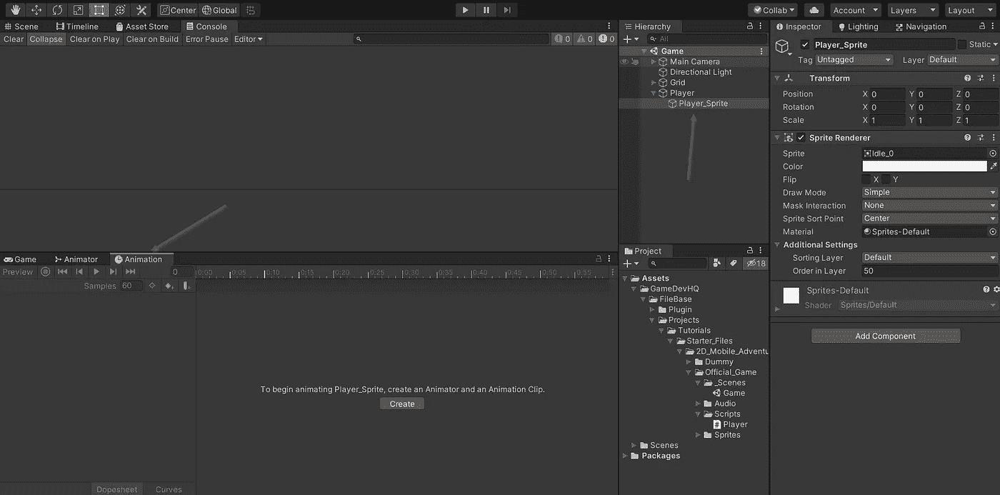

创建动画，点击创建，保存到你喜欢的目录，然后下拉“字符”文件夹。在这里你可以找到组成 2D 动画的 PNG 文件。

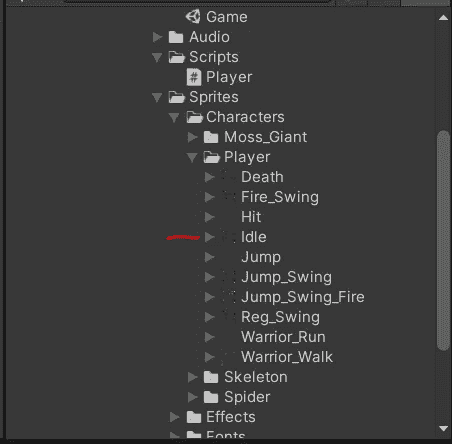

单击该对象，您会看到一些东西填充了检查器窗口。导航到“精灵编辑器”。在这里，您可以分割 spritesheet，以便所有 png 都具有相同的尺寸。这对于游戏中需要创建的所有动画来说将会非常方便。

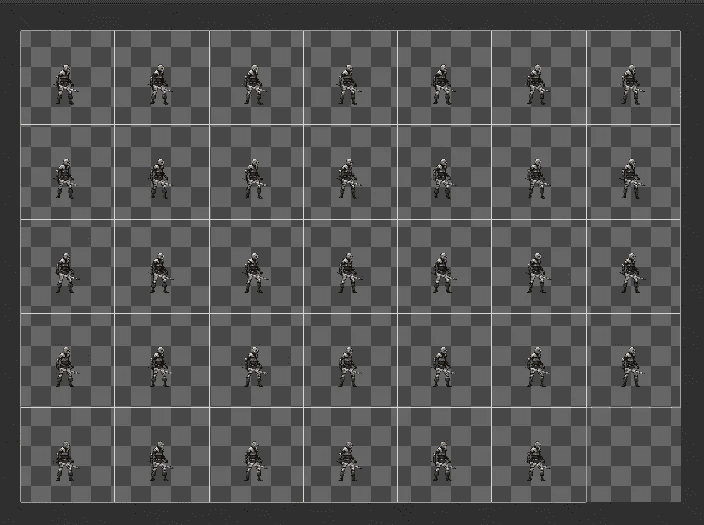

相应地切片。下拉空闲文件夹，你会看到 33 个文件。选择第一个，然后按住 shift 键选择最后一个。这将选择所有这些选项。现在只需将它们全部拖入动画窗口。这将为每个文件创建关键帧。播放动画，你会看到空闲的动画发生。因为这将是默认动画，我们不需要在动画窗口设置任何参数。(如果你的移动速度很快，将样本设置为 15。)

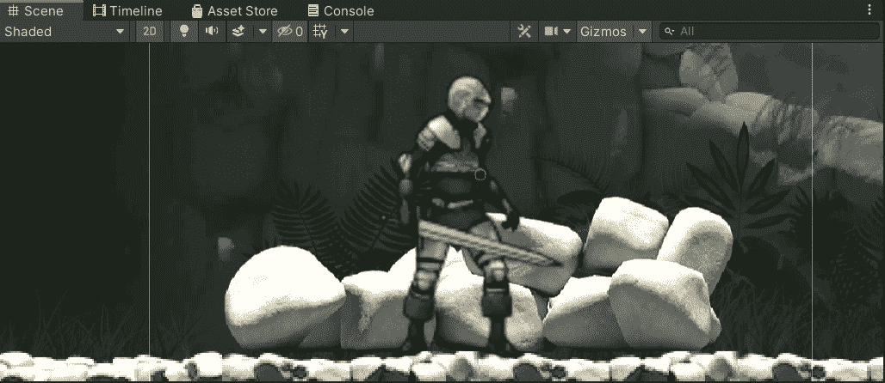

这也正是我将为跑步动画所做的。我该如何从空闲状态转换到运行状态呢？

在 animator 窗口中，我可以设置一个可以通过代码操作的参数。我做了一个参数叫“移动”。如果这个值小于 0.1，我将运行动画转换回空闲状态。

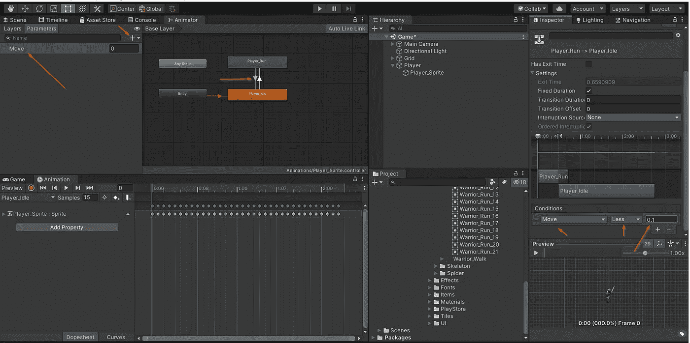

为了过渡到跑步，这将需要小于零(向左跑步)或大于 0(向右跑步)。我会用绝对值来实现。看看这个。

我创建了一个名为 PlayerAnimation 的新类。这是我处理动画的地方。我有动画师的把柄。在这个例子中，我将动画中的浮动“移动”设置为绝对值“移动”。

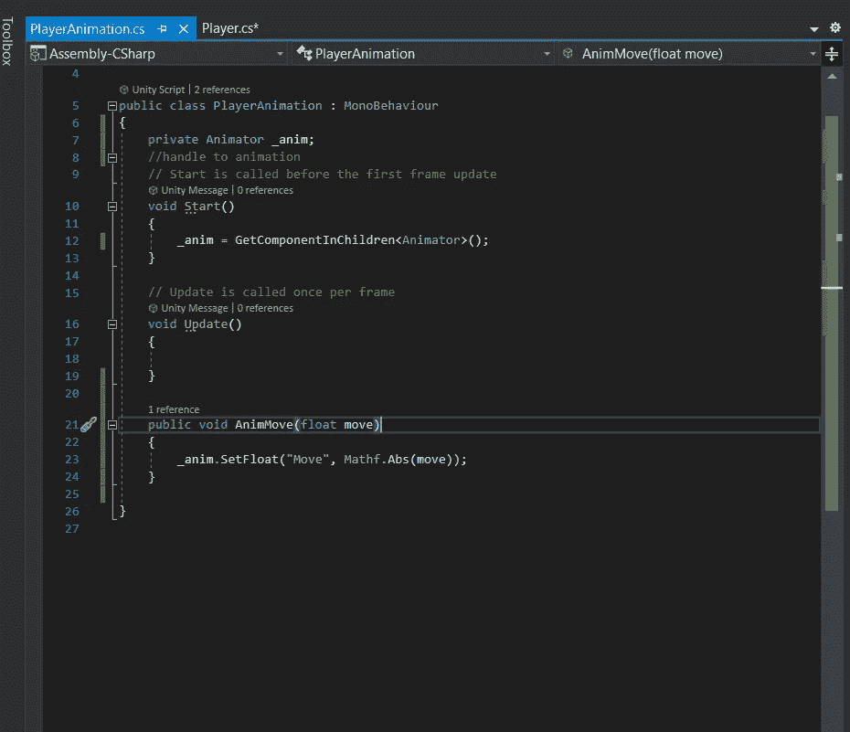

这个方法必须从某个地方获取某种浮点值。在播放器脚本中，我将“horizontalInput”设置为一个 float，这就是我想要确定的 float 的值。所以！在玩家脚本中，我只需要通过创建一个变量并在 start 中赋值来访问脚本。

`private PlayerAnimtion _playerAnim;`

然后在我的移动方法中我会放下面一行代码。

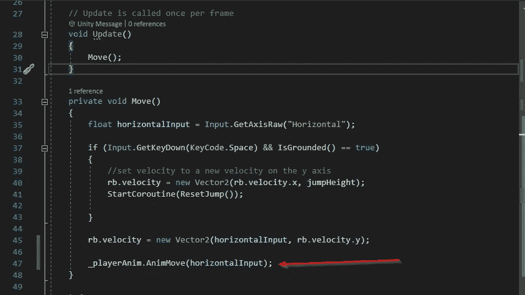

这将调用 PlayerAnimation 中的 helper 方法，并将 float 值设置为 horizontalInput 值。因为我用的是 GetAxisRaw，这个值会直接跳到 1 或-1，这取决于方向，而且由于 Mathf 的原因，动画只会读取 1。Abs()线。

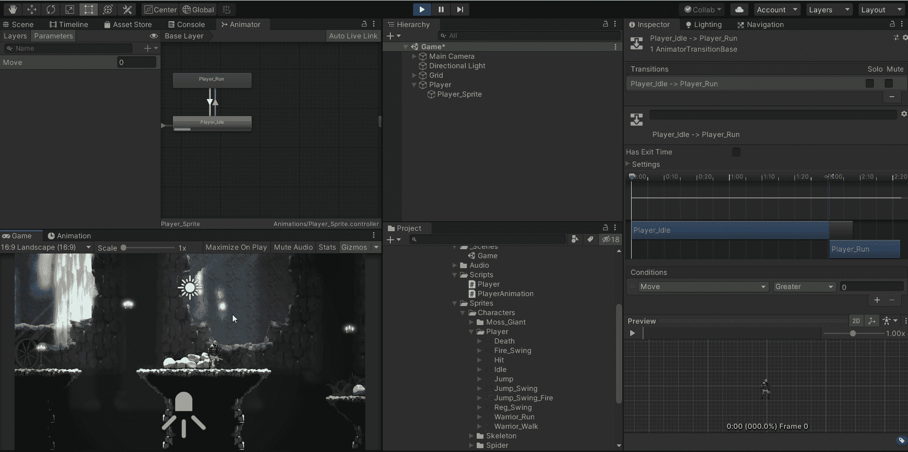

现在我需要做的就是根据玩家移动的方向翻转精灵。我将先发制人地把这个功能放在它自己的脚本中。一旦我实现更多的东西，比如挥剑动画，我会添加更多的东西。

首先，我需要一个精灵渲染器组件的句柄。为什么这么问？看看这个:

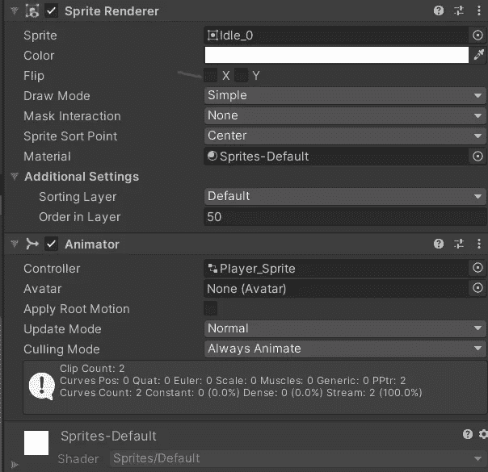

精灵渲染器内置了翻转参数！我需要做的就是访问这个参数，并根据我的玩家面对的方向将其设置为真或假。

所以在 start 中，在我将 SpriteRenderer 声明为`_renderer`之后，我需要声明 getCOmponentInChildren，因为脚本在父对象上，而 Sprite Renderer 在子对象上。下面你会看到`Flip()`方法。这是一个叫做 faceRight 的 bool。

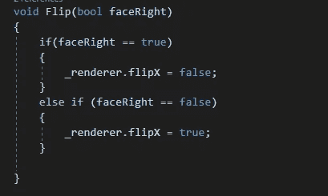

要翻转精灵，需要做的就是 type _renderer.flipX。所以如果 faceRight == true，我不会翻转它。如果它是假的，我会。在我的运动代码中，我要说的是，如果 horizontal input > 0，那么 Flip 为真。如果不是它的假！轻松点。

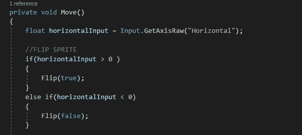

最终结果:

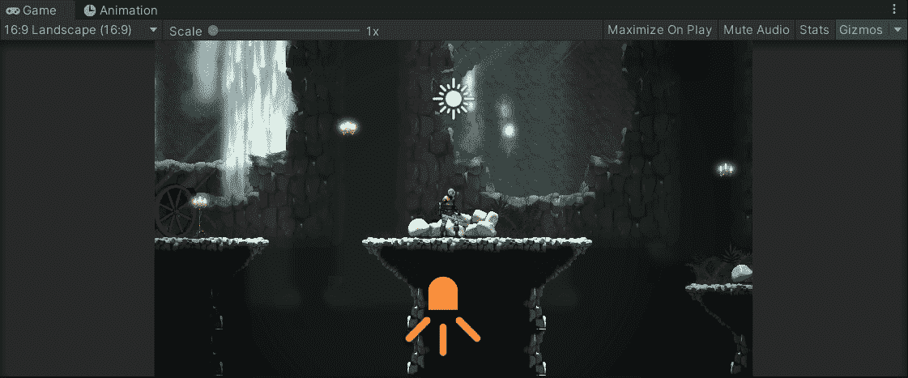