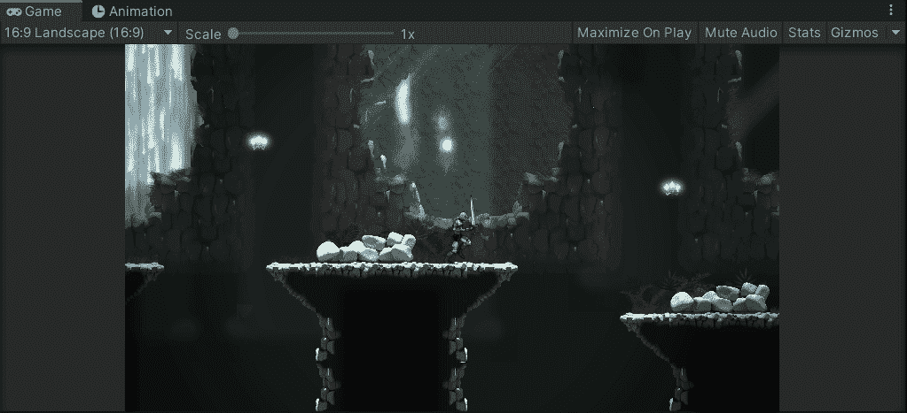

# Unity 中的手机游戏:使用 Cinemachine 的相机跟随

> 原文：<https://medium.com/nerd-for-tech/mobile-games-in-unity-camera-follow-using-cinemachine-ed3d26ed91f7?source=collection_archive---------5----------------------->

在本文中，我将通过为这个游戏设置一个简单的相机跟随功能来简要介绍 Cinemachine。

导航到软件包管理器并安装 Cinemachine。

然后创建一个新的虚拟相机，称为类似“跟随玩家凸轮”的东西。你可以看到它被超级放大了。将 Z 位置设置为-10 左右。现在你可以看到球员和水平。现在你需要做的就是将玩家游戏对象拖到虚拟 cam 和 viola 上的 Follow 槽中！

