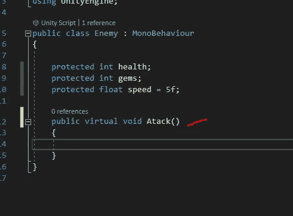
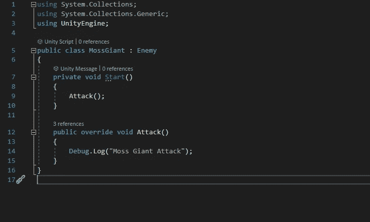
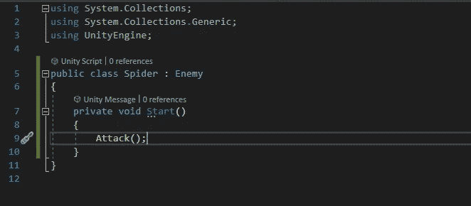
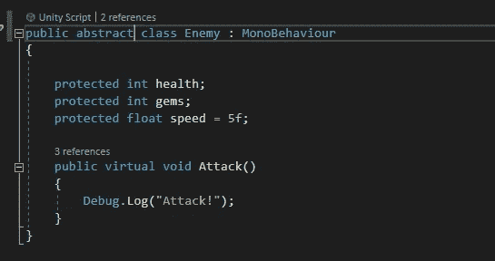
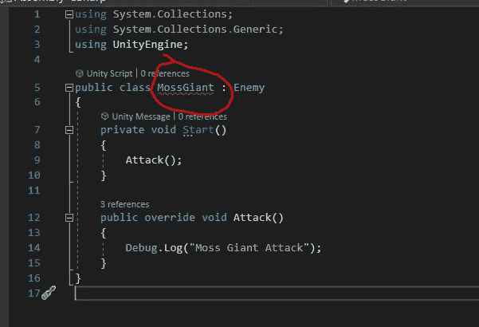
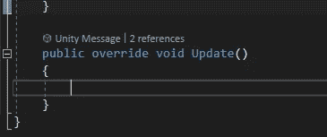
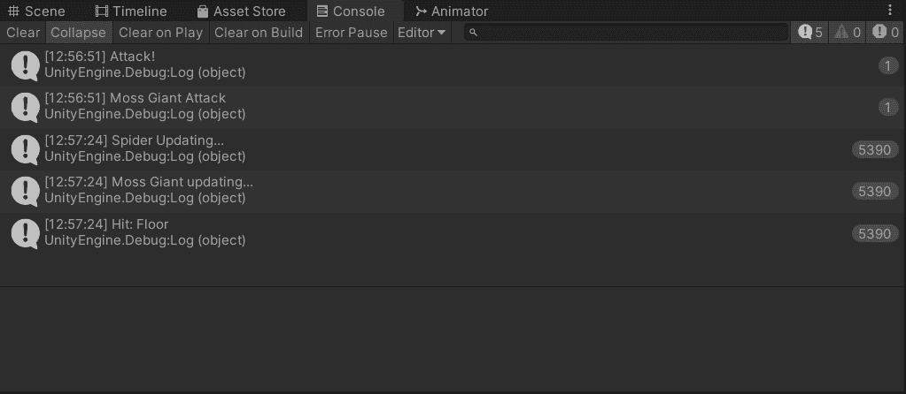

# Unity 中的手机游戏:敌人设计——抽象类

> 原文：<https://medium.com/nerd-for-tech/mobile-games-in-unity-enemy-design-abstract-classes-e055d55fdc6e?source=collection_archive---------8----------------------->

现在所有的敌人都通过他们自己的脚本共享敌人类的数据。想让苔藓巨人有独特的攻击方式怎么办？在 Moss Giant 脚本中编写一个全新的方法来处理攻击是没有意义的，特别是如果我想从敌人的攻击方法中借用一些功能的话。这就是虚方法派上用场的地方。

虚拟方法允许我覆盖父攻击方法，但也允许我使用它的实现。敌方等级我想把攻击方式从`public void`改成`public virtual void`。`virtual`关键字将允许我重写基本实现。

所以现在在 MossGiant 脚本中，为了覆盖来自敌人类的实现，我需要做的就是做一个攻击方法，说:

`public override void Attack()`。

现在无论我想放什么实现进去，我都可以。如果我想从基本的敌人脚本中运行实现，我只需要在新的虚拟方法中的实现之前说`base.Attack`。

例如:

这是运行游戏后的控制台。我有苔藓巨人调用自己的攻击方法而蜘蛛敌人调用基础敌人职业的攻击方法。

敌人阶级

苔藓巨人级

蜘蛛类

我想让这个敌人脚本定义敌人的行为。如果我有 50 个敌人，我不想为每一个都键入一堆代码。我的目标是确定敌人进出的路径。这将通过更新方法来控制。

所以我可以强迫敌人使用更新方法，但是每个敌人都有不同的路点。所以我能做的一件事就是强迫他们有自己的更新方法。所以利用我们已经学过的知识，我可以在敌人的职业中放一个`public void Update()`，他们可以共享它，或者我可以使用一个虚拟的方法来覆盖每个敌人的脚本。`public vitual void Update()`。这个实现使得 update 方法成为可选的。我不想那样。这就是**抽象类**派上用场的地方。

简单的把敌人职业从`public class Enemy`改成`public abstract class Enemy`就是如何开始的。

这样做允许我创建所谓的抽象方法。接下来我会做一个抽象的更新方法。

它在没有任何实现代码的情况下被初始化。

现在在我的 MossGiant 脚本和 Spider 脚本中，我应该会得到一个错误。这是因为我没有在这些脚本中实现抽象的 update 方法。

因此，我需要确保每个敌人都有自己独特的更新方法来覆盖父对象。

这确保了每个敌人都以完全相同的方式建造。如果我们在不被敌人发现的情况下运行这个程序，它就不会起作用。为了测试这一点，我将进行一些简单的调试。登录他们各自的类并运行游戏。

每个敌人都在用他们自己独特的更新方法进行更新，同时分享一些共同的特征，比如生命值。:)

在接下来的文章中，我将介绍如何设置一些动作，这样我们就能真正看到使用抽象类是多么的方便！