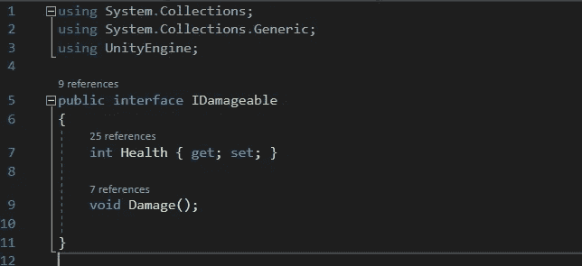
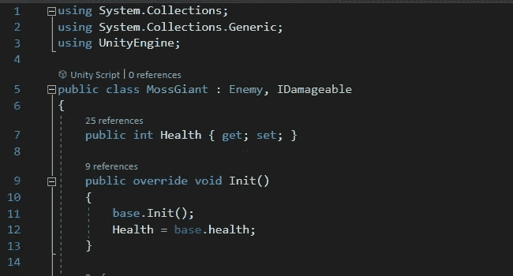
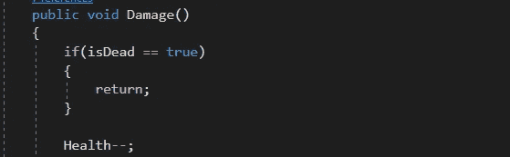
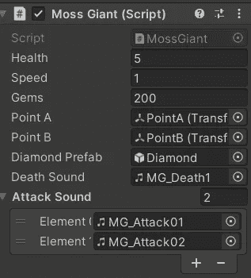

# Unity 中的手机游戏:界面

> 原文：<https://medium.com/nerd-for-tech/mobile-games-in-unity-interfaces-4a62b7dd87c9?source=collection_archive---------12----------------------->

在上一篇文章中，我谈到了球员的进攻设置。我提到了一个叫`IDamageable`的东西。以下是参考链接:[Unity 中的手游:玩家攻击设置| Gerald Clark | Nerd For Tech | 2021 年 10 月| Medium](/nerd-for-tech/mobile-games-in-unity-player-attack-set-up-3bf955af5879) 。

这到底是怎么回事？让我们看看剧本。

它不是一个公共类，而是一个名为 IDamageable 的公共接口。正如你所看到的，我在这里拥有的只是一个健康参数，我在敌人的脚本中赋值，还有一个`void Damage()`函数。这意味着什么呢？

在我的《苔藓巨人》剧本中，我有一些事情要做。

我已经看过遗产了。这是那篇文章的链接；)[Unity 手游:敌方设计级传承|作者杰拉德·克拉克|科技书呆子| 2021 年 9 月| Medium](/nerd-for-tech/mobile-games-in-unity-enemy-design-class-inheritance-957d29c04e06)

这个脚本继承了敌人类和这个 IDamageable 接口。在我的 IDamageable 脚本中，Damage()方法对于从该接口继承的任何东西都是必需的。所以我的苔藓巨人脚本也有伤害功能。

如果没有这个函数，脚本将包含错误，不允许游戏运行。这基本上保证了游戏中任何可损坏的东西都有一个损坏功能。这可以是敌人，桶，植物，任何东西！这也使得实现起来极其简单。由于`int Health`也存在于这个 IDamageable 接口中，所以任何易损坏的东西都有一个需要赋值的健康参数。

正如你在这里看到的，我给苔藓巨人分配了 5 点生命值。稍后我将进入宝石参数和声音的东西。我还指定了蜘蛛和骨骼各自的生命值。IDamageable 界面使得在游戏中设置敌人和其他可破坏的东西变得更加容易，耗时更少。