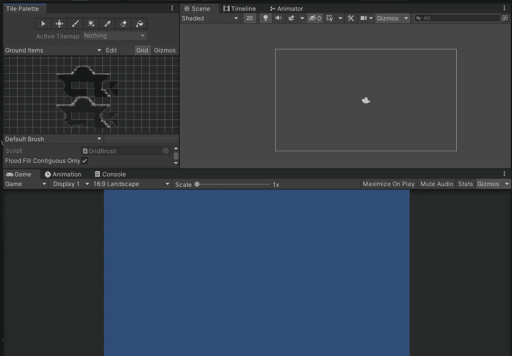
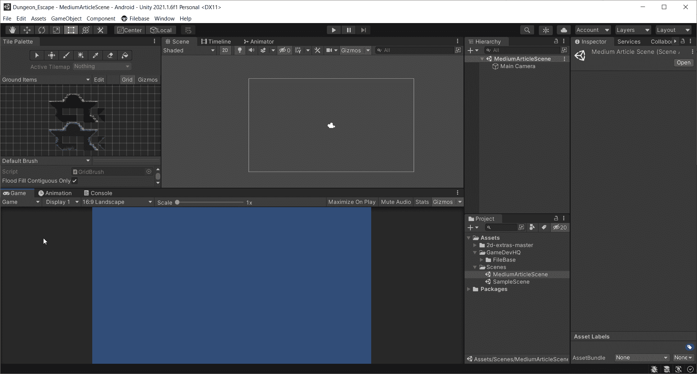
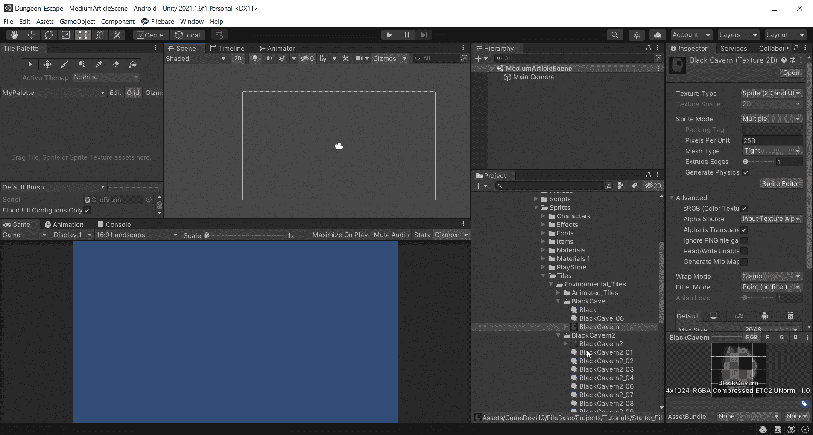
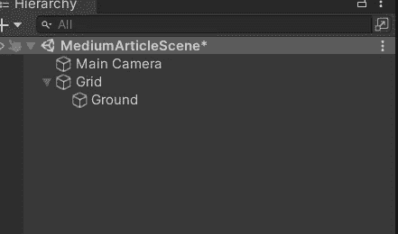
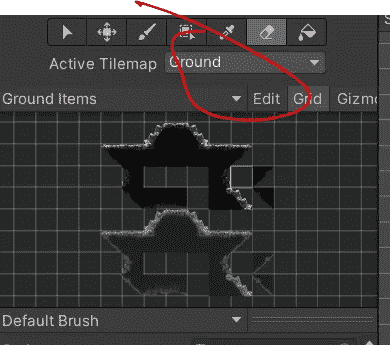
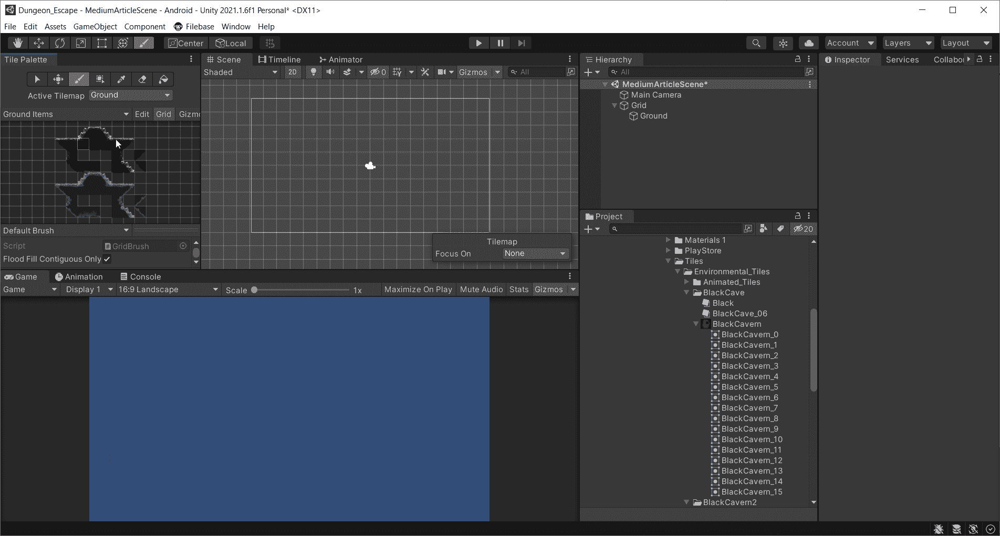

# Unity 中的手机游戏 Tilemaps 简介

> 原文：<https://medium.com/nerd-for-tech/mobile-games-in-unity-intro-to-tilemaps-5256e5fb2e4b?source=collection_archive---------15----------------------->

在本文中，我将介绍 Tilemaps 以及如何使用它们。

这是一个空白场景，在左上角有一个平铺调色板窗口。当使用瓷砖调色板时，我喜欢这样设置我的场景。“拼贴调色板”窗口基本上包含了您导入到项目中的所有 2D 艺术资源。我已经导入了一些不同的瓷砖地图，但我会去如何创建一个调色板。

要创建一个调色板，你需要做的就是点击下拉菜单，我的菜单上写着“地面项目”，然后点击“创建新的调色板”。Unity 会提示你保存这个调色板。将其保存在您选择的位置。之后，你就可以向这个调色板添加东西了。

在我的项目中，我已经导入了一些东西。

我需要切割这个图像，以便我可以使用它的一部分来创建的水平。

在精灵编辑器中，按单元格大小剪切它们，然后将所有图像拖动到调色板中。系统还会提示您保存该文件。将其保存在另一个名为“Tiles”的文件夹中。一旦你这样做了，你会看到调色板窗口内的图像填充。

现在你可以画关卡了。我们需要一个网格。所以创建一个新的游戏对象。转到 2D > Tilemap，调用网格的子对象“地面”。这将是地面层。

确保活动切片地图是地面图层。

现在你可以画关卡了。我将创建一个简单的地面层。

你可以在游戏视图中看到场景视图中白色矩形周围的任何东西。当谈到制造一个完整的关卡时，有很多东西需要挖掘。可以创建几个层来给关卡一种深度感，甚至可以使用统一的层来实现视差感。我将在接下来的几篇文章中深入探讨这个话题。这是对 Unity 中 tilemaps 的简单介绍。