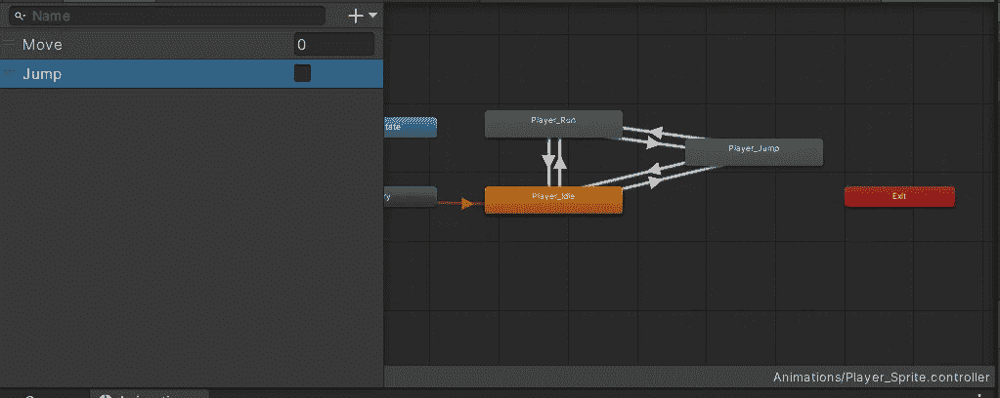
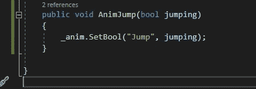
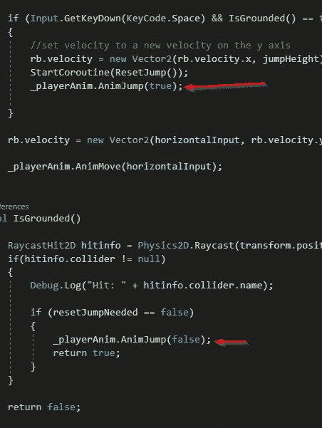
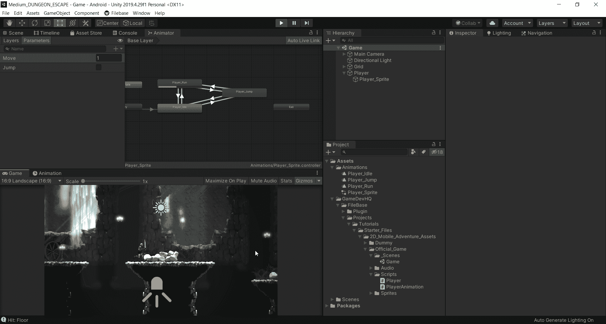

# Unity 中的手机游戏:跳跃动画逻辑

> 原文：<https://medium.com/nerd-for-tech/mobile-games-in-unity-jump-animation-logic-d2b9094c4f5f?source=collection_archive---------4----------------------->

在以前的文章中，我演示了如何使用 2D 精灵创建动画，以及如何在 Animator 窗口中设置从空闲到运行的过渡。本文将演示跳转动画背后的逻辑。

我已经创建了动画，并将其导入到 animator 窗口。当我跑步或者空闲的时候，我想成为一个蹦蹦跳跳的人。所以我设置了从每一个到跳跃动画的过渡。

为了从这些过渡到跳跃，我需要一个参数。我建立了一个名为“跳跃”的博客。

我使用 bool 的原因是我可以控制动画何时结束。我希望在我没被禁足的时候动画能继续。一旦我被禁足，我想根据我的移动浮动值回到跑步或空闲状态。

在我的 PlayerAnimations 类中，我有一个新的公共方法，该方法通过向其中输入一个名为“jumping”的 bool 来控制 bool 参数。

然后，我将值“jumping”设置为播放器脚本中的任何值。

当我跳的时候，布尔值为真，当我落地的时候，布尔值为假。这将打开和关闭动画。我还在 animator 中设置了另一个条件，当我转换回跑步时。如果“移动”大于 0，并且“跳转”为假，我将转换回跑步。否则，我将转换回空闲状态。这就是全部了！

我个人认为默认跳转动画太长。所以我去掉了一些帧，让跳跃在我看来好看一点。摆弄它，并设置成你喜欢的样子！这就是这一切的意义所在！