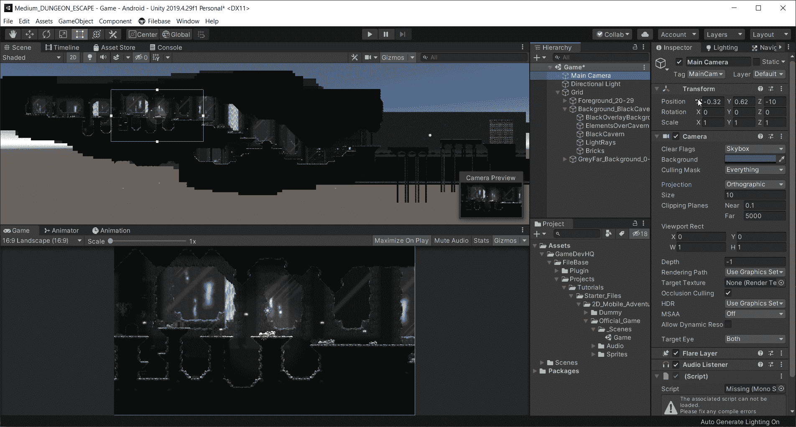
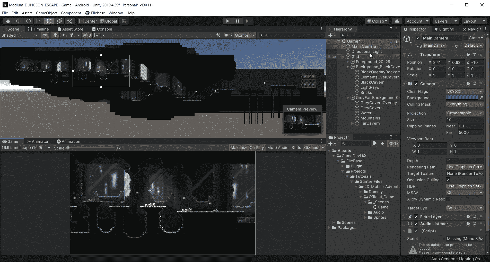
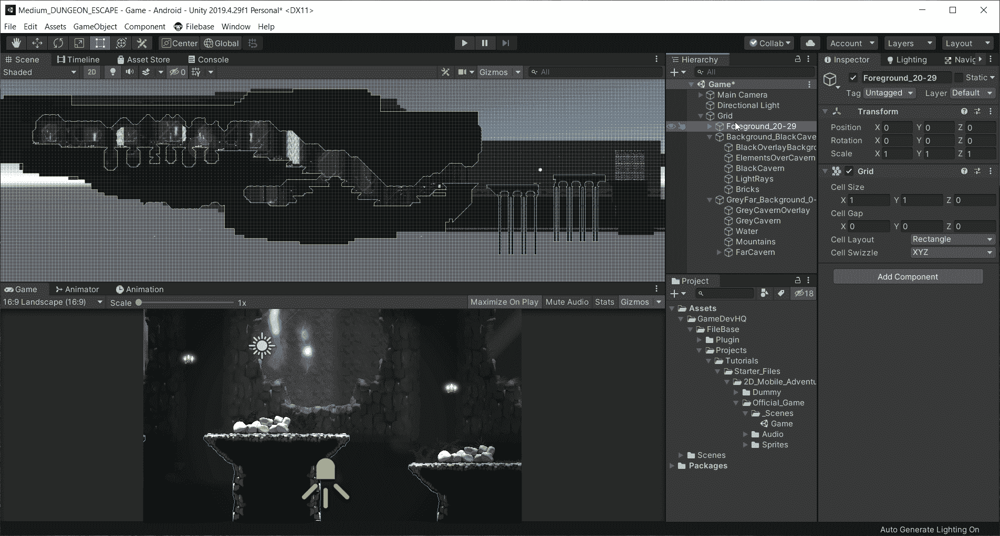

# Unity 手机游戏:透视 vs 正投影相机:视差

> 原文：<https://medium.com/nerd-for-tech/mobile-games-in-unity-perspective-vs-orthographic-camera-parallax-534bd7f7fbdc?source=collection_archive---------11----------------------->

在这篇文章中，我想介绍一种非常酷的方法，使用视差将这种层次带入生活。现在，当我在 X 轴上移动我的相机时，水平面当然会移动，但是没有深度。它们都在同时移动，但是我们显然有不同的层次。

首先，我想把我的相机从正投影设置为透视投影。

现在镜头拉近了。这对于一款手机游戏来说是一个很好的视角，因为我们的重点将会放在玩家身上。

现在我需要做的就是选择层次中的每一层，并设置它们的 Z 位置。前景层将为 0，背景层将为 1，远地层将为 3。现在，当我移动的时候，我有一种非常好的视差环境的感觉，它有足够的深度，更加真实。

在接下来的文章中，我将会介绍如何设置玩家并开始构建这个游戏！