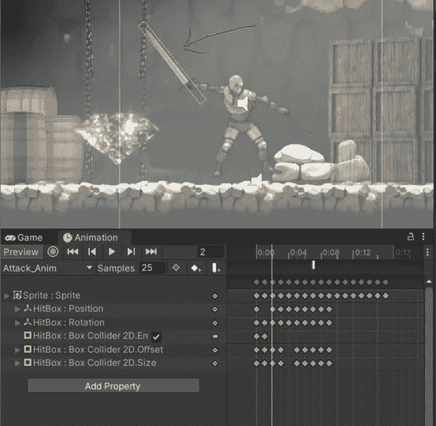
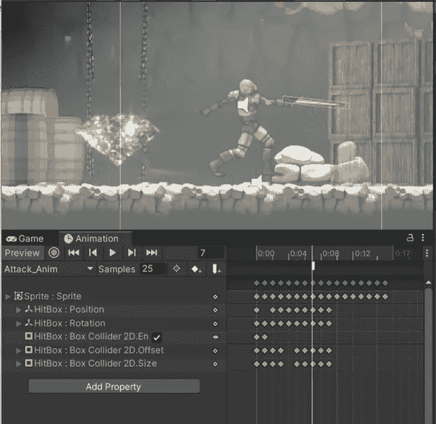
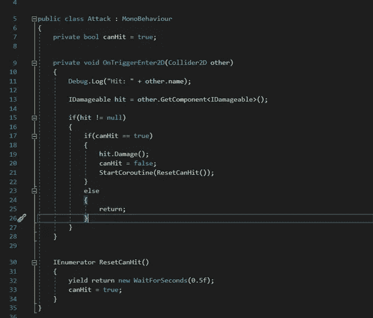
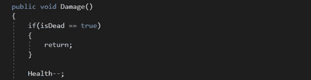
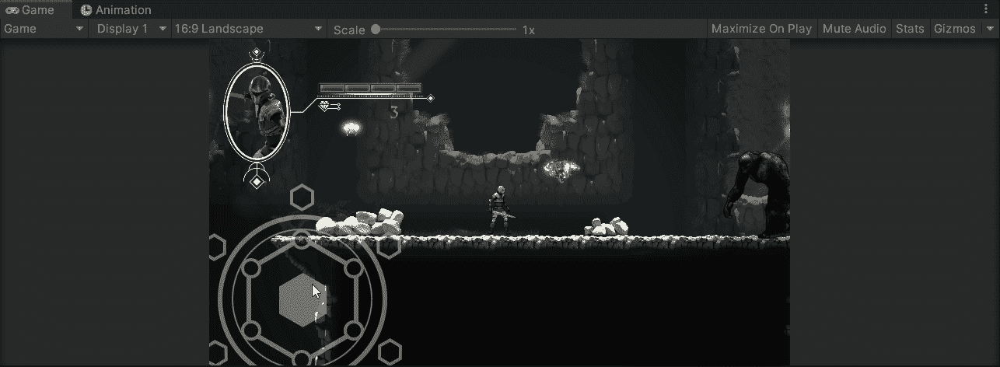

# Unity 中的手机游戏:玩家攻击设置

> 原文：<https://medium.com/nerd-for-tech/mobile-games-in-unity-player-attack-set-up-3bf955af5879?source=collection_archive---------7----------------------->

在这篇文章中，我将介绍如何为玩家设置攻击功能。让我们开始吧。

我认为最有趣的部分是设置 hitbox。我所做的是创建一个空的游戏对象，它将有一个盒子碰撞器，一个刚体，和一个处理攻击逻辑的脚本，并使它成为玩家精灵的子对象。

要创建这个 hitbox，我需要进入我设置的攻击动画。我需要做的就是按下 record，然后根据攻击动画的帧来调整 hitbox 的大小和形状。

这部分实际上需要一点时间。确保在动画开始和结束时使 hitbox 的盒子碰撞器在 animator 中处于非活动状态，这样它就不会在玩游戏时撞到其他东西，或者对敌人造成额外的伤害。

现在我需要开始编写脚本了。

为了防止盒子碰撞器每帧击中敌人数百次，我设置了一个协程，在 0.5 秒后重置`canHit` bool。在 OnTriggerEnter 函数中，我正在检查我在调试中遇到了什么。日志线。在此之后，我将从被点击的游戏对象中获取 IDamageable 接口。在那之后，我说如果剑击中的物体有 IDamageable 脚本，获取它，并为那个游戏物体实现伤害函数。由于每个敌人都有不同的生命值，所以有些敌人很容易被击败，而有些则比较困难。在调用 IDamageable 脚本中的损坏函数后，启动重置 bool 的协程。

这是苔藓巨人脚本中的伤害函数:

所以如果敌人死了，什么都不要做。否则生命值减一。如果苔藓巨人有 5 点生命值。玩家需要击中苔藓巨人 5 次才能击败它。

你也可以让敌人触发一个动画，让它看起来像是被击中了！在敌人脚本中调用伤害函数中的触发参数。

这就是全部了！