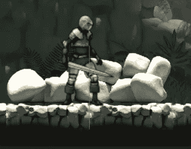
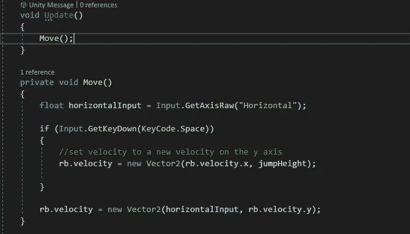
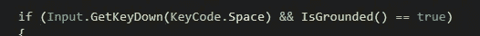
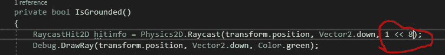
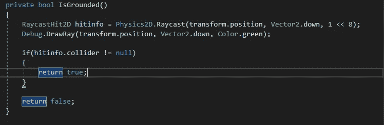
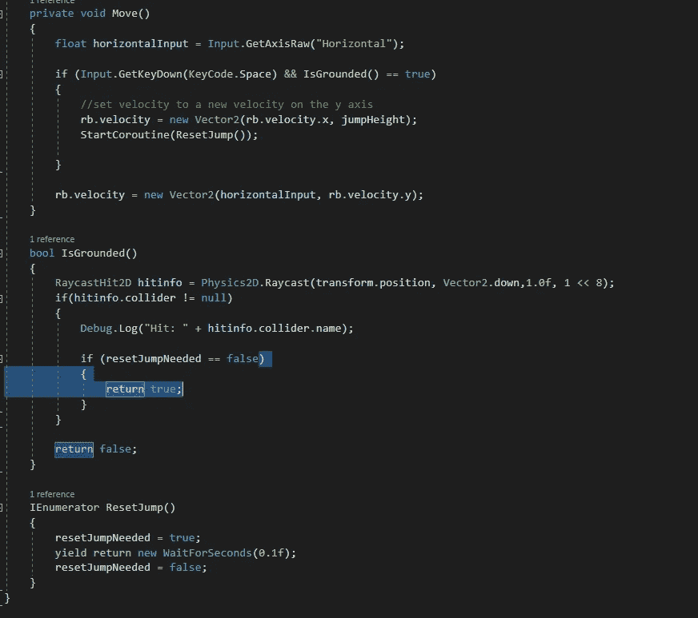
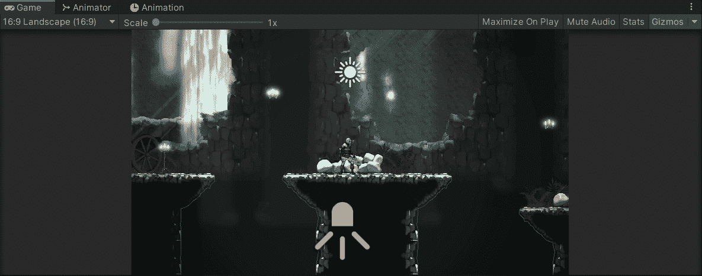

# Unity 中的手机游戏:玩家使用 Raycast 进行跳跃

> 原文：<https://medium.com/nerd-for-tech/mobile-games-in-unity-player-jump-using-raycast-7506fef18758?source=collection_archive---------2----------------------->

在这篇文章中，我将使用一个返回类型的方法来设置跳转功能，让我们知道我们是否被固定了。

什么是光线投射！？

在这种情况下，光线投射基本上是从玩家到地面的光线。如果射线与地面碰撞器碰撞，玩家将被禁足。如果射线没有碰到它，玩家就不会被禁足。我希望只有当玩家被禁足时才能跳跃。我已经讲述了如何将一个布尔值从 true 变为 false，反之亦然，但是在这篇文章中，我将演示如何通过使用一个***返回类型函数*** 来避免这种情况。

在此之前，我要清理一下我的代码，这样 Update()函数就不会变得杂乱无章。

现在所有处理移动的代码都在一个方法中。让我们进入接地的返回类型方法。

首先我需要做一个光线投射。为此，我只需要下面的代码。通过输入`Color.`*插入颜色名称，你可以让你的光线变成你想要的任何颜色。对我来说，我用绿色。

这将从玩家的位置向地面绘制一条射线。

现在我只需要创建一个函数来决定我是否被禁足。这就是接地的返回类型功能发挥作用的地方。

我的跳转功能只有在我按下“Space”并且 IsGrounded() == true 时才会发生；

在 IsGrounded 方法中，我将绘制射线。我还需要设置一个图层蒙版。

这意味着光线将忽略除第 8 层以外的所有层。我将地面层分配给这一层。现在，射线只能探测地面。

现在我要说的是，如果 hitinfo.collider 不等于 null，则返回 true，否则返回 false。

如果它没有落地，这个方法返回 false。在这里，我可以创建一个 bool 来重置跳转。这将基本上帮助我防止能够垃圾邮件跳转键。

我创建了一个名为 resetJumpNeeded 的 bool，最初将它设置为 false。当我跳转的时候，我希望它被设置为真。然后等待 0.1 秒，将其设置回 false。现在我可以说如果 hitinfo.collider 不等于 null，如果 reset jump needed 为 false，则返回 true。

最后的结果是我把垃圾从空格键里扔了出来:

如你所见，我只能在再次着陆时跳:)