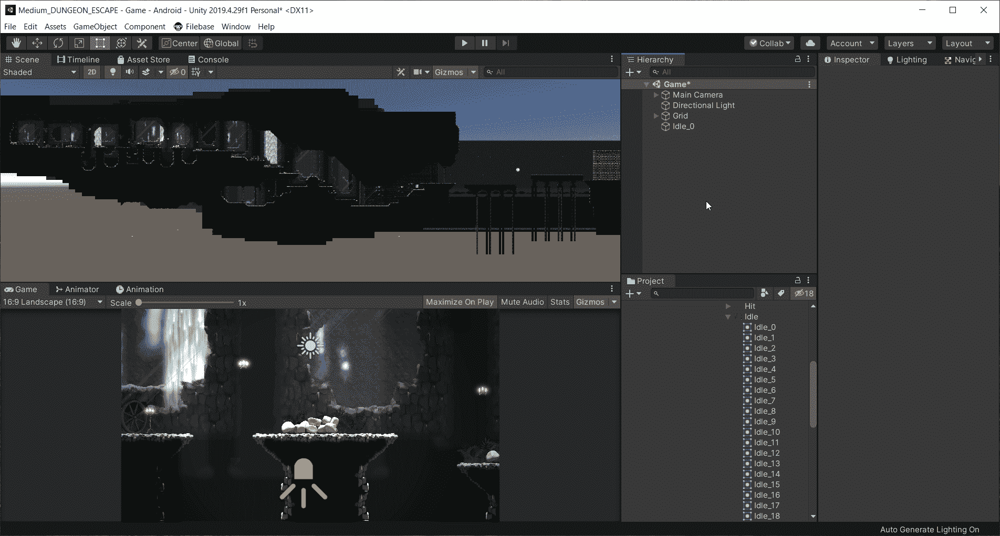
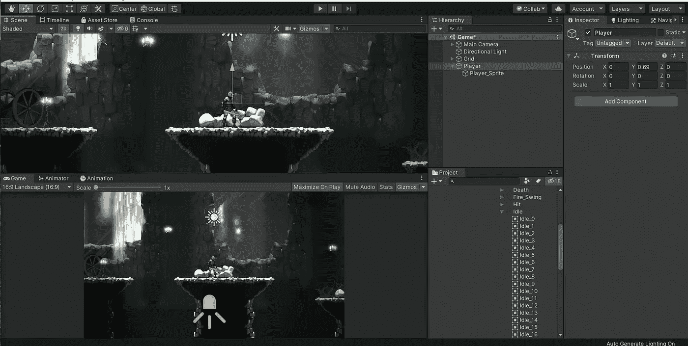

# Unity 中的手机游戏:玩家设置

> 原文：<https://medium.com/nerd-for-tech/mobile-games-in-unity-player-set-up-99dbcb4bb2fd?source=collection_archive---------13----------------------->

在这篇文章中，我将回顾如何设置播放器。下拉到项目视图中的“字符”文件夹。找到播放器并导航到空闲文件夹。选择空闲文件夹的第一帧，并将其拖动到层次结构中。

现在我看不到球员。这是由于层值的顺序。为了确保玩家总是可见的，我将图层顺序设置为 50。

在这个游戏中，玩家将有动画，健康，宝石收集等。我不想弄乱这个游戏对象的检查器，所以我实际上要创建一个空的游戏对象，将其命名为“玩家”，然后将我们刚刚拖入场景的精灵设置为“玩家”游戏对象的子对象。这样我就能保持一切整洁，知道去哪里找东西。

我只需要创建对象，并拖动精灵。确保将父对象的位置设置为 0，0，0，然后将播放器精灵拖入其中。然后 0 表示精灵的位置。现在剩下要做的就是将父对象拖动到位。你的场景应该是这样的。

在下一篇文章中，我将介绍如何让玩家移动！