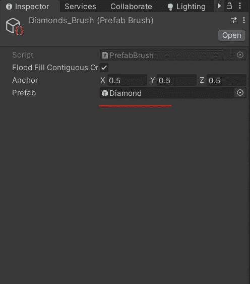
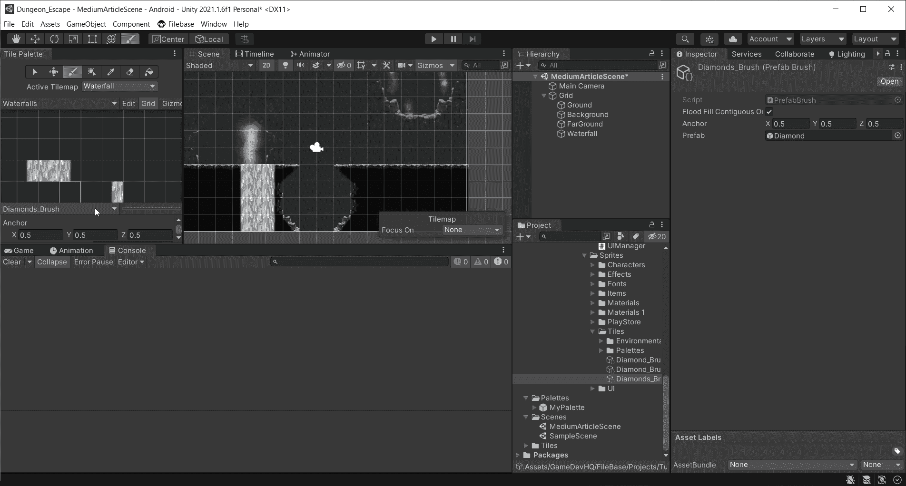

# Unity 中的手机游戏:预设画笔

> 原文：<https://medium.com/nerd-for-tech/mobile-games-in-unity-prefab-brushes-ca44da8bdbb2?source=collection_archive---------12----------------------->

现在，我相信你知道什么是预制的。我们可以制作一个笔刷来处理在被称为预设笔刷的关卡上绘制预设。

我现在在 Unity 2021，在哪里找东西的问题上有些小变化。要创建一个预设笔刷，你需要做的就是在项目视图中点击鼠标右键> 2D >笔刷>预设笔刷。我把这个叫做“钻石画笔”。

我已经创建了一个钻石预制件。所以现在我所需要做的就是把那个预设拖到预设笔刷上的“预设”槽中。

如果你导航到调色板窗口并找到画笔的下拉菜单，你会在列表中看到新创建的画笔。选择它，并选择调色板窗口中的绘画工具，开始绘画！

你可以想象这不仅对物品有多有用，而且对任何需要花很长时间才能导入/放置到场景中的东西都有多有用。