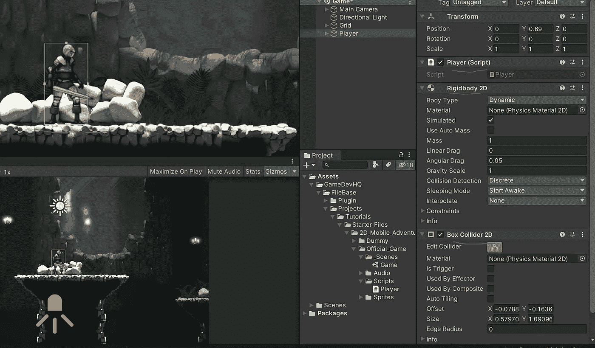
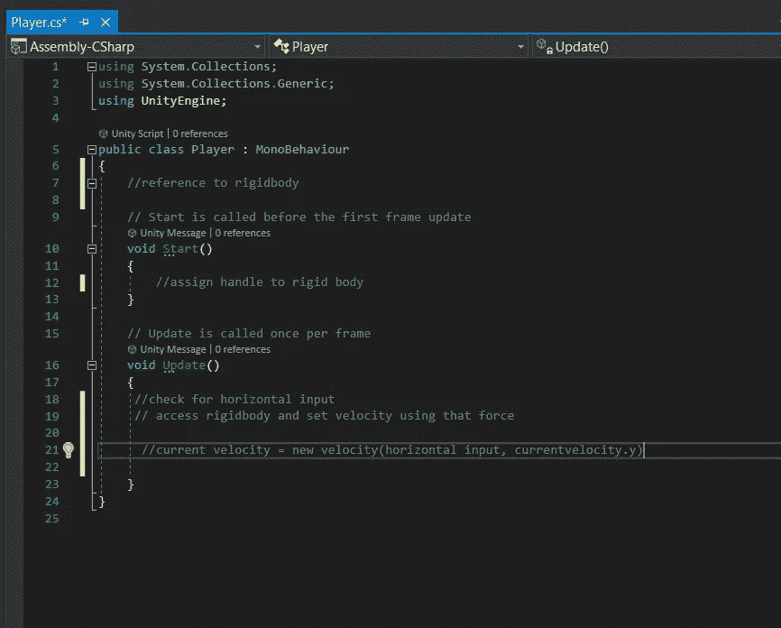
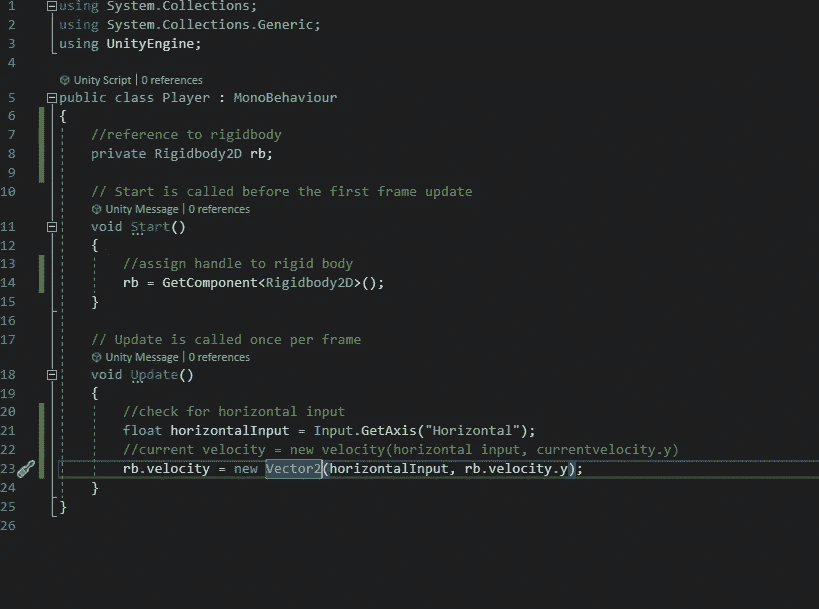
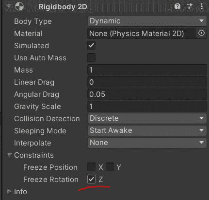

# 手机游戏 Unity:刚体运动设置

> 原文：<https://medium.com/nerd-for-tech/mobile-games-in-unity-rigidbody-movement-set-up-2a3b81c95a4c?source=collection_archive---------7----------------------->

在这篇文章中，我将开始设置基于 2D 物理学的角色控制器。

我将为脚本创建一个新文件夹。在里面，我将创建一个“玩家”脚本。这是玩家所有功能的归宿。

所以现在，我将只关注运动的 WSAD 键。我将在以后的文章中深入探讨移动移动主题。

首先，我需要获得轴输入，而不是使用 transform.translate 来移动玩家，我想实际上使用刚体 2d 系统并操纵对象的速度。为了利用这一点，我必须给玩家游戏对象添加一个刚体 2D 和一个碰撞器，并调整盒子碰撞器来很好地适应玩家。

现在剩下要做的就是进入刚体并移动玩家。

我想访问刚体组件，并在开始分配它。然后我想确定水平输入，并将 x =上的刚体速度设置为水平输入。Y 轴将保持当前速度。

现在玩家可以在 x 轴上移动了！

你可能已经注意到，当你放开琴键时，演奏者会受到一点阻力。你已经放开了，但是玩家继续向前移动了一秒钟。那是因为输入。GetAxis()逐渐从 0 移动到 1 或从 0 移动到-1。我希望我一放开钥匙就能停下来。所以我要把我的代码从 GetAxis 改成 GetAxisRaw。这将根据您移动的方式立即将值设置为-1 或 1。这将在以后设置跑步动画时派上用场。

你的玩家对象可能移动得太快，当这种情况发生时，当你在 x 轴上改变方向时，玩家会摔倒，所以需要做的就是在刚体上设置约束，这样玩家就不会再摔倒了。只需要冻结 Z 轴的旋转，因为当它倒下时，它会在 Z 轴上旋转。