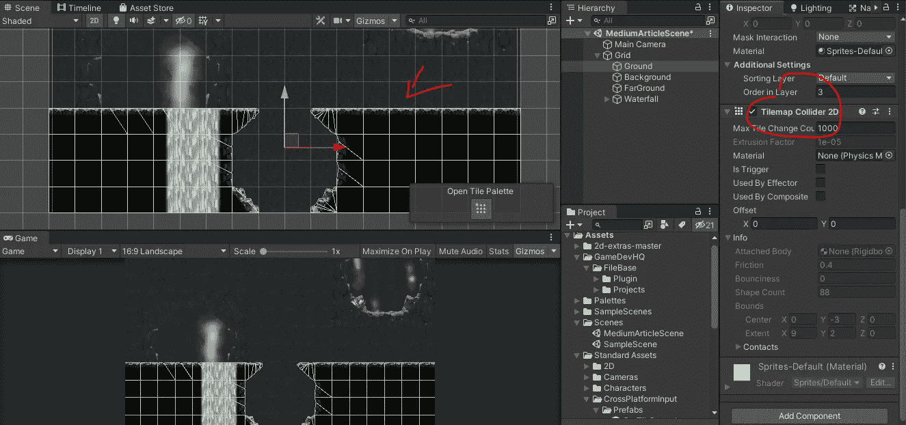
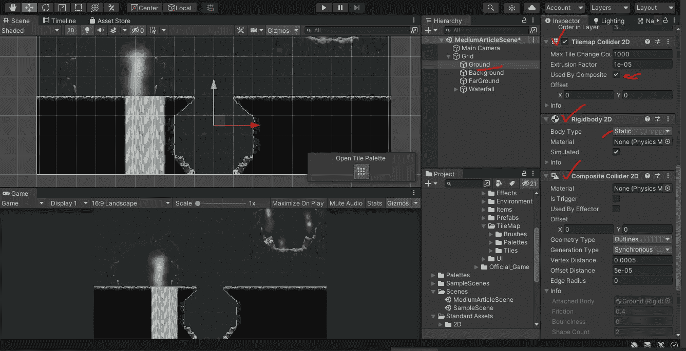

# Unity 中的手机游戏:Tilemap 碰撞器

> 原文：<https://medium.com/nerd-for-tech/mobile-games-in-unity-tilemap-colliders-90570ca692c6?source=collection_archive---------11----------------------->

Tilemap 碰撞器在设置关卡边界时非常有用。这个碰撞器基本上会包围它所在的 tilemap 层。

例如，我在这里创建的场景有一个地面层。我想能和这种权利发生碰撞？所以我给地面添加了一个 Tilemap 对撞机 2D 组件，就像这样:

如果我不想让每块瓷砖都有碰撞器呢？如果你的游戏中有这么多的碰撞器，你的系统运行一个更大更长等级的游戏会变得非常昂贵。这就是复合对撞机发挥作用的地方。

添加一个复合对撞机 2D 到地面层。这也将自动添加一个刚体 2D。将刚体上的主体类型更改为静态。然后在 tilemap Collider 上选择“由复合使用”。这将移除所有额外的碰撞映射。现在我们的玩家可以和地面层互动了。

在接下来的一系列文章中，我将使用 Unity 的免费“地牢逃脱”包中的所有可用资源，使用预先制作的场景来深入研究移动游戏开发。在我一头扎进一个充分利用这些概念的场景之前，我想在 Unity 中使用 tilemap 功能把一些与 2D 合作的基础知识带回家。期待在那里见到你！