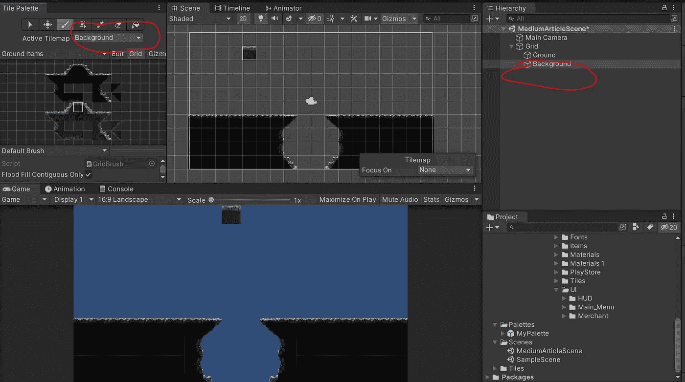
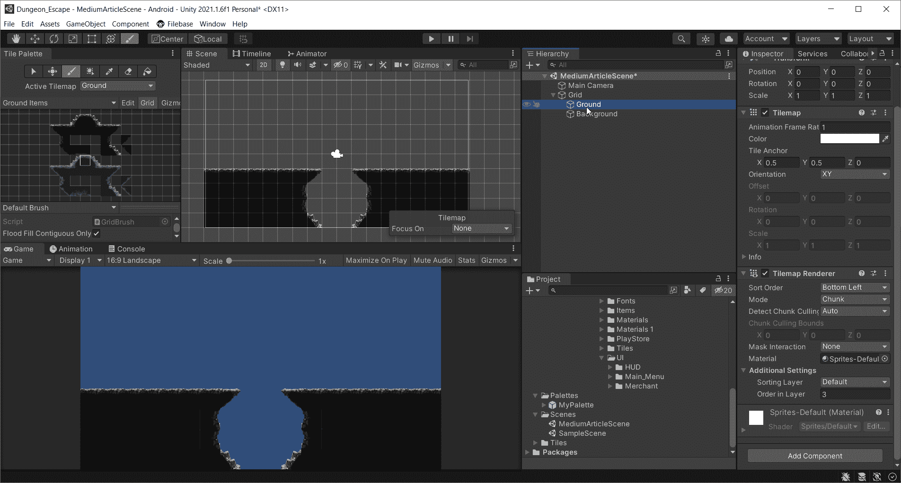
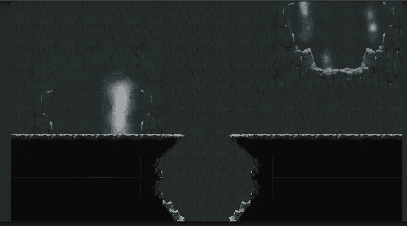

# Unity 中的手机游戏:理解层

> 原文：<https://medium.com/nerd-for-tech/mobile-games-in-unity-understanding-layers-a9a7ec172c3?source=collection_archive---------18----------------------->

在上一篇文章中，我展示了如何创建一个可以用来绘制地面的瓷砖调色板。我想在使用网格时快速浏览图层系统。

我又创建了几个包含不同环境元素的调色板。我想在背景中放一些洞穴。于是我又做了一个 tilemap 游戏对象，命名为“背景”。现在，当我导航到调色板窗口并单击下拉菜单时，有两个活动的 tilemaps。如果我想在背景上绘画，我需要将背景设置为活动 tilemap。我还需要改变层值的顺序。数字越高，基本上离屏幕越近。

我现在设置我的地面层为 3，背景层为 2。每当我在场景中绘画时，背景层现在不会与地面层重叠。

在这张照片中，我创建了另一个名为“FarGround”的图层，并将其在图层中的顺序设置为 1。现在我可以在背景层后面画画了。

