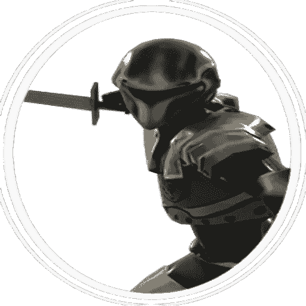
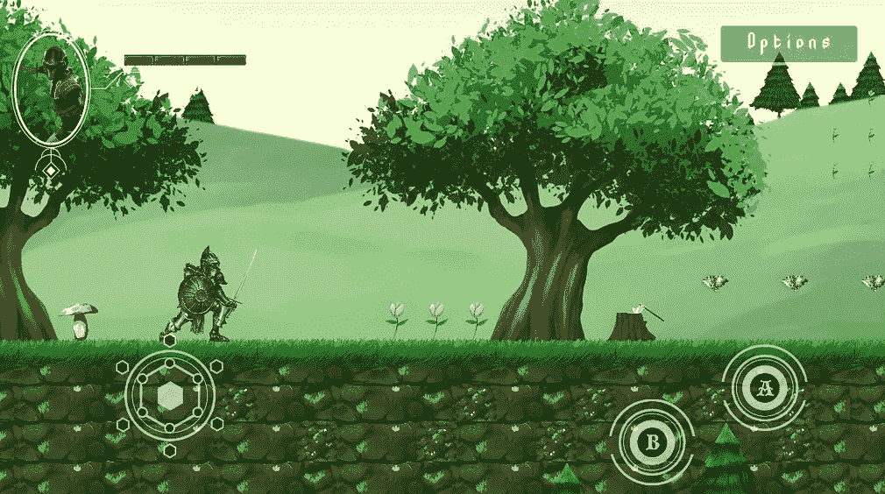
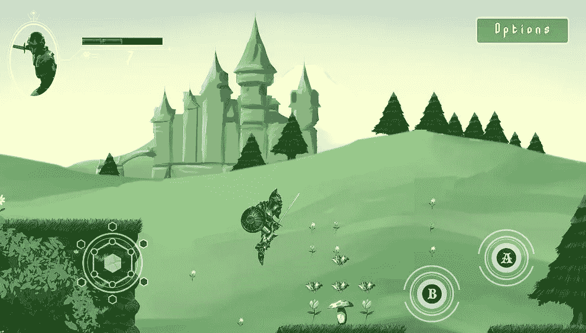
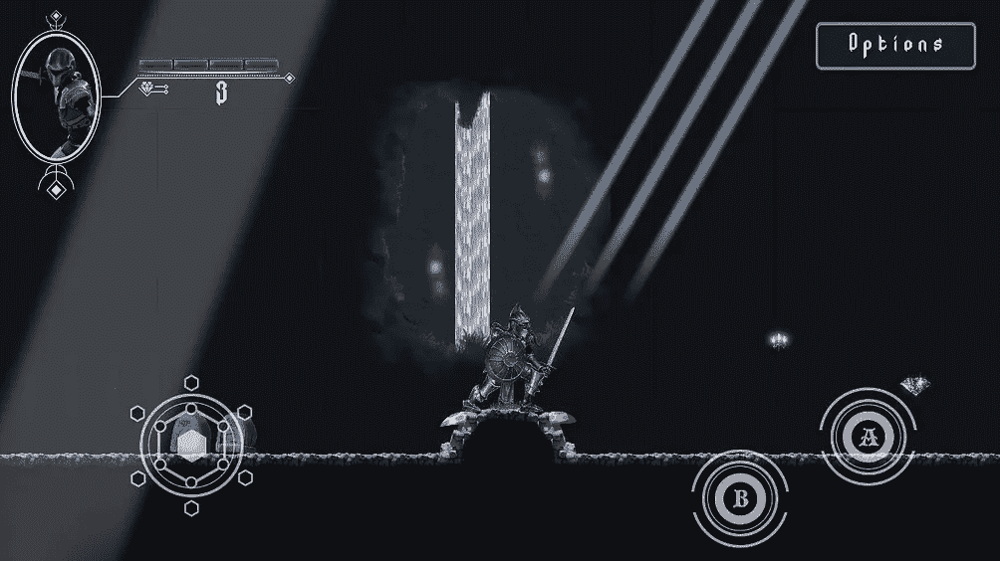
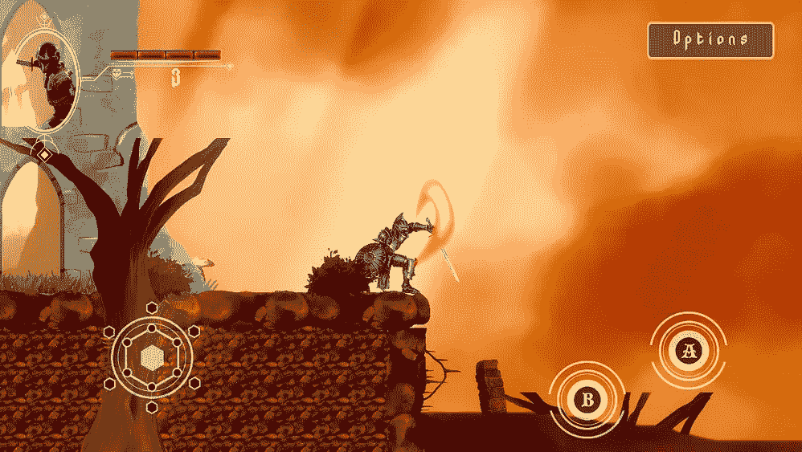

# 移动项目进度报告:演示完成 Unity

> 原文：<https://medium.com/nerd-for-tech/mobile-project-progression-report-demo-finished-unity-1063198236f1?source=collection_archive---------23----------------------->

游戏开发总部的移动项目终于完成了([移动项目进展报告:关卡设计第二部分 Unity](/nerd-for-tech/mobile-project-progression-report-level-design-part-2-unity-479e4417aa2a) )。

演示现在包括三个级别。两个普通级和一个 boss 级。

演示将提供一个游戏的快速俯瞰，你必须与受诅咒的生物和亡灵战斗，以达到你的王国。

这个演示叫做“被诅咒的王国”

> 游戏的故事

黑暗国度的邪恶巫师诅咒了你的王国。动物变异了，亡灵复活了。你作为国王已经被放逐到遥远的土地，现在你的任务是与被诅咒的生物战斗，到达你的王国，所以你打败邪恶的巫师，解除诅咒。

> 游戏性

该游戏是一个黑客和斜线动作/冒险游戏。用你强大的剑打败你的敌人，获得珍贵的钻石来购买物品和升级。

> 截屏

演示将很快在谷歌商店发布，(https://play.google.com/store/apps/details？id=com。NovusXDev.CursedKingdom)