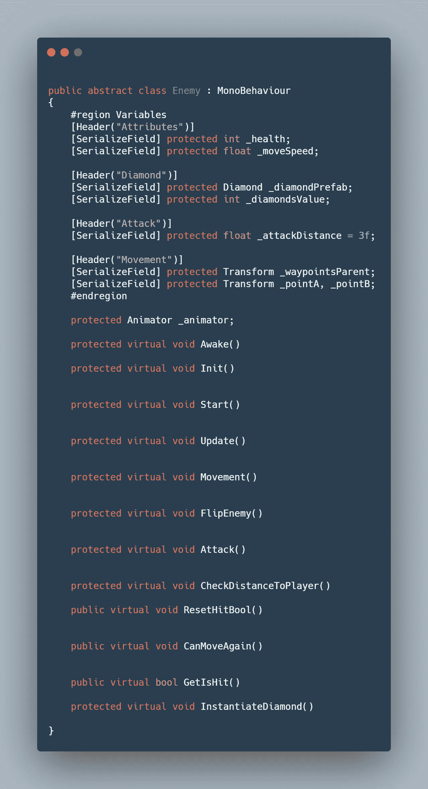
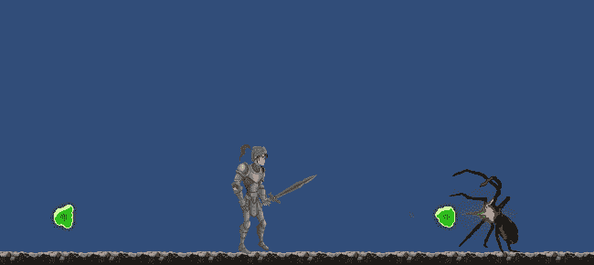
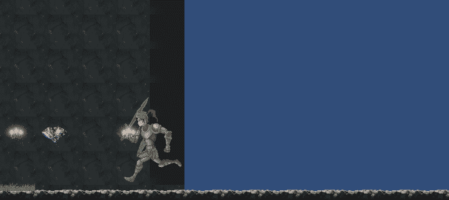
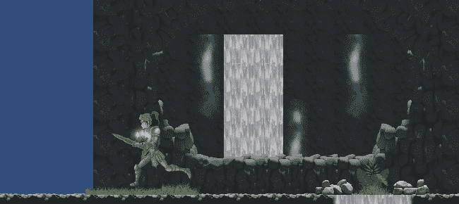

# 移动项目进度报告:敌人设置统一

> 原文：<https://medium.com/nerd-for-tech/mobile-project-progression-report-enemy-setup-unity-145bbe43f0bc?source=collection_archive---------12----------------------->

今天我们继续上次进度报告中我停止的地方(=> [Tilemaps &玩家设置 Unity](/nerd-for-tech/mobile-project-progression-report-tilemaps-player-setup-unity-ff4e0d0a8a00) )并继续完成敌人设置。

敌人来自每个人的噩梦，我们将有一只吐酸的蜘蛛，一具行尸走肉的骷髅，一只怪异的半动物半机器人弗兰肯斯坦式的实验鸵鸟等等。

> 敌人的设置

有很多方法可以编写敌人的脚本来控制游戏中不同的人工智能，但是我们需要简化流程，使其模块化。

最好的方法是使用敌人的抽象类。虽然我会写一篇关于这个想法的文章，但是一个抽象类基本上是我们用来创建不同敌人类型的模板。

每个敌人都有生命值、移动速度、移动方法、攻击方法、攻击方法和伤害/死亡方法。有了抽象类，我们可以只编写一次基本代码，然后针对每种敌人类型进行个性化设置。

抽象敌人类概述

## 到目前为止的敌人类型

> 吐酸蜘蛛

> 弗兰肯斯坦鸵鸟

> 喝醉的骷髅

接下来，UI 和一些非常酷的东西。