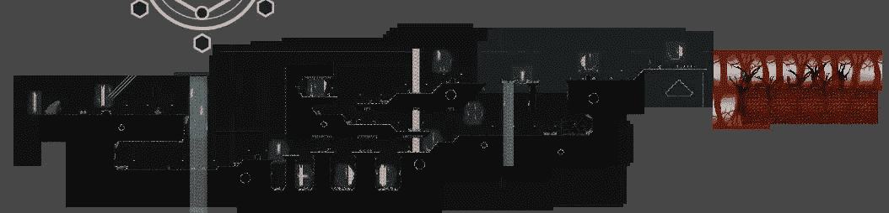
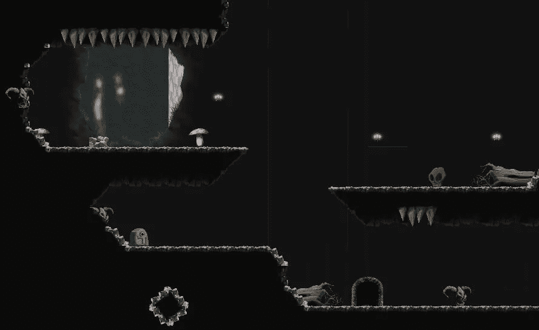
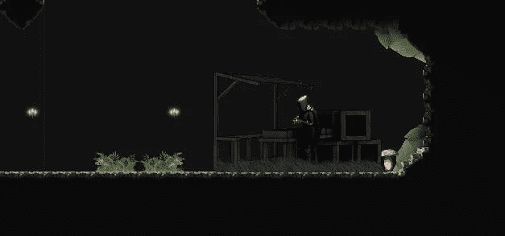
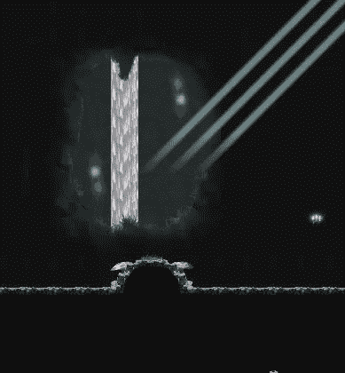
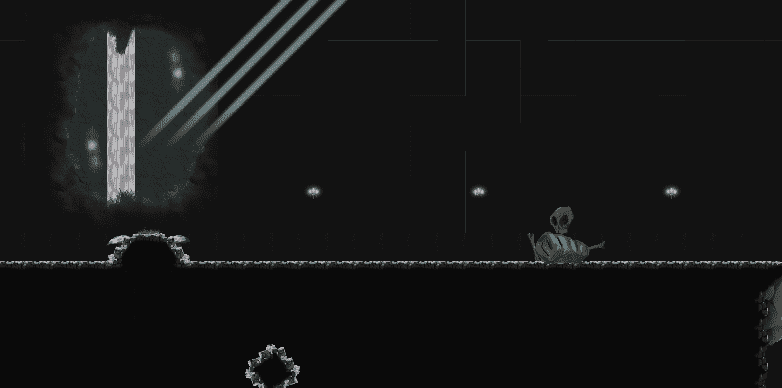

# 移动项目进展报告:级别设计第 1 部分 Unity

> 原文：<https://medium.com/nerd-for-tech/mobile-project-progression-report-level-design-part-1-unity-28c81d7ec789?source=collection_archive---------32----------------------->

在上一次进度报告中，我展示了第一个教程级别([移动项目进度报告:原型想法和级别设计统一](/nerd-for-tech/mobile-project-progression-report-prototype-idea-and-level-design-unity-d94b89d89ec8))的一个戏弄，今天我完成了第二个级别。

第二关从第一关继续，玩家进入一个黑暗的洞穴以到达他的城堡。

在洞穴中，玩家将面对两个新的敌人，喝醉的骷髅和酸液致命的吐酸蜘蛛。

我真的考虑过在这个关卡中加入生命回复或者一个生命值，但是我想让它变得难一点，如果你死了，你必须重新开始这个关卡。虽然从悬崖上死去会稍微宽容一些，玩家只是在关卡开始时重生，而不会和他一起重生敌人。

如果原型变成一个完整的游戏，这可能会改变，也许我可以增加一个难度级别，在更高的难度下敌人会重生。

最后，我介绍了店主，玩家必须用他来购买升级物品，这样他才能穿越洞穴。在这里，玩家必须找到秘密宝石，如果他们想通过游戏中的货币购买升级，否则他们将被提供一个 Unity add 来用真实世界的货币购买所需的宝石。

这里是进入第二层的一个潜行高峰。

满级

店主

快速飞越

下一个也是最后一个关卡可能是到达城堡前的快速 boss 关卡。