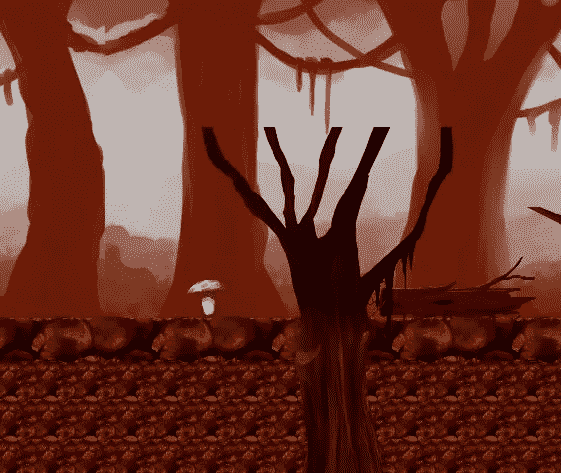
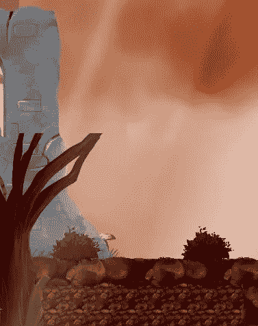
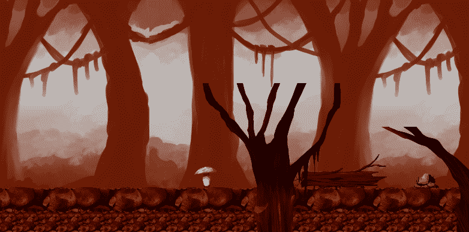
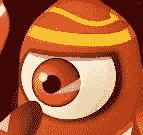

# 移动项目进展报告:级别设计第 2 部分 Unity

> 原文：<https://medium.com/nerd-for-tech/mobile-project-progression-report-level-design-part-2-unity-479e4417aa2a?source=collection_archive---------18----------------------->

在原型的关卡设计的第 1 部分(=> [移动项目进展报告:关卡设计第 1 部分 Unity](/nerd-for-tech/mobile-project-progression-report-level-design-part-1-unity-28c81d7ec789) )，我完成了前两个关卡。

第一级是森林环境中的快速教程。从那里玩家进入第二关，致命的洞穴，在那里玩家被介绍给店主和几个新的敌人。

现在这个第三级我决定做一个 boss 级。环境是城堡的沼泽。在这里，玩家必须杀死老板才能前进，并从店主那里得到钥匙，让他进入城堡并保存它。

> llevel 3 预告

**关卡飞越**

**快看 Boss】**

完成第三关后，现在是时候把所有的事情都联系起来，完成最后的工作，然后把原型放到谷歌商店和网络上。