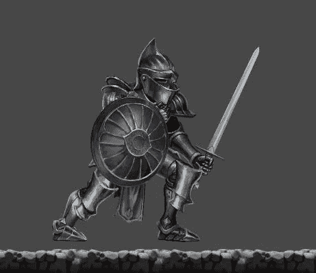
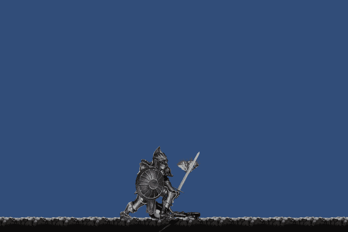

# 移动项目进度报告:新的可玩角色统一

> 原文：<https://medium.com/nerd-for-tech/mobile-project-progression-report-new-playable-character-unity-253b21efbf?source=collection_archive---------39----------------------->

今天我决定使用旧的播放器模式，并使用一个新的。老骑士有点僵硬，几乎毫无生气。他的动画还过得去，也只是僵硬。

不是对自己苛刻，我不是艺术家，所以我外包使用 Unity 资产商店寻找一些很酷的动画好看的骑士。
我找到了这个:[中世纪骑士——脊柱 2D](https://assetstore.unity.com/packages/3d/animations/medieval-knight-spine-2d-189898) ，这个资产是由[皇冠幻想工作室](https://assetstore.unity.com/publishers/52644)完成的。

这是模型。骑士看起来更令人生畏，只是比老型号更适合。

以下是不同的动画效果。

这个新模型可以空中攻击，有一个可以用来攻击和阻挡的盾牌，一个新的翻滚动画，一个躲闪动画，甚至一个吃/从地板上抓取物品的动画。

我希望你喜欢这个新的角色模型，如果你不喜欢，请告诉我。