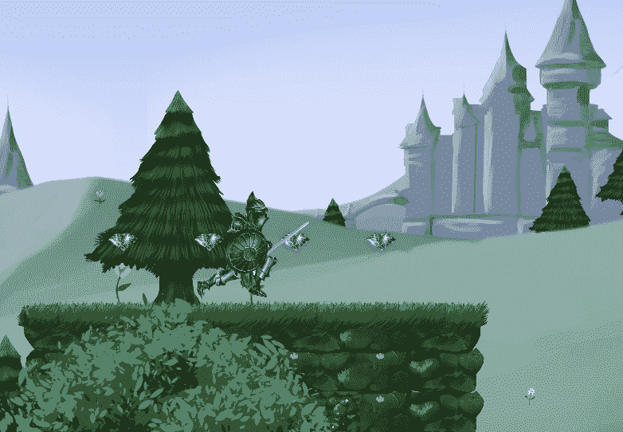
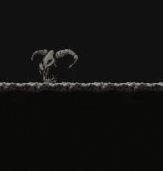
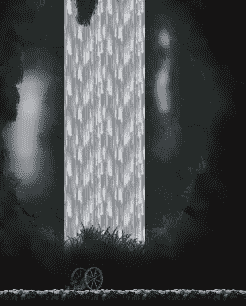
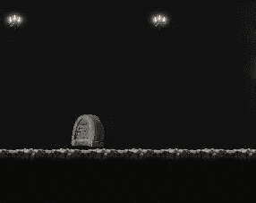
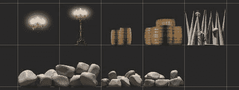
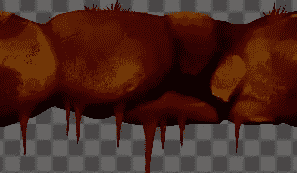
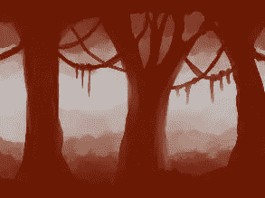
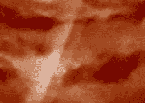

# 移动项目进展报告:原型理念和层次设计的统一

> 原文：<https://medium.com/nerd-for-tech/mobile-project-progression-report-prototype-idea-and-level-design-unity-d94b89d89ec8?source=collection_archive---------25----------------------->

继续我在最后一份进展报告中完成的工作(在这里查看:[移动项目进展报告:UI Unity](/nerd-for-tech/mobile-project-progression-report-ui-unity-a7959967eb59) )，我想创建一个原型，在实现任何新功能之前，它将在谷歌商店上市。

> 原型观念

我将为原型创建三个级别。这个原型的主要目的是展示玩家将经历的一些敌人类型和生物群落。

我们穿着闪亮盔甲的骑士将从森林进入，他的目标是到达城堡，将王国从诅咒中拯救出来。

经过森林后，他将进入一个洞穴，这个洞穴将带他进入已经变成地狱的王国。

> 生物群落

第一级几乎完成了，所以我将展示它的一部分，它将主要是一个教程。

森林

这里是其他生物群的一些截图。

在我完成原型之后，我将完成店主，并创建一些统一的广告，最后上传到谷歌商店进行测试。