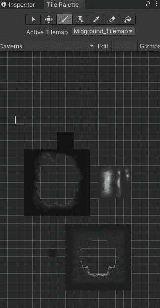
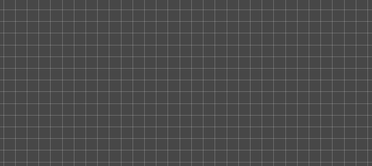
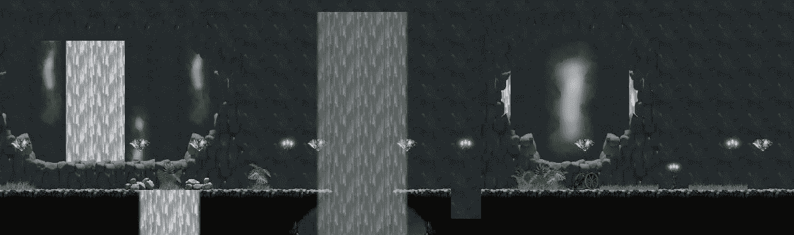
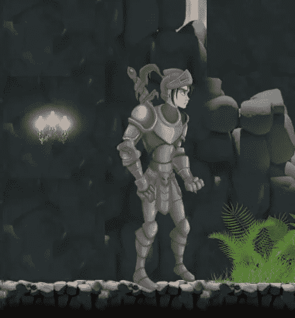

# 移动项目进度报告:Tilemaps & Player 设置 Unity

> 原文：<https://medium.com/nerd-for-tech/mobile-project-progression-report-tilemaps-player-setup-unity-ff4e0d0a8a00?source=collection_archive---------25----------------------->

自从我们上次的进度报告([你可以在这里查看](https://novusxdev.medium.com/mobile-project-progression-report-going-mobile-in-unity-23d000648e3f))，我取得了很大的进步，主要是在环境建设和玩家设置方面。

这个项目是一个 2D 动作/平台，所以我依靠 tilemaps 来构建环境。

> Tilemaps

2D tilemaps 是非常有趣的工作，他们允许建立一个巨大的环境与努力。



使用[托盘](/nerd-for-tech/tip-of-the-day-tile-maps-101-unity2d-c59aadc999e4)窗口，我添加了几个托盘。一个用于地面，一个用于洞穴，一个用于[动画瀑布](/nerd-for-tech/tip-of-the-day-animated-tile-pallets-unity2d-3650ba894517)，一个用于前景物品，例如桶，一个用于收藏品(我将使用预制笔刷来帮助绘制收藏品)。



绘画

使用 Unity 的 2D Tilemaps 构建环境就像在画布上绘画一样。它允许如此多的创造力。



上面的图片是我准备用来设置玩家和敌人的原型阶段的快照。

> 播放器设置

玩家将是一个中世纪的骑士，他的目标是到达城堡，并杀死一路上侵扰他家的怪物。



玩家骑士

我添加了下面的动画，并依靠他的刚体 2D 来控制他的运动。


球员运动

```
private void Movement()
    {
        _xHorizontal = Input.GetAxisRaw("Horizontal");if (_isGrounded)
        {
            if (Input.GetButtonDown("Jump"))
            {
                _rb2D.velocity = Vector2.up * _jumpForce;
            }_isJumping = false;
        }
        else
        {
            _isJumping = true;
        }
    }
```

接下来，设置敌人和攻击系统。