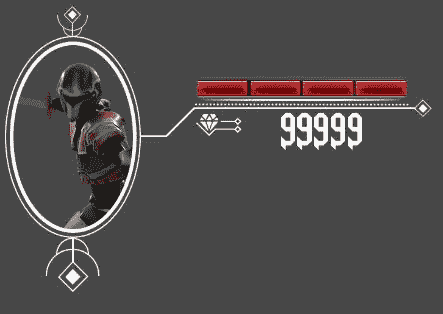
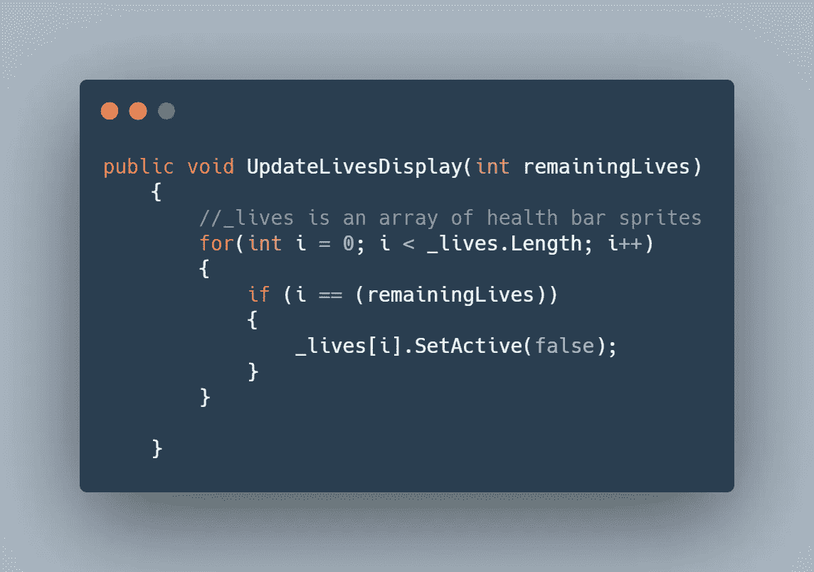
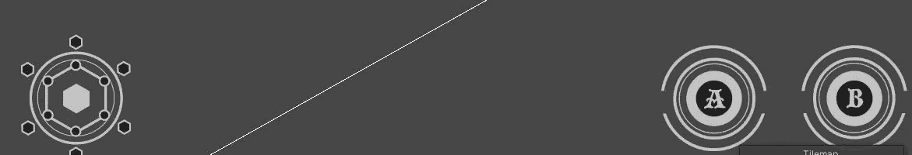
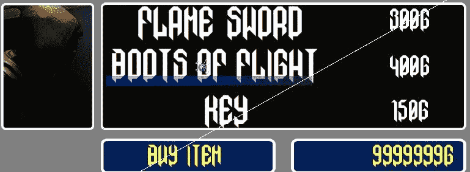
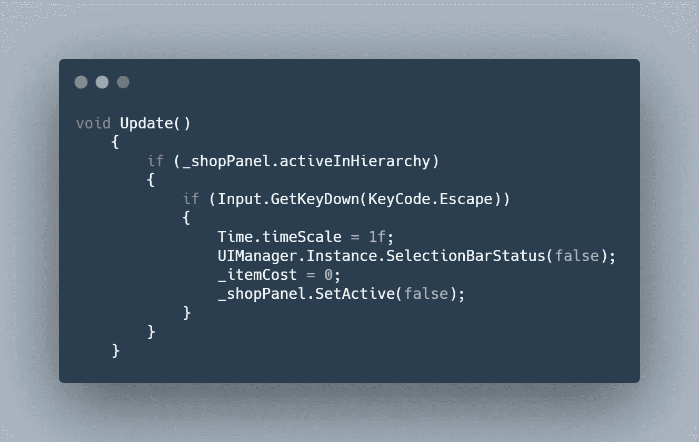

# 移动项目进展报告:UI Unity

> 原文：<https://medium.com/nerd-for-tech/mobile-project-progression-report-ui-unity-a7959967eb59?source=collection_archive---------18----------------------->

继续我们上次进度报告中停止的地方([移动项目进度报告:新的可玩角色 Unity](/nerd-for-tech/mobile-project-progression-report-new-playable-character-unity-253b21efbf) )，是时候开始创建游戏 UI 了。

游戏 UI 包括玩家 HUD 和店主菜单。

> P 层 HUD

***UI 元素:***

*A .玩家生命值和钻石数*
这基本上是向玩家显示他们还剩多少生命值，以及他们收集了多少钻石。

控制健康栏的代码如下:

*B .移动控制*
在左侧玩家将可以移动骑士，在右侧有两个按钮，一个用于跳跃，另一个用于攻击。稍后可能会添加更多内容

在游戏中，它看起来像这样== >

平视显示

***店铺保管员菜单:***

商店老板是游戏的商店，将允许玩家购买不同的物品，它将连接到统一广告以后。目前它包含三个项目。

店主

店主开门和关门的代码= >

接下来，添加 Unity 广告和游戏关卡。