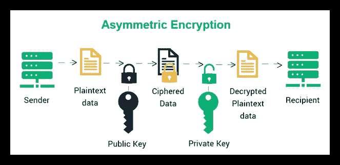

# 移动安全基础:学习 OpenSSL 代码签名

> 原文：<https://medium.com/nerd-for-tech/mobile-security-fundamentals-code-signing-859bd86c90de?source=collection_archive---------11----------------------->

作为一名移动开发人员，在构建或部署应用程序时，您可能会努力处理代码签名。但是在尝试修改一些你并不真正理解的配置之后，所有的错误都消失了！虽然这绝不影响你开发一个优秀的移动应用，**但了解我们为什么需要代码签名以及它是如何工作的**还是很有意思的。

不像在服务器上运行的代码——通常是完全由你自己控制的设备，**让你的代码在用户端运行**并不安全，比如网络应用和移动应用。事实上，您很难知道代码是否与您应该从用户设备上运行的代码相同。

例如，我们想要“ThoughtWorks 是一家好公司”的文本。在屏幕上显示，但它可以是“ThoughtWorks 是一家好公司”。但 SunnyCorp 是个更好的公司。如果我们的代码在发出后被修改。当 HTTPS 还没有被广泛应用时，类似的场景经常发生——你可能会看到你的 ISP 在网页中注入一些广告。

一个好消息是，由于 HTTPS 在网站中的使用，目前很难看到这种奇怪的情况。一个现代化的浏览器将帮助用户建立一个安全的连接，只加载你交付的可信内容。

然而，移动应用程序不同于网页，因为没有服务器根据用户的请求发送你的代码。相反，用户从某个地方下载您的代码包，并将其安装在设备上。因此，从你发布你的移动应用的那一刻起，你似乎无法确保你的应用不会出现意外——**有人可能会修改你的软件包，甚至“好心”为你的用户构建一个新版本**。

放轻松。这就是代码签名要避免的。因此，让我们深入代码签名，看看它是如何工作的。

# 威胁

如前所述，向目标设备交付应用程序可能很危险。最明显的威胁是包的修改，这意味着**包的内容可以在您交付后被修改**。

想一想修改包之后能跟着做什么。

1.  用户可以看到有损你声誉的误导性措辞或数据；
2.  它可以记录敏感和机密信息，并悄悄地发送到修改者的服务器；
3.  像金融交易这样的危险动作，可以在没有用户意图的情况下完成；
4.  …

除了应用程序的完整性，识别开发者的身份也很重要。如果修改包内容的方法被阻止，仍然有可能欺骗手机将你的应用程序升级到新版本——被黑客攻击的新版本继承了你保存的敏感数据，你的应用程序现在正在被修改。

因此，**移动操作系统必须识别软件包的开发者，并确保应用的完整性**。**让我们设计一个简单的机制来更好地理解底层的基本原理。**

# 为我们的虚拟操作系统设计一种机制

为了简单起见，让我们假设:

1.  我们 OS 消耗的 app 包就像一个文件夹(没错，解压缩后，iOS 和 Android 的 app 包都会变成文件夹)；
2.  我们的 OS 在启动一个 app 时会从 app 包中执行一个名为`main.js`的 JavaScript 文件(实际上 iOS 和 Android 确实会从 app 包中寻找一个条目，虽然代码是二进制形式)；
3.  我们的操作系统通过读取`meta.json`文件中的`name`值来识别应用程序(操作系统要求应用程序具有唯一的标识符，以便能够将我们的应用程序与其他应用程序区分开来)；
4.  我们的操作系统的名字是 our OS(这一点都不重要)。

现在，我们的包看起来像这样:

```
/
meta.json
main.js
```

在`meta.json`里面，有我们 app 的标识符。

```
{
 "name": "AnOurOSApp"
}
```

我们的`main.js`只有一条内线，但是我们需要尽力防守那条线！

```
console.log('Protect me');
```

# 帮助 OurOS 识别开发者

这个包太简单了，不能确定谁是开发者。所以为了告诉 OurOS 谁是这个包的作者，我们必须设计 OurOS 从`meta.json`中的`developer`读取作者的标识符。

我们可以在`developer`字段中放置我们的标识符，比如‘sunny @ thoughtworks ’,这样 OurOS 就可以知道这个包是(宣布是)由我们创建的。

```
{
 "name": "AnOurOSApp",
 "developer": "sunny@thoughtworks"
}
```

众所周知，公告相当脆弱，因为每个人都可以将同一个文件放入另一个包中，并说该应用程序是你的。

该如何应对？像这样附加一个链接到包裹的秘密怎么样:

```
{
 "name": "AnOurOSApp",
 "developer": "sunny@thoughtworks",
 "secretKey": ".ZczU9uQbBXx_eaivWJxAHxBc4MGwcqQ!zdPBdB7Rp@4c_PbgUWXr!yGQQqfXgJdPyp@2Kyq*eaXmq4rGVe8iCG.63Y8_EiRuk7k"
}
```

如果我们是唯一知道“sunny@thoughtworks”秘密的人，其他人就不能冒充我们！

但是坚持住。因为每个人都可以下载和阅读你的包，在你发布它之后，秘密就泄露了！

它不能打败聪明的我们。我们知道有一个名为非对称加密的算法家族(如果你不知道的话，请参阅本文)。我们保存私钥并用它加密一些文本。**如果 OurOS 用我们的公钥成功解密了加密文本，那么这个包就证明是我们自己创建的。**原因显而易见，只有对应的私钥才能产生公钥可以解密的加密文本。我们通常称这种行为为签名。



让我们假设每个包都需要加密‘OurOS ’,并将加密的文本插入到`meta.json`中，以便以后验证。当然，我们需要将我们的公钥附加到我们的包中。我们可以选择 RSA，这是一种经典的非对称加密算法。

借助 openssl 轻松创建 RSA 私钥。将创建一个名为`private_key.pem`的文件。

```
> openssl genrsa -out private_key.pem
```

并获得相应的公钥:

```
> openssl rsa -in private_key.pem -pubout > public_key.pub
```

然后，用私钥加密‘OurOS ’,并将签名和公钥放入我们的包中:

```
> echo 'OurOS' | openssl rsautl -sign -inkey private_key.pem -out signature.txt/
meta.json
main.js
signature.txt
public_key.pub
```

启动 app 时，OurOS 会在 OpenSSL 的帮助下，用附带的 RSA 公钥解密加密文本。

```
> openssl rsautl -in signature.txt -verify -pubin -inkey public_key.pub
OurOS
```

结果就是‘OurOS’。除了我们没有人能在上面签名！没有秘密泄露！

# 颁发证书

但是，如果攻击者将附加的公钥替换为自己拥有的公钥呢？然后，他可以用他的私钥签署‘OurOS ’,它肯定会通过 OurOS 检查，因为它不知道这是谁的密钥。因此，公钥可以欺骗你！

```
/
meta.json
main.js
signature.txt // replaced by the signature encrypted by the attacker
public_key.pub // replaced by the attacker's key
```

我们可以从 TLS/SSL 中学到一些东西来解决这个问题。首先，TLS/SSL 要求客户端通过向客户端提供证书来验证公钥是否属于特定的域。然后**客户端应该验证证书，以决定它是否可以信任证书中列出的公钥**。

同样，我们需要建立一个服务来为开发者签署证书。但是，在此之前，让我们设计一下我们的证书应该包括哪些内容:

1.  应用程序名称或包标识符，用于说明证书的颁发对象
2.  解密加密文本的公钥
3.  由可信机构(如我们)生成的上述两者的签名。

要颁发证书，需要一对私钥/公钥。简单来说，我们可以强制 OurOS 总是使用同一个公钥来验证 app 证书。假设证书签名可以被解密以获得与包标识符和公钥相同的值。在这种情况下，这意味着我们是这个证书的发行人。

为证书签名生成新的私钥(我们需要更长的密钥来签名更大的内容):

```
> openssl genrsa -out cer_private_key.pem 8192
```

获取公钥并将其存储在 OurOS 的每个发行版中:

```
> openssl rsa -in cer_private_key.pem -pubout > cer_public_key.pub
```

我们的证书的一部分应该是这样的(例如 JSON 格式):

```
{
"package": "AnOurOSApp",
 "publicKey": "-----BEGIN PUBLIC KEY-----\nMIIBIjANBgkqhkiG9w0BAQEFAAOCAQ8AMIIBCgKCAQEAvJ9GymWXeFxGREgSMNoj\nnuBYfazpJxeIOy/0xXI368oHnOTDwaUqqxmPbobKGhzuoG8OuMw4Q1BohTxAofql\nCRVxoPSL/dB1gAf8hs0uUrRiBLVnw2jfDYiuDJT4RpqVBDb+JZ67q7HgjdND9raM\nHQMxCnwHCoUEkC4230XTZzMEUmfDD84gHzgyLXIL/meZtWtqUgkyNMj7/zJLosYR\nMqCKR+2an1wgTLh0U0k/V/8DW5sq5trmeuaSL22lbsbZSMKf4W/6acATtdOKHV2O\nL2tEDCKkfXy/JlUOdqYukxZLsUgr5dptgIQkTlxYD7TFvGp48leLjwXxvowBUjde\nbwIDAQAB\n-----END PUBLIC KEY-----"
}
```

对这个 JSON 文件进行签名，并将签名保存到`cer_signature.txt`中:

```
> openssl rsautl -sign -inkey cer_private_key.pem -in certificate.json -outcer_signature.txt
```

看，这里有两对不同的钥匙。我们强制 OurOS 使用的一个是颁发和验证证书，另一个证书中列出了其公钥，需要 OurOS 检索，然后使用它来验证整个 app 包。

作为一个可信的权威，当一个开发者来找我们时，我们应该为他生成一对密钥和一个证书。为了对同一个包标识符负责，我们不应该颁发两个不同的证书。

作为开发人员，在获得证书和私钥后，我们可以继续用那个密钥加密‘OurOS ’,并将我们的证书放入包中。

```
/
meta.json
main.js
signature.txt
certificate.json
cer_signature.txt
```

所以对于 OurOS，它可以先验证证书，然后从证书中检索公钥。现在，OurOS 可以说经过验证的公钥属于被授权签署应用程序的开发者。

```
> openssl rsautl -in cer_signature.txt -verify -pubin -inkey cer_public_key.pub
{
   "package": "AnOurOSApp",
   "publicKey": "-----BEGIN PUBLIC KEY-----\nMIIBIjANBgkqhkiG9w0BAQEFAAOCAQ8AMIIBCgKCAQEAvJ9GymWXeFxGREgSMNoj\nnuBYfazpJxeIOy/0xXI368oHnOTDwaUqqxmPbobKGhzuoG8OuMw4Q1BohTxAofql\nCRVxoPSL/dB1gAf8hs0uUrRiBLVnw2jfDYiuDJT4RpqVBDb+JZ67q7HgjdND9raM\nHQMxCnwHCoUEkC4230XTZzMEUmfDD84gHzgyLXIL/meZtWtqUgkyNMj7/zJLosYR\nMqCKR+2an1wgTLh0U0k/V/8DW5sq5trmeuaSL22lbsbZSMKf4W/6acATtdOKHV2O\nL2tEDCKkfXy/JlUOdqYukxZLsUgr5dptgIQkTlxYD7TFvGp48leLjwXxvowBUjde\nbwIDAQAB\n-----END PUBLIC KEY-----"
}
```

并重复这些步骤来解密加密的文本。是‘欧洛斯’。我们做到了！

# 保护完整性

现在，OurOS 已经成功确定了授权开发者。但是，如果攻击者改变了`main.js`的内容呢？我们花了很多努力来确保签名是由授权的开发人员创建的，但这并不意味着开发人员创建了其余部分。

与其给静态文本签名，不如给代码签名？**如果我们解密后在包中得到相同的代码，那么这个包无疑是由授权开发者签名的。**如果有人修改了代码，解密结果将与当前代码不符。然后，OurOS 应该会阻止该应用程序启动。

```
> openssl rsautl -sign -inkey private_key.pem -in main.js -out signature.txt> openssl rsautl -in signature.txt -verify -pubin -inkey public_key.pub
console.log('Protect me'); // If the content of main.js is different, the package should be hacked
```

为了支持更多的代码行，我们可以**集成一个哈希算法来生成代码指纹，然后签署指纹来代替**。这样做是必要的，因为非对称加密是如此的消耗。

```
> md5 main.js | openssl rsautl -sign -inkey private_key.pem -out signature.txt> openssl rsautl -in signature.txt -verify -pubin -inkey public_key.pub
eac097dc6888a4246bcf11f7ba4c3266> md5 main.js
eac097dc6888a4246bcf11f7ba4c3266 // It matches!
```

在我们做了上述所有改进后，OurOS 可以为我们检查应用程序的合法性。干杯！

# 回到现实世界

虽然 OurOS 的包验证机制非常简单，但它几乎涵盖了 iOS 和 Android 遵循的所有基本步骤！所以这就是为什么你需要一个证书和私钥来为真实设备构建移动应用。

代码签名在移动安全中起着至关重要的作用。但是，**无法应对重新打包攻击**——攻击者对你的包进行逆向工程，添加一些有害代码，然后用自己的证书和私钥对代码进行签名。你无辜的后端可能会将机密数据传输到重新打包的应用程序中。

**下面的文章将介绍一些标准技术来保护我们的数据不被应用程序重新打包。向我订阅更新。**