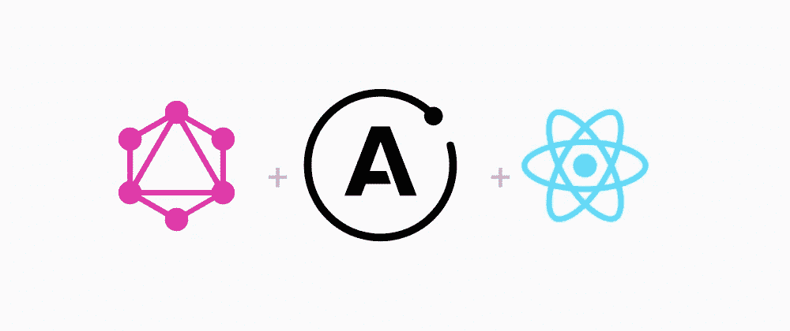
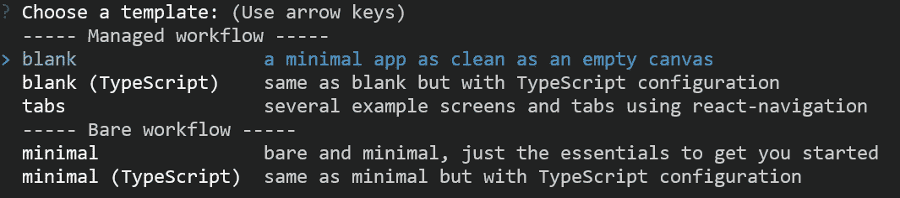
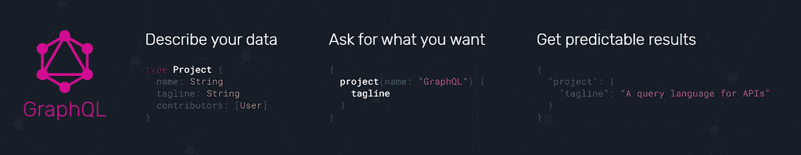
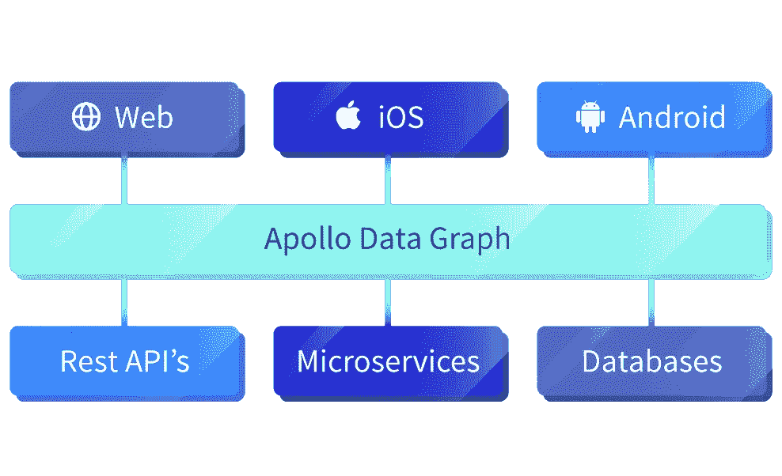

# 移动、网络应用？React Native 入门。API？使用 Apollo GraphQL。

> 原文：<https://medium.com/nerd-for-tech/mobile-web-apps-get-started-with-react-native-api-use-apollo-graphql-71ab384a8be7?source=collection_archive---------0----------------------->

联合:GraphQL、Apollo 和 React Native(由 [Freecodecamp](https://www.freecodecamp.org/news/content/images/size/w2000/2020/04/cover-3.png) 提供)

我从事 web 开发已经一年多了，当我遇到 React、React Native、GraphQL API 和 Apollo GraphQL 时，我对它们能做什么以及能节省多少时间感到非常敬畏！哇，等等，等等，不要被他们的美丽吓到了。这个博客将让你了解什么是 React Native，GraphQL 如何优于 Rest API，以及 Apollo GraphQL(客户端)的用途。

# **什么是原生应用？**

> 本机应用程序被编译成运行 CPU 的机器语言。例如，Windows 和 Mac 可执行应用程序是 x86 机器语言，而移动应用程序是基于 ARM 的(参见 [x86](https://www.pcmag.com/encyclopedia/term/x86) 和 [ARM](https://www.pcmag.com/encyclopedia/term/arm) )。(来源: [PCMAG](https://www.pcmag.com/encyclopedia/term/native-application#:~:text=An%20executable%20program%20coded%20in,(see%20x86%20and%20ARM).) )

# React Native —使用 React 构建原生应用的框架。

正如广泛宣传的那样，react-native 将本机开发与 react(一个用于构建用户界面的 JavaScript 库)结合在一起。它支持创建纯本地应用，映射到平台的 UI 元素。因此，无论是 Web、iOS 还是 Android，只需编写一次代码就可以享受了！听说过 [Instagram](https://instagram-engineering.com/react-native-at-instagram-dd828a9a90c7#.3h4wir4zr) ？React Native 目前正在 Instagram、特斯拉、 [Uber Eats](https://eng.uber.com/ubereats-react-native/) 、 [Discord](https://blog.discord.com/how-discord-achieves-native-ios-performance-with-react-native-390c84dcd502) 、著名网站建设者 [WiX](https://www.wix.com/mobile/wix-app) 上使用。

使用 React Native 的一个优点是可以选择利用 [**Expo**](https://expo.io/) 。世博会的工具和服务，例如:

1.  **模板:**懒？Setup React native [(带 web)](https://github.com/necolas/react-native-web) &导航带‘tabs’模板。

Expo CLI 的可用模板

1.  **社交认证:**启用脸书和谷歌原生 SDK 登录，或支持任何基于浏览器的认证流程。
2.  **推送通知:**用几行 JavaScript 发送和接收跨平台的推送通知。
3.  **图标:**font awesome&ion Icons 顶部的一组图标。
4.  **原生图形:** Expo 包含一个兼容 WebGL 的 API，名为 EXGL。

很酷，对吧？在浏览器里试试:[https://snack.expo.io/](https://snack.expo.io/)

了解和探索更多关于 [React 原生教程](https://reactnative.dev/docs/tutorial) & [Expo 文档](https://docs.expo.io/)

# **GraphQL 来了！休息时间结束了。**

> GraphQL 是一种用于 API 的查询语言，是一种服务器端运行时，用于通过使用用户定义的数据类型系统来执行查询。GraphQL 不依赖于任何特定的数据库或存储引擎，而是由您现有的代码和数据提供支持。

图片来自 [GraphQL](https://graphql.org/)

**graph QL 相对于 Rest API 的主要优势:**

1.  使用 REST API，人们通常会通过访问多个端点来收集数据，比如说/shop/<id>来获取初始数据，然后/shop/<id>/items 来获取特定商店可用的所有商品，在 GraphQL 中，向 GraphQL 服务器发送对单个**端点的简单查询，这将返回所需的 JSON。**</id></id>
2.  不要过度抓取:过度抓取意味着客户端下载的信息比应用程序实际需要的要多。虽然人们可能会点击/shops，唯一的目的是请求商店的名称，但是使用 rest API 获得相同的内容也可能会给出所需内容之外的内容(比如 JSON 中的商店图像)。对于 GraphQL 来说，这种变化是轻而易举的。
3.  容易解决提取不足的问题:提取不足通常意味着特定的端点不能提供足够的所需信息。这可能会升级到一种情况，客户端需要首先下载一个元素列表，然后需要对每个元素发出一个额外的请求来获取所需的数据。GraphQL 使您能够在一个请求中获得所有这些，而不是命中多个请求。

了解有关 GraphQL 以及如何使用它的更多信息

# **阿波罗 GraphQL(客户端)**

> [通过将 API、数据库和微服务组合成一个可以使用 GraphQL 查询的数据图，简化应用开发。](https://www.apollographql.com/docs/react/)

现代建筑管理由[阿波罗 GraphQL](https://www.apollographql.com/)

Apollo 是行业标准的 GraphQL 实现，提供了将现代应用程序连接到云的数据图形层。

> [**Apollo Client** 是一个全面的【JavaScript 状态管理库，让你可以用 GraphQL 管理本地和远程数据。](https://www.apollographql.com/docs/react/)

Apollo 客户端的功能:

*   **声明性数据获取:**不需要手动跟踪加载状态，只需编写查询并让它处理其余的。
*   **缓存:**通过直接查询缓存，更容易进行仅限本地的修改。
*   **本地状态:**用一个 API 管理本地和远程获取的状态。
*   **专为现代 React 设计:**利用最新的 React 特性，比如钩子。
*   **通用兼容:**使用任何构建设置和任何 GraphQL API

从([apolloapp.org](https://apolloapp.org/))创建阿波罗应用程序

在网上搜索初学者工具包？我怀疑你会找到比 [Create Apollo App](https://apolloapp.org/) 更好的东西，它包含了一个 web 应用程序或原生移动应用程序的启动程序，甚至是一个通用应用程序，以及更多支持服务器的应用程序。

我还做了一个 React Native(用 react-native-web)，Expo，Apollo Client & GraphQL starter。在[React-Native-With-Web-ApolloGraphQL-starter](https://github.com/digitalPlayer1125/React-Native--With-Web--ApolloGraphQL-starter/)找到它

这就是我现在所拥有的。希望这有所帮助！