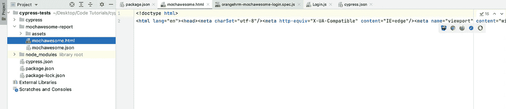
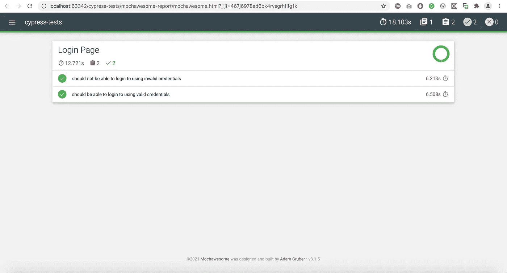
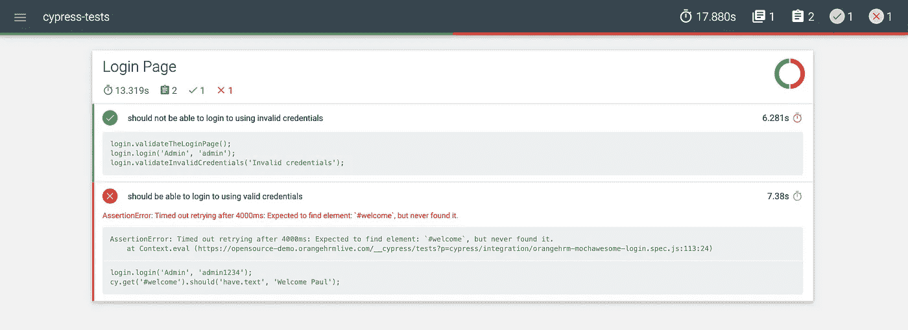
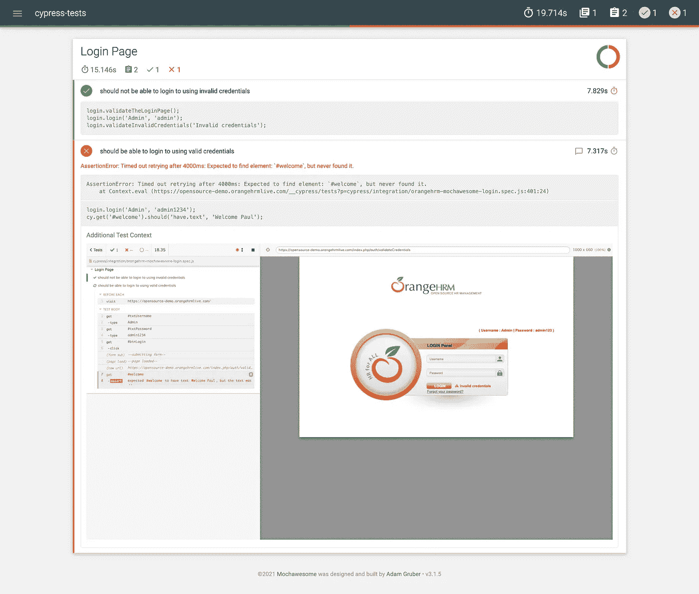

# Mochawesome 报告与 Cypress 的集成

> 原文：<https://medium.com/nerd-for-tech/mochawesome-report-integration-with-cypress-e9f5c72c01a3?source=collection_archive---------3----------------------->


**什么是摩卡牛逼**

Mochawesome 是为 mocha 定制的 Javascript 测试报告程序。这是一个简单，圆滑，现代风格，可爱的图表，测试和套件嵌套支持，显示之前或之后的挂钩，检查在线测试代码。它对失败的测试进行跟踪，并支持为测试添加的上下文信息。它只过滤显示你想要的测试。【https://www.npmjs.com/package/mochawesome 号

因此，让我们使用命令提示符安装它。

```
npm i --save mochawesome
```

我创建了一个测试**orangehrm-moch awesome-log in . spec . js**

```
import {Login} from "../pages/Login";
const login = new Login();

describe('Login Page',()=>{
    beforeEach('navigate to login page',()=>{
        login.navigate();
    })
    it('should not be able to login to using invalid credentials',()=>{
        login.validateTheLoginPage();
        login.login('Admin','admin');
        login.validateInvalidCredentials('Invalid credentials');
    })
    it('should be able to login to using valid credentials',()=>{
        login.login('Admin','admin123')
        cy.get('#welcome').should('have.text','Welcome Paul');
    })
})
```

然后通过以下命令运行该命令:

```
cypress run --spec "cypress/integration/orangehrm-mochawesome-login.spec.js" --reporter mochawesome
```

一旦它被执行，您就会在下面的路径中看到 HTML 和 JSON 报告:moch awesome-report/moch awesome . HTML



当我们打开 HTML 报告时，您可以看到如下图像:



让我测试失败并打开 HTML 文件:



这份报告真的很棒，对吧，☺☺☺☺

现在是时候用失败截图把报告做得很详细了。将以下代码片段添加到 describe 块中。

```
Cypress.on('test:after:run', (test, runnable) => {
    if (test.state === 'failed') {
        const screenshot = `screenshots/${Cypress.spec.name
        }/${runnable.parent.title} -- ${test.title} (failed).png`;
        addContext({ test }, "/cypress-tests/cypress/"+screenshot);
    }
});
```

Cypress 在每个测试用例执行后检查失败，如果失败，它从给定的路径中获取截图并将其添加到报告中。

完整详细的代码:

```
import {Login} from "../pages/Login";
const login = new Login();
const addContext = require('mochawesome/addContext');

describe('Login Page',()=>{
    beforeEach('navigate to login page',()=>{
        login.navigate();
    }) Cypress.on('test:after:run', (test, runnable) => {
        if (test.state === 'failed') {
            const screenshot = `screenshots/${Cypress.spec.name
            }/${runnable.parent.title} -- ${test.title} (failed).png`;
            addContext({ test }, "/cypress-tests/cypress/"+screenshot);
        }
    });

    it('should not be able to login to using invalid credentials',()=>{
        login.validateTheLoginPage();
        login.login('Admin','admin');
        login.validateInvalidCredentials('Invalid credentials');
    })
    it('should be able to login to using valid credentials',()=>{
        login.login('Admin','admin1234')
        cy.get('#welcome').should('have.text','Welcome Paul');
    })
})
```

然后再次运行测试并打开 HTML 报告:

