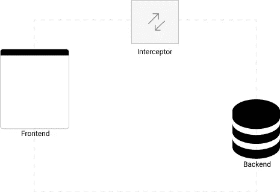
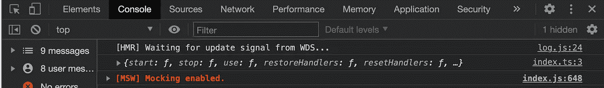
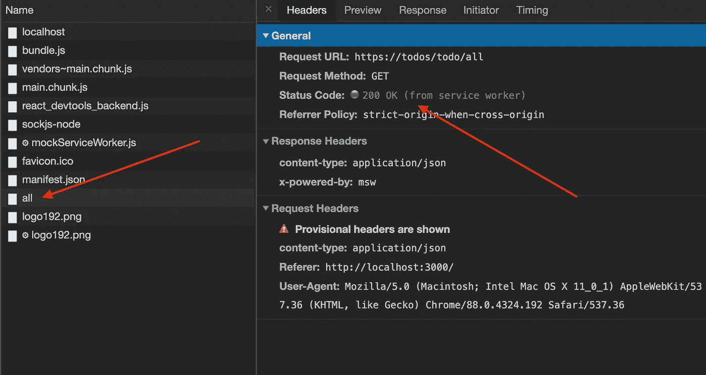
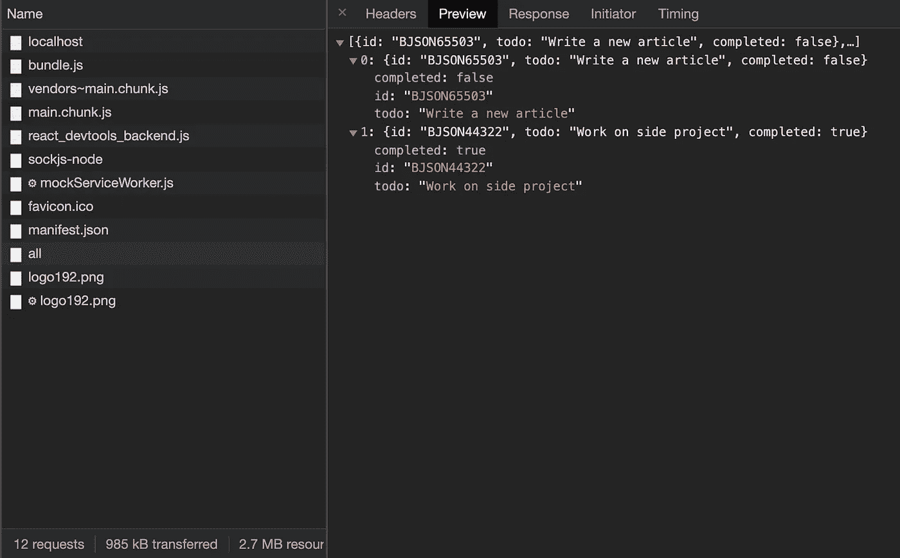

# 模仿前端开发人员的 API

> 原文：<https://medium.com/nerd-for-tech/mocking-apis-for-frontend-developers-e8c1fadc8f58?source=collection_archive---------6----------------------->



考虑到如今的 web 开发是多么的松散耦合，导致我们的应用程序的前端(主要是 SPA)和后端(API 驱动)的分离，并且经常由不同的团队处理，需要考虑的一个主要问题是 ***“阻塞因素”***

阻碍因素是开发人员花费多长时间等待外部 API 依赖，从而阻止前端功能开发或整个项目。

嘲讽是摆脱这种受阻因素的一种方式。它们易于编写、灵活且无状态(因此重复测试场景更容易)，并最终提供了一种摆脱外部 API 依赖的方法。

模拟允许我们通过指定端点和它给出的响应来模拟后端 API。

## 嘲弄的框架

在本文中，我将演示如何使用 [MSW](https://mswjs.io/) (模拟服务器工作器)来模拟 todo react 应用程序的 API。

> 模拟服务工作器是一个 API 模拟库，它使用服务工作器 API 来拦截实际的请求。— mswjs.io

注意: MSW 是完全框架不可知的，也支持 GraphQL。你应该去看看！

我们开始吧！

我们需要安装城市生活垃圾。

下一步将是建立模拟。为了方便起见，我将 API 操作(如创建、读取等)与模拟服务器本身分开。

就这么办吧。

我们现在可以创建我们的模拟。

如果你熟悉 node.js 的 express 框架，用 MSW 写 REST API Mock 的方式也差不多。

用于客户端模拟所有 rest 端点的服务器工作进程

上面，我们已经定义了所有的 REST APIs 及其响应，如果您注意到，我们的 REST 端点都指向一个 HTTPS 服务器*(API URL 前缀)*。这是因为服务人员将通过 HTTPS 而不是 HTTP 接受服务(请始终注意这一点)。

我们可以附加响应状态，JSON，e.t.c，这很好，类似于我们的 API 的正常行为。

setupWorker 或处理程序尚未启动；因此，服务工作器 API 不会拦截任何请求。我们将在开发模式下启动 worker，因为我们不想在生产甚至是登台时遇到模拟。

就这么办吧。

我们需要做的就是将上面的文件导入到应用程序的入口点。

```
//index.tsimport './server'
```

现在，当我们启动 react 应用程序时，我们应该在浏览器控制台中看到以下内容。



太棒了。

如果我们向 ***"/todo/all"*** 端点发出一个 API 请求，并查看 Network 选项卡，我们将看到一个实际的请求和由服务工作器 API 提供的相应响应。



请求检索 todosDB.json 中的所有 todo，并从服务工作器 API 获得响应

我们将从 todoDB.json 中检索 todos 数据。



todoDB.json 的响应

这是伟大的，因为我们没有我们的后端准备好，等等；作为前端开发人员，我们在开发过程中没有遇到任何阻碍。

关于使用模拟的一个主要问题是维护，因为后端行为可能会快速变化，我们必须维护模拟。这是一个有效的观点，但是如果我们要在前端为这个 API 消费编写测试(我们将在本文的第二部分中做),我们仍然需要维护我们的模拟，考虑到我们的用户不会模拟 fetch 或 Axios，因此我们的测试也不应该这样，如果有一种方法可以在开发服务器和测试服务器之间共享处理程序，从而只维护一个处理程序和 API 操作呢？

我们将在下一篇文章中更深入地探讨 MSW 的威力。

感谢您的阅读。