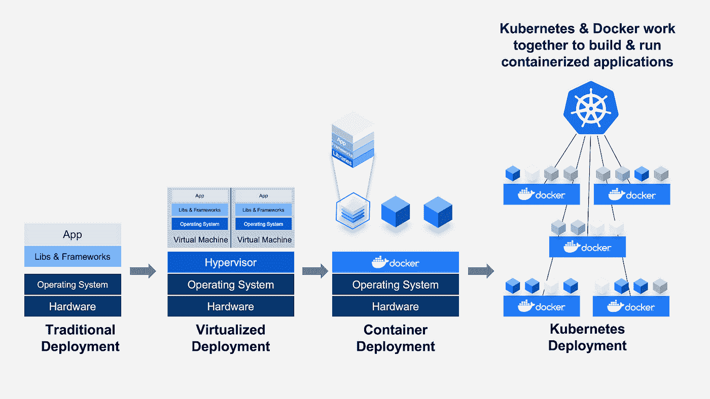

# ML 中的模型部署:概述

> 原文：<https://medium.com/nerd-for-tech/model-deployment-in-ml-an-overview-61abdd9cc40b?source=collection_archive---------19----------------------->

来源:走向数据科学

> 云计算原生计算基金会(CNCF)发现，2019 年绝大多数受访者(84%)在生产中运行容器。这比前一年增长了大约 15%(或者说从 73%增长了 11 个百分点)。当 CNCF 在 2016 年 3 月首次进行调查时，生产容器的使用率仅为 23%。

作为《 [**机器学习**](https://techin3-min.medium.com/what-is-machine-learning-72144e57d6a6) 中的一个新手，从数据清洗、探索性数据分析、特征工程开始，通常结束于模型训练，并通过**烧瓶**进行部署，这总是一个激动人心的旅程。然而，当我们向更可扩展和更高效的已训练模型的部署前进时，各种工具和技术就出现了。

Docker 和 Kubernetes 就是其中的几个！让我们试着对它们做一个概述吧！

所有企业都在增加对机器学习(ML)和深度学习(DL)的使用。在这一点上，一个最重要的问题出现了，这是关于规模和工业化的 ML 部署。而在部署过程中，也需要为模型服务重新创建相同的环境(用于模型训练/开发)。

来源:Docker

为此，像 **Docker** 这样的容器系统提供了一个构建环境的工具，它是可再生的，也是比**虚拟机方法**更轻便的选择。**像 Docker 这样的容器系统提供了一个隔离的环境**，在这里我们可以设置执行提取转换加载(ETL)工作、模型服务或托管交互式 web 应用程序所需的依赖关系。因此，一旦我们指定了代码需要的依赖项，容器框架就会用轻量级的内存来处理管理不同执行环境的工作。

各种弹性容器环境，如**弹性容器服务器(ECS)** 提供了与无服务器功能非常相似的功能。唯一的区别是，这些无服务器的生态系统大多局限于某些运行时，并且还有内存限制，这使得使用深度学习框架有点困难。但是使用 ECS，我们负责设置用于服务模型的实例类型**，并且还可以灵活地使用任何需要的语言和内存**。

使用 Docker，我们通常会创建一个名为" **Dockerfile** 的文件，用于定义应用程序容器的依赖关系。然后，构建“ **Dockerfile”的结果是一个“Docker Image** ”，它打包了运行我们的应用程序所需的所有运行时、代码和库。容器基本上是运行应用程序的实例化图像。

然后，我们可以在弹性计算实例上将映像作为容器运行，尽管这一过程为隔离机器上的不同服务提供了解决方案，但**不提供生产就绪模型部署所需的伸缩性或容错性。**

为此， **Google 提供了一个名为 Google Kubernetes Engine (GKE)的服务来服务 docker 容器**。Kubernetes 是 Google 开发的一个容器编排系统，也是开源的。

Redis Labs 的技术营销经理阿吉特·刘冰提供了 Kubernetes 的五个方面来补充 ML 流程。

“为了将云原生开发和基础设施的灵活性应用于机器学习应用，Kubernetes 提供了五种强大的功能:**可扩展性、GPU 支持、多租户、数据管理和基础设施抽象**，这使它成为数据科学家将 ML 引入生产的最受欢迎的工具，”刘冰说。

简而言之，Docker 非常适合用于跨不同环境复制模型，但大多数情况下，云平台将是一个受限的选择，因为不同的公司使用特定的云平台。最终，它更多地取决于模型的延迟和复杂性的要求。

> 人工智能的巨大帮助在于做出预测，并降低预测的成本。亚马逊 Madhusudan Shekar