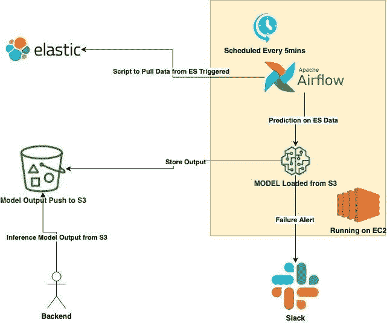
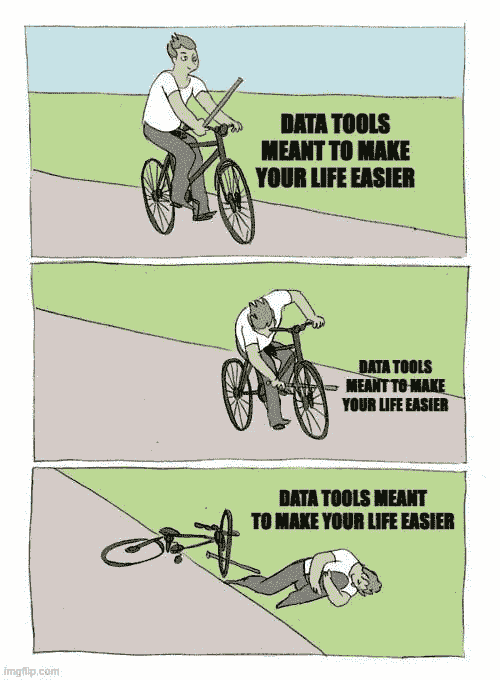
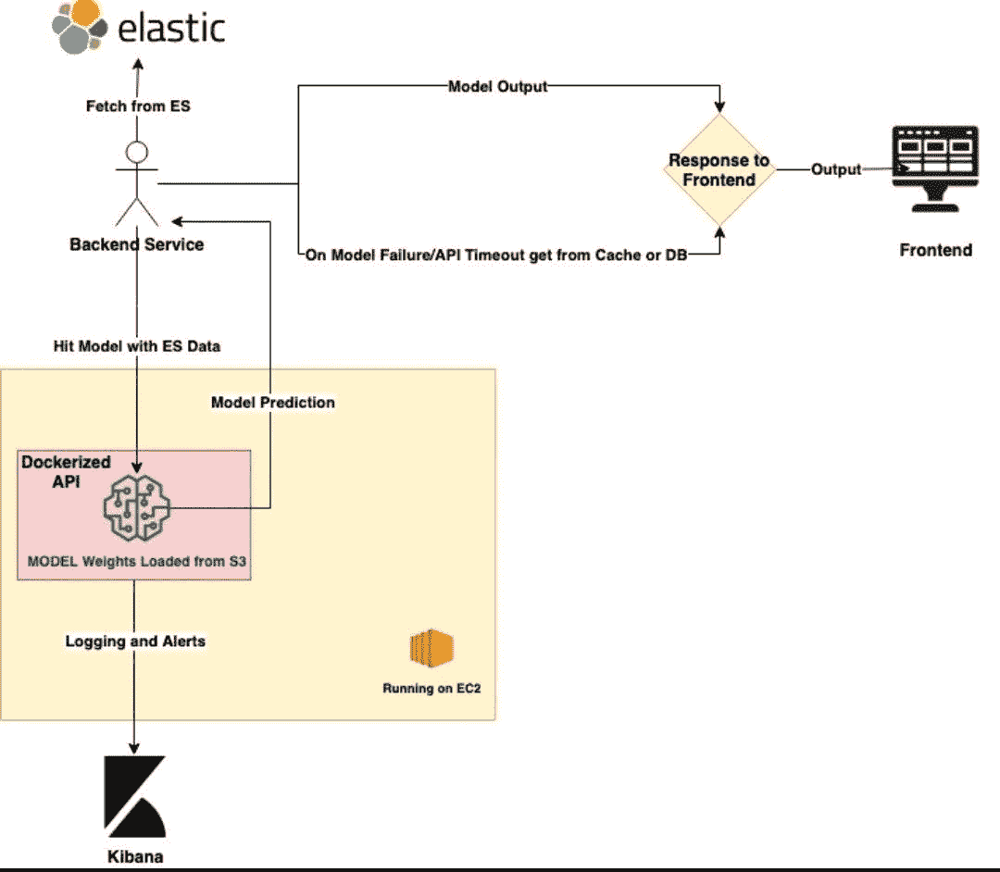

# 数据科学中的模型生产化体系结构设计|成为模型部署设计的专家|设计不仅仅是软件工程师的事情

> 原文：<https://medium.com/nerd-for-tech/model-productionization-architecture-design-in-data-science-become-expert-in-model-deployment-47718f299829?source=collection_archive---------2----------------------->

数据科学家生产模型

许多公司努力将他们的数据科学项目投入生产。

这主要是因为存在巨大的知识缺口，数据科学家很好地理解了模型构建，但缺乏生产技能。原因很简单，这些技能不会在 Youtube 视频上教授，也很难在数据科学课程或 Kaggle 学习方法中接触到。

知识流动

> *本新闻简报的目的是分享我从各种部署中获得的经验。*
> 
> *部署的技术规则:较少依赖∝更快部署*

**让我们通过一个实际问题来了解数据科学模型部署。**我的一个朋友打电话给我，请求帮助他完成用例，并将模型部署到生产中。

呼叫振铃

> 我们对这个问题讨论了一两个小时，以了解制约因素。

## 讨论的约束摘要:

*   数据源是弹性搜索(ES 非常频繁地用新条目更新)
*   实时或接近实时的推理(可接受 10 分钟的延迟)
*   预算低
*   具有回退的最小失效率
*   发生任何故障时的警报系统

> *波斯特了解这些制约因素和问题，他正在努力解决。我提出了一个接近实时(每 5 分钟批量推断一次)的架构(检查下图)，回退到最后一次模型更新(后端从 s3 获取以前的更新结果)，并共享了一个 slack webhook 简单的警报路径。*

批量模型设计

大约两个星期后，他打电话告诉我，🥳的解决方案很有效(情绪非常激动)。以上是经过试验和测试的:低预算和低维护——模型生产设计。

> *咱们讲道理！*
> 
> *以上架构设计如何解决约束*

替代 Sagemaker 批处理推断:这可能是一个很好的选择，但我们没有采用，因为他已经有一个 24x7 运行的 EC2 实例，并且没有得到充分利用。除了上述 5 分钟推理(近实时推理架构)，不使用 Sagemaker 批量推理更安全，而实时推理选项成本更高。

开发熟悉度是构建架构设计时另一个超级重要的因素，EC2 一直是他的乐园。

> *另一个学习点:如果您正在运行一个更新频率为 1 天的模型，并且您希望每次运行时都在新的 EC2 机器上运行任务计算，那么您仍然可以使用上述架构。人们可以关注这个博客来学习“* [*”如何使用 Lambda 定期停止和启动 Amazon EC2 实例？*](https://aws.amazon.com/premiumsupport/knowledge-center/start-stop-lambda-cloudwatch/) *"这将有助于节省 EC2 机器的成本，因为它只运行到计算窗口。*

## 为什么是气流？

Apache Airflow 是一个开源调度程序，用于管理您的日常工作。这是一个很好的工具，可以组织、执行和监控您的工作流，使它们无缝地工作。

气流将在定义的时间间隔内触发从 ES 和预测任务获取数据，对于上述情况，该时间间隔为每 5 分钟。要编写调度器表达式，可以使用 [Crontab。Guru](https://crontab.guru/) (这个表情编写工具很优秀，我在写一个气流任务的时候经常用到)。

## 关于架构的其他推理要点:

*   模型从内存中的 S3 加载以进行推理，因此模型权重不使用本地磁盘存储。建议:我见过许多数据科学家将模型文件保存在机器存储器上，当 EC2 出现问题时，所有文件都会被删除，他们的努力也白费了。始终将 S3 上的模型作为备份“[创建 S3 备份](https://docs.aws.amazon.com/aws-backup/latest/devguide/s3-backups.html)”。也可以查看[数据版本控制(DVC)](https://dvc.org/) 。
*   输出在 S3 被覆盖，后端从 S3 选择模型结果；S3 存储在 AWS 上是可靠且最便宜的。
*   对于警报，slack 是最好的选择，因为它在办公时间总是打开的，当你不在时，你的团队成员可以看到警报，甚至可以添加气流故障和重试电子邮件，但我更喜欢办公室通信工具上的 webhooks 警报:slack/flock/teams。

简单并不总能解决问题

> *我知道有更好的气流组件选择，如 Dagster 或 Perfect 相似性对于体系结构中的其他组件，有新的/可比较的替代方案。但是，在为您的模型管道选择工具时，永远不要忘记熟悉开发的因素。工具越老，支持越好，不能轻视它。*

> "如果我们想在生产中部署一个实时模型呢？"—我的朋友问，就连这里的读者也一定是这么想的。

我有个问题？

## 我们讨论了限制因素，总结如下:

*   从 ES 中获取项目池
*   需要 100 毫秒超时的实时模型输出
*   超时时，模型会退回到缓存版本
*   需要日志记录

以下是实时模型生产化架构设计👇

实时模型设计

## 实时架构的推理和其他要点

*   我已经展示了部署在 EC2 上的 dockerized 模型。它也可以部署在 ECS/SageMaker 上，让您自己选择。
*   对于缓存—个人偏好 [Redis](https://redis.com/) 。
*   [Kibana](https://www.elastic.co/kibana/) 用于记录模型服务中的响应和信息日志
*   对于模型服务，可以使用 [MLFlow](https://mlflow.org/) 、 [BentoML](https://docs.bentoml.org/en/0.13-lts/) 、 [FastAPI](https://fastapi.tiangolo.com/) 、 [Cortex](https://www.cortex.dev/) 等。我更喜欢 BentoML，因为在 10 分钟之内，您将能够通过 HTTP API 端点提供您的 ML 模型，并构建一个 docker 映像，准备在生产中部署。

## 结论

希望，数据科学模型生产化架构设计不再是一个超出教学大纲的问题，它总是比我们所能涵盖的要多得多，但确实要花些时间绞尽脑汁..！

## 我希望你从这篇文章中学到了一些新的东西。如果你喜欢，点击👍或者❤️，并与他人分享。敬请期待下一期！

如果你觉得这篇文章有用，请在 LinkedIn[上联系、关注或支持我。要了解更多关于我的信息，请访问:](https://www.linkedin.com/in/shaurya-uppal/)[此处](https://linktr.ee/shauryauppal)