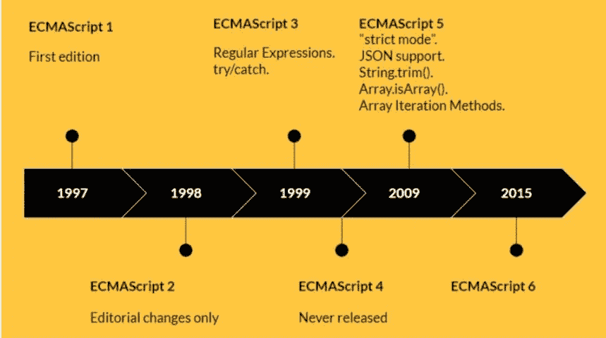
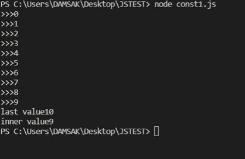
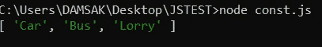
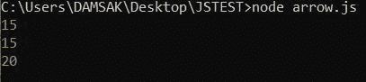
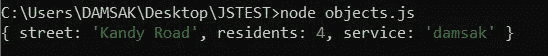
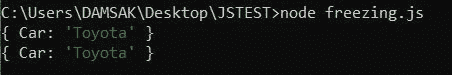
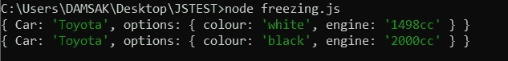

# JavaScript 中的现代概念(第 1 部分)

> 原文：<https://medium.com/nerd-for-tech/modern-concepts-in-javascript-part-1-4f56ffbedbc9?source=collection_archive---------15----------------------->

图 1:JS——来源:谷歌

JavaScript 是一种轻量级的、动态的、基于文本的编程语言，用于客户端和服务器端，以使网页更具交互性。Javascript 最初是在 1995 年以 LiveScript 的名字推出的。后来，随着 Java 的流行，Netscape 改名为 JavaScript。JavaScript 是唯一一种网络浏览器自带的编程语言，也是一种相对容易学习的语言。因此，在过去的几年里，Javascript 的流行程度迅速增加。几乎所有的网络浏览器都包含一个 JavaScript 引擎。Javascript 引擎是用于执行 JavaScript 代码的计算机程序。这些是流行浏览器使用的 JavaScript 引擎。

*   铬合金— V8
*   Mozilla —蜘蛛猴
*   Safari — JavaScriptCore
*   边缘脉轮

## JavaScript 的优势

*   客户端速度快，因为它可以立即在浏览器中运行。
*   互操作性。
*   简单易学。
*   轻松创建吸引人的 web 界面。
*   由于 JavaScript 在客户端运行，减少了服务器负载。
*   经常更新最新功能。

## JavaScript 的缺点

*   安全。当 Javascript 代码在客户端计算机上执行时，很容易被利用。
*   不同浏览器的不同解读。

Javascript 实际上是基于一种叫做 ECMAScript 的标准脚本语言。

## ECMAScript 的演变

ECMAScript 是一种著名的脚本语言，是 JavaScript 的基础。

图 2- ECMAScript 的发展

ES6 或 ECMAScript 6 是对现代 Javascript 的重大变革。

通过这篇文章，让我们讨论 JavaScript 中的一些关键概念，每个开发人员都必须了解这些概念。这些是在最近的更新中引入 Javascript 的一些新变化(尤其是在 ES6 中)。

# 1.范围

变量的作用域用来决定它在程序中的可访问性。这个范围由变量声明的位置控制。在 JavaScript 中有 3 种主要的方法来声明变量——“var”、“let”和“const”。

Javascript 有两个主要范围。

*   **全局作用域:**最外层的作用域是全局作用域，在这个作用域中声明的任何变量都是全局可访问的(可以在程序的任何地方访问)。
*   **局部作用域:**在特定块中声明的变量。这些变量只能在该块中访问。

“let”和“const”关键字有一个块范围，其中“var”关键字仅限于函数范围。

让我们借助一个例子来进一步理解这些范围。考虑下面的代码。

图 1:范围输出 1

该程序将被执行并打印出如图 1 所示的值。

如果我们把变量“k”的类型从 **var** 改成 **let 会怎么样？**这将抛出一个错误，指出值 **k 未定义**。

所以，

> 如果你定义一个变量类型为 let，那么它在作用域之外是不可访问的。

在这种情况下，“k”在 forloop 之外是不可访问的。如果我们把 k 的类型改成 **const** 呢？尽管如此，还是会有误差。

**有用:**避免在两个不同的位置声明相同的变量名。

# 2.常数

如前一节所述，常量具有块范围。常量不能重新声明和重新赋值。常数需要一个初始化式。开发人员必须在同一声明语句中指定该值。

## 它是如何工作的？

常数的声明过程会创建对该值的只读引用。无法重新分配此变量标识符。因此，常量值不能改变。

考虑下面的例子—

让我们创建一个常量数组并添加另一个值。会发生什么？

图 2:常量输出 1

我们可以看到值已经成功添加。

> **“声明为常量的数组和对象是可变的。”**

# 3.箭头功能

ES6 中引入的新功能。这基本上是开发人员编写更短的函数语法的一种机制。箭头函数不能用作构造函数。没有到“this”或“super”关键字的唯一绑定。

## **箭头功能中的“this”关键字**

*   箭头函数不包含“this”的绑定。
*   在箭头函数中，“this”总是代表定义特定箭头函数的对象。

箭头函数可以写成—

图 3:箭头函数的输出

所以我们可以看到语法被简化了很多。

# 4.在 JavaScript 中处理对象

JavaScript 对象是一个可以包含许多值的变量。它们基本上是命名值、属性和方法的容器。要点-

*   如果我们定义一个从另一个模块获取值的变量，我们可以在对象内部使用该变量，而不需要在其中指定任何值。例子—

图 4:对象输出

因此，我们可以看到，即使我们没有在对象内部指定任何值，我们也获得了“SQRT2”的值。

## 动态性能

指的是使用占位符作为键的技术。这用于开发人员在执行时不知道确切密钥的情况。

ES6 之前(两步流程)—

*   创建对象文字
*   然后使用括号符号。

在 ES6 之后—

*   可以直接使用变量作为对象文本中的属性键。

例子—

图 5:动态属性

我们可以看到属性“Key”已经被值“service”所取代。

# 5.在 JavaScript 中冻结

" **Object.freeze()** "是 JavaScript 中用来冻结对象的方法。这将导致—

*   不能更改对象。
*   无法向对象添加新属性。
*   无法删除对象中的现有属性。
*   防止原型被更改。

让我们借助一个例子来理解这一点。

图 6:冻结 Js 对象

现在我们可以看到，即使我们不能改变冻结后的值。

冻结对一个对象中的所有值都有效吗？

考虑这个例子，

图 7:冻结 JS 对象— 2

从上面的输出中，我们可以看到，即使在我们调用“Object.freeze”方法之后，第二级值也发生了变化。

> **Object.freeze 只会冻结第一级值。它不会冻结内部级别的对象。**

本文的第 2 部分将讨论更多与 JavaScript 相关的概念。我使用了由 [Krishntha Dinesh](https://krish-blog.medium.com/) 先生制作的以下视频来收集所需信息。

# 参考

 [## 揭开 JavaScript 变量作用域和提升站点点的神秘面纱

### 在变量中存储值是编程中的一个基本概念。一个变量的“作用域”决定了它何时以及…

www.sitepoint.com](https://www.sitepoint.com/demystifying-javascript-variable-scope-hoisting/)  [## JavaScript 箭头函数

### 组织良好，易于理解的网站建设教程，有很多如何使用 HTML，CSS，JavaScript 的例子…

www.w3schools.com](https://www.w3schools.com/js/js_arrow_function.asp)