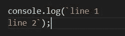
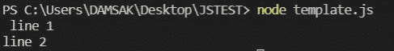
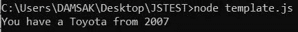
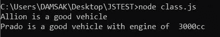
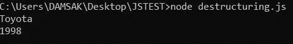
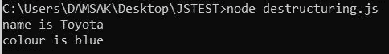
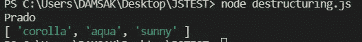

# JavaScript 中的现代概念(第 2 部分)

> 原文：<https://medium.com/nerd-for-tech/modern-concepts-in-javascript-part-2-598bd14faed1?source=collection_archive---------22----------------------->

图 01: Js(来源:谷歌)

通过这篇文章，让我们来讨论 JavaScript 中的一些新概念。这是上一篇文章的延续。因此，我建议您在继续阅读本文之前，先浏览一下本文的第 1 部分。

请访问上一篇文章，作者是—

 [## Javascript 中的现代概念—第 1 部分

damsak.medium.com](https://damsak.medium.com/modern-concepts-in-javascript-part-1-4f56ffbedbc9) 

# 6.模板文字

指允许嵌入表达式的字符串文字。模板文字应该用 **` `** 括起来，而不是用 **" "** 括起来。

**使用模板文字的多行字符串—**

无需使用“\n”即可轻松编写多行字符串

图 1:多行字符串

图 2:多行字符串输出

**表达式插值—**

在普通字符串中嵌入表达式

这会将总和打印为 13。

**嵌套模板—**

图 3:嵌套模板

请参考参考资料一节中的文章，以了解更多关于模板文字的信息。

# 7.班级

JavaScript 类的行为与 Java 类相似。然而，有一些关键的区别。

*   在 Javascript 中，我们必须使用关键字“constructor”而不是类名来定义构造函数。
*   不需要创建一个局部变量来调用 **"this。<variablename>= variablename "**在构造函数内部。
*   轻松覆盖功能。

让我们从一个例子来看这几点。

图 4: Javascript 类

# 8.解构

这是 JavaScript 提供的一个有用的特性，可以从对象中提取属性并绑定它们。

让我们借助一些例子来理解析构对象的行为。

## **访问数值**

图 5:解构 1

我们可以看到，使用对象析构要简单和干净得多。

## 使用析构的另一种方式

现在该方法将打印 196。我们只传递了对象 vehicle，required 方法从对象中提取了必要的属性(上面例子中的“base”)。这消除了使用整个对象的需求。

## 分配默认值

考虑下面的例子，

图 6:默认值

该应用程序打印了 Toyota，因为“品牌”属性在车辆内部很容易获得。但是，车辆内部没有颜色属性。因此，应用程序打印了默认值“蓝色”。

## 用函数进行析构

考虑一个场景，我们需要读取一个文件。

我们可以看到，使用析构的代码更加简洁，对开发人员也更加友好。我们不需要写“fs.readFileSync”。

## 三个点(…)

这是 ES6 中引入的全新功能。这可以用作 Rest 运算符或 Spread 运算符。

## Rest 运算符

基本上是将所有剩余的元素添加到一个数组中。使函数可以接受不确定数量的参数作为数组。

图 6: Rest 操作符

我们还可以使用 rest 操作符将值从一个数组复制到另一个数组。

## 传播算子

考虑这样一种情况，我们需要在某种列表中包含一个对象的所有元素。在这种情况下，我们可以使用 Spread 运算符。

# 9.承诺

这是 JavaScript 中处理异步操作的一种方式。承诺基本上是我们将来要做某事的保证。承诺的价值在创造的时候是未知的。这个值将在将来的某个时候提供。

承诺的主要状态

*   **待定**:承诺成功或失败前的状态。
*   **解决**:操作成功完成。
*   **被拒绝**:操作失败。

图 7:承诺

让我们试着用一些例子来理解承诺。考虑这样一种情况，我们需要从一个网站获取数据，

## 为什么我们要用承诺来包装这个？

因为 HTTP 需要时间去服务器获取响应。

## 消费者-

**。然后:**当响应完成时

**。catch():** 记录任何错误。

**。最后(**):不管状态如何(解决或拒绝)，这个方法都会触发。

现在，为了成功获得输出，我们需要借助“await”关键字在“async”函数中调用它。

*   **wait**:等待承诺的操作员。

如果我们不使用 await 关键字会怎么样？

那么程序将打印未定义的。这是因为应用程序没有等待承诺的响应(直到承诺被解析)。“await”关键字仅在“async”函数中有效。

我使用了 Krishntha Dinesh 先生的以下视频来收集所需的信息。

# 参考

 [## 模板文字(模板字符串)- JavaScript | MDN

### 在 ES2015 规范的早期版本中，它们被称为“模板字符串”。模板文字用……括起来

developer.mozilla.org](https://developer.mozilla.org/en-US/docs/Web/JavaScript/Reference/Template_literals)  [## Promise - JavaScript | MDN

### Promise 对象表示异步操作的最终完成(或失败)及其结果…

developer.mozilla.org](https://developer.mozilla.org/en-US/docs/Web/JavaScript/Reference/Global_Objects/Promise)  [## Rest 参数- JavaScript | MDN

### rest 参数语法允许函数接受不确定数量的参数作为数组，提供了一种方法…

developer.mozilla.org](https://developer.mozilla.org/en-US/docs/Web/JavaScript/Reference/Functions/rest_parameters)