# 现代 Javascript

> 原文：<https://medium.com/nerd-for-tech/modern-javascript-a5c7dd9c2b07?source=collection_archive---------9----------------------->


(来源:[https://pure infotech . com/set-print-screen-key-screen-screen-sketch-windows-10/](https://pureinfotech.com/set-print-screen-key-screenshot-screen-sketch-windows-10/))

你可能在这里或那里学过 javascript，有些人可能在他们学校的 IT 课程中学过。但是当像 MEAN 和 MERN 这样的堆栈出现时，大多数开发人员开始学习 JS。因为从那时起，JS 在许多方面都发生了变化。 **Ecma** 是 JS 的基础。每个开发人员都必须了解 JS 的基本原理。所以让我们来谈谈 JS 的一些现代概念。

# 范围

在 JS 中有 3 种声明变量的方法，一种是使用`var`关键字，另一种是`let`，还有一种是`const`，但是有什么区别吗？

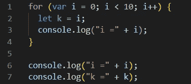

1-scope.js

考虑到上面的代码，当您运行这段代码时，它会给出如下输出:

```
i =0
i =1
i =2
i =3
i =4
i =5
i =6
i =7
i =8
i =9
k =9
```

但是当你在第 2 行(`let k =i`)声明变量“ **k** ”的时候用`let`代替`var`，那么会发生什么呢？你会得到这样的东西👉`ReferenceError: k is not defined`

因为用`let`关键字定义的变量在范围之外是不可见的。所以作为一个最佳实践，最好使用`let`关键字在一个冗长的脚本或项目的多个函数中声明变量。这使得调试更加容易。

# 常数

如果您在上述场景中使用了`const`，您将得到与`let`相同的响应，但原因不同。让我们看看为什么，

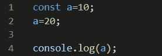

2-const.js

如果你运行这段代码，你会得到一个`TypeError`，因为我们试图改变常量变量。

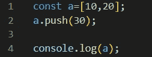

2-const.js

如果您运行这段代码，那么您将得到`[ 10, 20, 30 ]`作为输出。因为`const`只保护一个不是对象或数组的变量。所以你可以像上面的代码一样改变数组。

# 箭头功能

我们通常用 JS 写一个函数，

```
function functionName (parameter) {
     //to-do
}
```

但是我们可以用新的方法用 JS 写一个函数，

```
const functionName =(parameter) => {
    //to-do
}
```

或者如果函数体中只有一行，我们可以这样写:

```
const functionName = (parameter) => //to-do;
```

这就是所谓的**箭头功能。**让我们看一个例子，

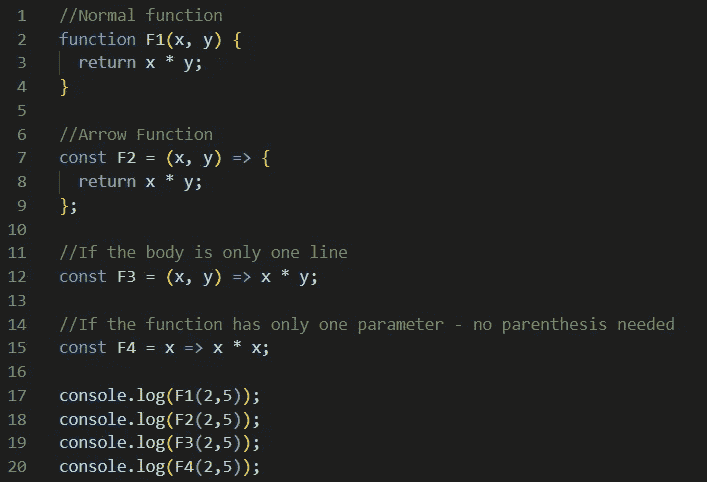

3-箭头 F1.js

如果您运行上面的代码，您将得到如下输出:

```
10
10
10
4
```

这就是箭头函数的妙处。

# 箭头函数的行为

尽管 arrow function 是用现代 JS 编写函数的另一种方式，但这两者的行为方式还是有一些不同。让我们看一个简单的例子，


4-arrowF2.js

所以如果你仔细观察上面的代码段， **print** 是一个对象变量，它有两个函数 **function1** (普通函数)和 **function2** (箭头函数)。当我们运行上面的代码时，输出会是什么？你会得到，

```
1st function : { function1: [Function: function1], function2: [Function: function2] }
2nd function : {}
```

因为在普通函数中，`**this**` 关键字代表调用该函数的对象，同时在箭头函数中，`**this**` 关键字代表定义箭头函数的对象。[点击此处](https://www.w3schools.com/js/js_arrow_function.asp)了解更多关于`**this**` 关键词。所以不要混淆。

# 目标

现在让我们看看我们可以在 JS 对象中做些什么。

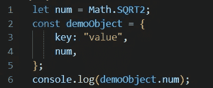

5-object.js

在上面的代码中，`demoObject`是一个应该有一个键:值对的对象。但是我用的是没有对子的`num`。如果我运行这个你会得到，

```
1.4142135623730951
```

因为我已经声明并使用了该变量的其他模块(Math ),所以在这种情况下我们不需要将它指定为一个 **key : value** 对。这实际上与`num:num;`类似，但没有必要放在这里。

让我们看另一个例子，

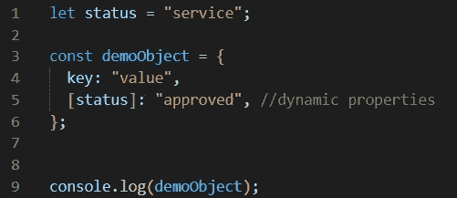

5-object.js

在上面的代码中，`[status]`是第 5 行的键。那就是所谓的**动态属性**。这意味着如果键值是动态的，我们可以在对象中设置一个占位符作为键。假设您想通过服务向用户发送一个对象，您被告知键值不是静态的。在这种情况下，您可以将占位符设置为一个键，然后从用户那里获取值。所以如果运行代码你会得到，

```
{ key: 'value', service: 'approved' }
```

为了演示，我将第 1 行中的占位符值设置为`service`。

# 冷冻法

让我们看看另一个很酷的特性，

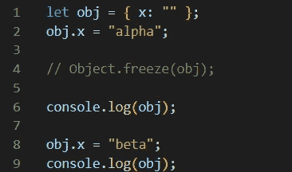

6-freeze.js

在上面的代码中，我定义了一个带有一个空值键的对象，我正在设置值并打印它(暂时忘记注释)。然后我再次改变这个值，再次打印这个对象。所以如果你运行这个你会得到，

```
{ x: 'alpha' }
{ x: 'beta' }
```

作为输出。那么，如果我取消第 4 行的注释并再次运行它，会发生什么呢？输出会是什么呢？

```
{ x: 'alpha' }                                 
{ x: 'alpha' }
```

您将得到这个输出。因为如果使用**冻结，**无论如何都不允许改变数值。因此，在工作时，假设你想在应用程序的所有服务中保持一个对象值不变，那么你可以冻结这个值并在服务中传递它。那么做下面的事情，

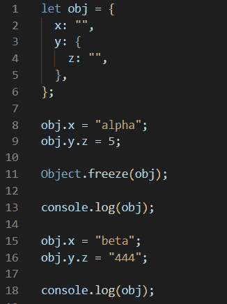

6-freeze.js

所以你认为一旦我打印出来，这个对象的值会是什么样子，

```
{ x: ‘alpha’, y: 5 }
{ x: ‘alpha’, y: 5 }
```

但是不，如果我运行代码，输出将是，

```
{ x: 'alpha', y: { z: 5 } }
{ x: 'alpha', y: { z: '444' } }
```

因为你需要记住 **Object.freeze()** 方法只冻结第一级的值(不是第一级的第一个值)而不会冻结内部级的对象值。

# 模板

让我们看看模板，

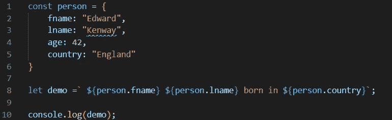

7-模板. js

如果你运行这个你会得到

```
Edward Kenway born in England
```

所以模板不是一个大话题，但它是用来代替执行时间中的值。这些都是用美元符号和花括号写的。而且整个句子要在反斜杠(``)之间。

# JS 中的类

大多数人都是从 Java 或。Net 作为他们的第一个面向对象编程语言。我们在这些语言中使用了类。众所周知，类是创建对象的模板，这里指的是 JS 对象。现在让我们看看 JS 中的类是如何工作的，

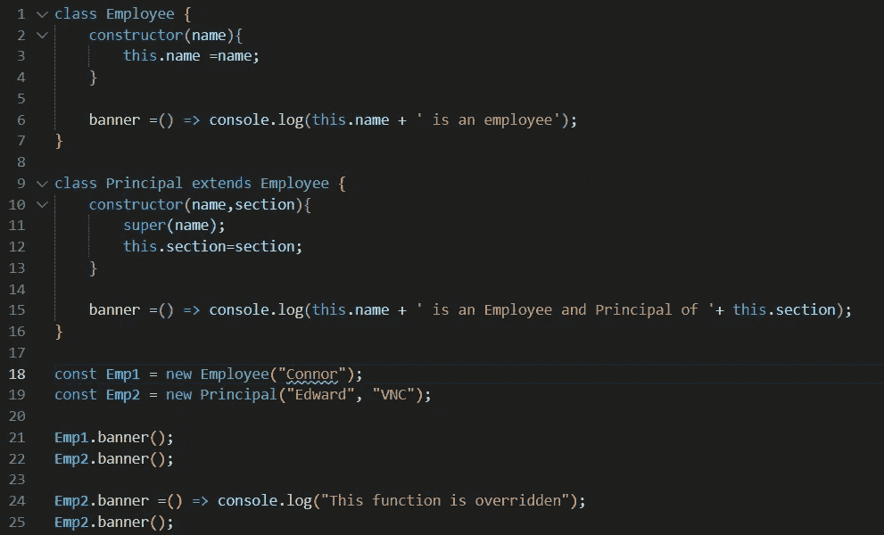

8 类. js

通常在 Java 中，我们使用与类名同名的构造函数，但是在这里我们使用关键字`constructor`。即使我们在构造函数中使用了`name`(上面的代码),我们也不需要像在 JAVA 中那样声明。最重要的是，我们可以在通过对象调用时覆盖一个函数。所以如果你执行上面的代码，你会得到如下结果，

```
Connor is an employee
Edward is an Employee and Principal of VNC
This function is overridden
```

前两行输出是预期的，因为我已经从每个类中调用了这些函数。但是在覆盖之后，您可以看到输出为“这个函数被覆盖”。所以尽管这看起来完全像 Java 类，但实际上它模仿了。

# JS 中的解构

这是一个 JS 表达式，用于从 JS 对象的数组或属性中获取值。如果我们进行数组析构，我们可以在一行中分别声明两个变量并赋值，如下面的代码所示，

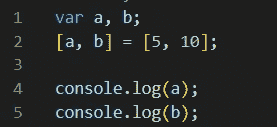

9-destruct . js

所以你会得到，

```
5
10 
```

作为输出。让我们再举一个例子，在下面的代码中有一个函数，我创建了一个带有一些键值的对象，然后创建了一个名为" **area"** 的函数，并将其中一个值 **"Obj "** 作为参数传递。

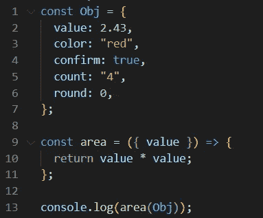

9-destruct . js

让我们看看如果我运行代码会发生什么，

```
5.9049000000000005
```

我得到 5.9049000000000005 作为输出，因为我已经用`Obj`作为参数记录了函数，所以我不需要特别提到`Obj`的值(像`Obj.value`)。它自动从 Obj 中获取值。

假设我们用相同的代码打印了如下内容，

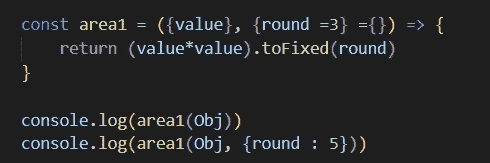

9-destruct . js

所以在上面的代码中，我添加了一个名为`area1`的函数，带有一个有趣的参数，我解释了它，正如我在前面的方法调用(`area`)中提到的，我将对象作为参数传递，但是在这里，我传递了对象以及带有条件的键值(`{value}, {round =3} ={}`)。基本上，如果给这一轮赋予任何值，它将取 3。因此，输出将带有根据舍入值的小数位。所以如果我运行代码，

```
5.905
5.90490
```

正如我上面提到的，在第一个控制台中，我没有传递任何值给`round`，所以它只输出 3 个小数点，在第二个控制台日志中，我传递了 5 作为`round`变量的参数，所以它输出 5 个小数点。

让我们再举一个在文件处理中使用和不使用析构的例子，

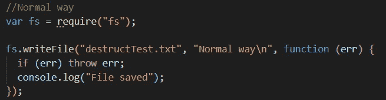

9-destruct . js

如你所见，我们通常需要 fs 模块，并使用了一个变量，并使用该变量中的函数作为上面的代码。但是使用析构，我们可以这样写，

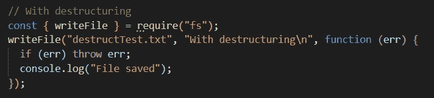

9-destruct . js

从上面的代码可以看出，我们不需要任何`const`来调用函数，我们可以直接调用我们想要的任何方法。所以这里我用了`writeFile`。让我们再举一个例子，

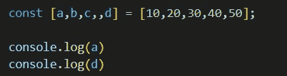

9-destruct . js

所以在上面的代码中，只有 4 个属性(其中一个为空)有 5 个值。如果你运行这个，

```
10
50
```

在这里，它跳过空属性的值，并将该值赋给`d` 。这就是为什么 d 的值打印为 50。让我们看看如果我们稍微改变一下代码会发生什么，

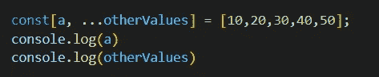

9-destruct . js

这里有两个属性`a`和`otherValues`，如果我们运行代码，

```
10
[ 20, 30, 40, 50 ] 
```

我们知道`a`是 10，但是**扩展操作符** (…)用来获得分配给`otherValues`属性的其余值。我们可以使用这个 spread 操作符将一个数组复制到另一个数组。让我们看看它是怎么做的，


9-destruct . js

没什么，只是我在代码中添加了这几行，如果我们打印出来，

```
10
[ 20, 30, 40, 50 ]
new  array:20,30,40,50
```

如您所见，新对象(`newArr`)获得了复制的值。你也可以用它来合并两个数组。这也适用于对象，让我们看看如何，

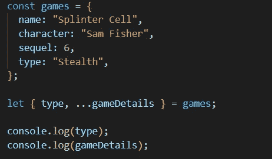

9-destruct . js

在这段代码中，我用一些值创建了一个 games 对象。如你所见，我已经用 spread 操作符将 games 对象传递给了 string 和 object，

```
stealth
{ name: 'Splinter Cell', character: 'sam fisher', sequel: 6 }
```

所以打印出了类型，其他的都分配给了`gameDetails` 对象。我们也可以使用析构来复制对象，就像数组一样。

# 承诺

当我们在 JS 中处理异步操作(比如 HTTP 请求和响应)时，我们使用了回调函数。但是 Promise 比回调函数要好。通常，我们可以将函数作为参数传递给另一个函数。(回调也是一个函数)。所以回调的问题是它会创建“**回调地狱**”，这意味着当函数中调用了如此多的嵌套函数时，代码会变得混乱。诺言能够处理这种问题。基本上在承诺中，当没有出错或拒绝时，它解决。换句话说，我们用它从异步流程中获得同步输出。

承诺有 3 种状态，如待定、已解决和已拒绝。让我们看看代码，

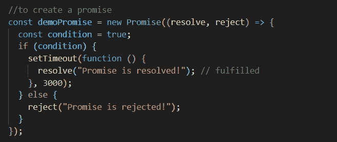

10-promise.js

为了创建一个承诺，我们使用一个构造函数。我设置了超时来模拟 HTTP 响应(需要一些时间来填充)。这段代码解释了 promise 如何工作的基本思想。

要使用承诺，我们必须用`then()`来解决，用`catch()`来拒绝。

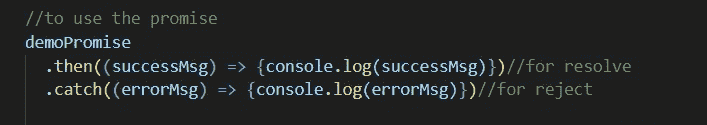

10-promise.js

如果您运行此命令，3000 毫秒后您将得到以下输出，

```
Promise is resolved!
```

我们还可以创建一个函数来使用前面的承诺，如下所示:

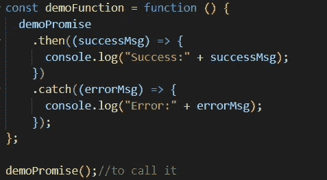

10-promise.js

有一种叫做**链接**的东西，假设有多个异步请求，我们可以创建一个单独的承诺并将它与其他承诺链接在一起。比如创建一个函数，在 then()方法中添加新的 promise，就像下面的代码一样(只有 then 部分)，

```
...
.then(1stPromiseObject)
.then(2ndPromiseResolve)
...
```

# 异步/等待

这和承诺一起工作，让承诺更容易写。如果有一个函数以 **async** 关键字开始，这个函数将返回一个 promise。 **await** 只在**异步函数内部工作。**这个关键词让 JS 知道了嘿！等到承诺返回任何结果。如果你使用 await 而不使用 async，你会得到 syntaxError，说“await 只在 async 函数中有效”。最重要的是，这是比 **promise.then()更简单的语法。**让我们看看这个例子(考虑前面的 **demoPromise** 代码)，


10-promise.js

这就是异步和等待函数 willl 的样子。与其他类型相比，这很容易理解。

我希望你通过这篇文章学到了很多新的 JS 特性，我已经把这些代码上传到了我的 GitHub 中。[点击此处](https://github.com/Ramsunthar/JS-snippets)查看代码。不断学习。

# 参考

我参考了下面的 YouTube 视频来写这篇文章，它是由 [Krishantha Dinesh](https://medium.com/u/26403c4bd160?source=post_page-----a5c7dd9c2b07--------------------------------) 制作的

[](https://www.w3schools.com/js/js_arrow_function.asp) [## JavaScript 箭头函数

### 组织良好，易于理解的网站建设教程，有很多如何使用 HTML，CSS，JavaScript 的例子…

www.w3schools.com](https://www.w3schools.com/js/js_arrow_function.asp) [](https://www.geeksforgeeks.org/destructuring-assignment-in-javascript/) [## JavaScript 中的析构赋值

### 析构赋值是一个 JavaScript 表达式，允许从数组中解包值，或者从…

www.geeksforgeeks.org](https://www.geeksforgeeks.org/destructuring-assignment-in-javascript/) [](https://www.loginradius.com/blog/async/callback-vs-promises-vs-async-await/) [## 回调 vs 承诺 vs 异步等待

### 这篇博客解释了 JavaScript 处理异步操作所依赖的基本概念。这些概念…

www.loginradius.com](https://www.loginradius.com/blog/async/callback-vs-promises-vs-async-await/)