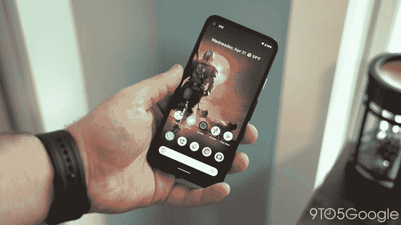

# Android 中的新闪屏

> 原文：<https://medium.com/nerd-for-tech/modern-splash-screen-in-android-9c804903c7c9?source=collection_archive---------0----------------------->

一种更好的显示 Android 闪屏的方式。#安卓 12


约翰尼·布朗在 [Unsplash](https://unsplash.com/s/photos/splash-drop?utm_source=unsplash&utm_medium=referral&utm_content=creditCopyText) 上的照片

🚣嗨，在这篇文章中，我们学习在 android 中实现闪屏。从**古老的**传统方式到**新的**现代方式。

# 介绍

Android 闪屏通常是当应用程序没有完全准备好显示内容时显示给用户的第一个屏幕。

# 闪屏如何工作

当用户在应用程序的进程未运行时(冷启动[)或活动未创建时(热启动](https://developer.android.com/topic/performance/vitals/launch-time#cold)[)启动应用程序，会发生以下事件。(在](https://developer.android.com/topic/performance/vitals/launch-time#warm)[热启动](https://developer.android.com/topic/performance/vitals/launch-time#hot)期间，不会显示闪屏。)

1.  系统使用你定义的主题和动画来显示启动画面。

2.当应用程序准备就绪时，闪屏会被关闭并显示应用程序。

现在让我们开始吧，

# 正在初始化 Splash 活动

首先，要启动闪屏形式的活动，我们只需将动作 **main** 和**category**launcher 添加到 **AndroidManifest.xml** 中的您的活动中

```
<activity
    android:name=".ui.splash.SplashActivity">
    <intent-filter>
        <action android:name="android.intent.action.MAIN" /> <category android:name="android.intent.category.LAUNCHER" />
    </intent-filter></activity>
```

# **传统方法**


等待插图 XD

# 老办法，

我们通常会暂停用户交互 2-3 秒，让闪屏加载。

> UI 持有从来都不是一个选项。就像在 activity 中我们曾经编写过这些恐怖的代码……而 Activity 曾经看起来像是 shi**。

这在当时很管用&现在也是，但我们都知道应该有比等待更多的东西。

# 现代方法

有了新的方法，我们不需要宣布等待的时间。


## 第一步

首先，收集所有必要的元素，如颜色和标志。

然后，创建 **drawable** 放置 logo 为位图/drawable。

> drawable/background_splash.xml

## 第二步

在 style 中为闪屏声明一个任意想要的主题，并将 android:windowBackground 属性值设置为我们创建的 drawable。

```
<style name="SplashScreenTheme" parent="Theme.AppCompat.Light.NoActionBar">
    <item name="colorPrimary">@color/colorPrimary</item>
    <item name="colorPrimaryVariant">@color/colorSecondary</item>
    <item name="colorOnPrimary">@color/colorWhite</item>
    <item name="android:windowBackground">   
           @drawable/background_splash</item
</style>
```

**Android:window background**属性

**并且，在 **AndroidManifest.xml** 中，我们将我们的主题添加为。**

```
<activity
    android:name=".ui.splash.SplashActivity"
    android:launchMode="singleTask"
    android:theme="@style/SplashScreenTheme"> <intent-filter>
        <action android:name="android.intent.action.MAIN" /> <category android:name="android.intent.category.LAUNCHER" />
    </intent-filter></activity>
```

## **最后一步**

**要隐藏闪屏布局的内容，在活动中删除 **setContentView()，****

****至于显示**创建的 drawable 作为这些 splash &之间的过渡的另一个活动，我们将不需要 splash 布局。**

```
public class SplashActivity extends AppCompatActivity {

    @Override
    protected void onCreate(Bundle savedInstanceState) {
        super.onCreate(savedInstanceState);
        // s̶e̶t̶C̶o̶n̶t̶e̶n̶t̶V̶i̶e̶w̶(̶)̶;
        doFirstRunCheckup();
    }

    private void doFirstRunCheckup() {
        startActivity(new Intent(SplashActivity.this, MainActivity.class));
        finish();
    }

}
```

**这里是[源代码……](https://github.com/iamnaran/search-recycler-view)如果你需要的话。**

**完成了。现代方法比我们的传统方法更有说服力。**

> **继续阅读更多关于 Android 12 闪屏的内容**

# **—最近，**

**Android 12 增加了`[SplashScreen](https://developer.android.com/reference/android/window/SplashScreen)` API，可以为所有应用启用新的应用启动动画。这包括启动时进入应用程序的动作，显示应用程序图标的闪屏，以及转换到应用程序本身。**

****

**图片来源: [9to5google](https://9to5google.com/2021/06/27/android-12-animated-splash-screen/)**

**新的体验为每个应用程序的发布带来了标准的设计元素，但它也是可定制的，因此您的应用程序可以保持其独特的品牌。**

> **这类似于我们的现代方法。**

**在官网了解更多。**

**[https://developer . Android . com/about/versions/12/features/splash-screen](https://developer.android.com/about/versions/12/features/splash-screen)**

# **让我们通过升级到— Android 12 来测试 Splash，**

```
 compileSdkVersion("android-S") defaultConfig **{** applicationId "com.template.androidtemplate"
        minSdkVersion 16
        targetSdkVersion("S")
        versionCode 1
        versionName "1.0"
    **}**
```

**升级后，从**无处**，Boom A 错误弹出，你的应用安装失败。**

> **`*Installation did not succeed.
> The application could not be installed: INSTALL_FAILED_VERIFICATION_FAILURE
> List of apks:
> [0] ‘…/build/outputs/apk/debug/app-debug.apk’
> Installation failed due to: ‘null’*`**

**或者**

> **`*INSTALL_PARSE_FAILED_MANIFEST_MALFORMED: Failed parse during installPackageLI:*`**
> 
> **`*Targeting S+ (version 10000 and above) requires that an explicit value for android:exported be defined when intent filters are present”*`**

# **去搞定`*Installation failed*`？👼**

**将属性`android:exported`添加到任何在应用程序的`AndroidManifest.xml`文件中声明了`<intent-filter>`的`<activity>`、`<service>`或`<receiver>`组件**

```
<activity
    android:name=".ui.splash.view.SplashActivity"
    android:launchMode="singleTask"
    **android:exported="true"**
    android:theme="@style/SplashScreenModern">

    <intent-filter
        >
        <action android:name="android.intent.action.MAIN" />

        <category android:name="android.intent.category.LAUNCHER" />
    </intent-filter>

</activity>
```

# **现在对于闪屏，**

**为了测试效果和变化，让我们先观察一下**白色** & **黑色**颜色背景。**

**创建新的 **styles.xml 或 theme.xml (v31)。****

> **如前所述，这类似于我们的现代方法。**

****唯一的区别**是，我们需要为 Android 12 移除**Android:window background**。**

# **为什么？**

**默认情况下，你的启动图标将作为一个闪屏视图。**

> **不需要创建 drawable。只需添加你的启动图标&砰，这是一个闪屏标志。**

****

**`As documented, SplashScreen`使用你的主题的`windowBackground`如果它是单色的，使用**启动器图标**。闪屏的定制是通过向应用程序主题添加属性来完成的。**

```
<style name="SplashScreenModern" parent="Theme.AppCompat.NoActionBar">
    <item name="colorPrimary">@color/colorWhite</item>
    <item name="colorPrimaryDark">@color/colorWhite</item>
    <item name="colorAccent">@color/colorWhite</item>
    **<item name="android:windowSplashScreenBackground">@color/colorBlack</item>**
    <item name="android:statusBarColor">@color/colorWhite</item>
    <item name="android:windowLightStatusBar">true</item>
    <item name="android:windowLightNavigationBar">true</item>
</style>
```

**但是它可以通过多种方式进行定制。神奇而简单，对吧？**

**谢谢你。**

**再见&喵😸**