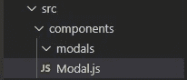
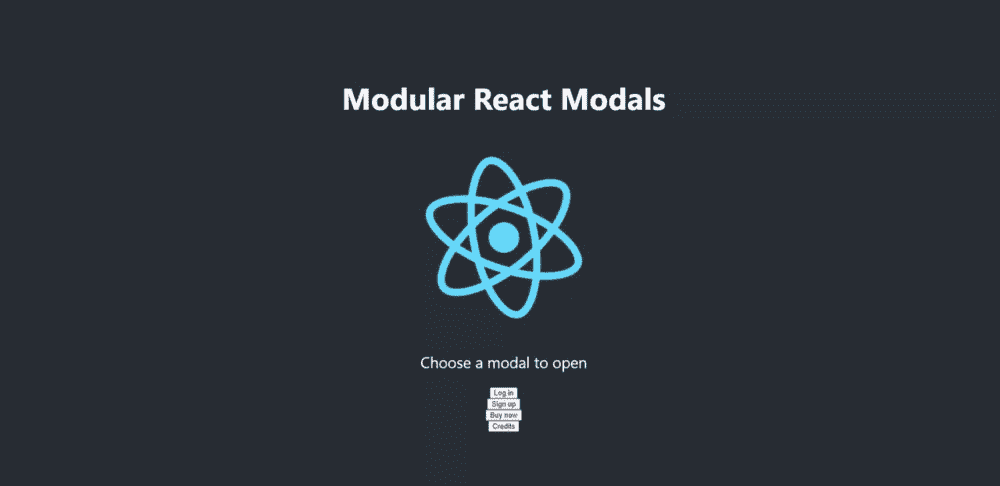

# React 中的模块化模态

> 原文：<https://medium.com/nerd-for-tech/modular-modals-in-react-2b9bde0c5d9c?source=collection_archive---------10----------------------->

## 关于如何创建多用途、模块化和可扩展的反应模型的指南


西蒙·戈茨拍摄的照片

模态是现代 UI 设计中最常用的图形控件元素之一，因为它们能够避免中断主窗口中用户的工作流程。

不幸的是，有时候，在一个干净的模型后面，隐藏着一些非常混乱的代码。

在本文中，我们将介绍如何使用 React 组件创建一个多用途的模型，保持它的整洁、模块化和可伸缩性，以满足您的各种需求。

# 开始

对于本指南，您可以使用任何您已经拥有并想要在中创建您的模态的项目，因为我们将主要关注模态组件。
然而，你可以随意使用这个 [Github](https://github.com/Roi-Livne/modular_modals) 作为代码本身，或者跟随我们一起创建它。

继续打开一个新项目并运行 react 应用程序模板:

```
npx create-react-app <path>
```

现在让我们首先编辑我们的 *App.js* 文件，用一些按钮来测试我们的模态:

接下来，在您的 src 文件夹中，创建一个*组件*文件夹。
在其中创建一个 *Modal.js* 文件和一个 *modals* 文件夹。



注意 *Modal.js* 不在 *modals* 文件夹中

# 打开模式

继续我们的 *App.js* 文件，我们将创建一个状态、一个上下文和一个更新函数来从应用程序的任何地方控制我们的模态。
我们还将删除`App()`上的默认导出。
(您必须将 *index.js* 上的导入更改为`import { App } from ‘./App’`，您的应用程序才能继续工作)

现在我们的按钮被配置为更新模态参数，这样我们的 *Modal.js* 组件将打开正确的模态。

# 情态动词

为了进行测试，我们将在我们的 *modals* 文件夹中创建一些非常基本的组件:log in model . js、SignupModal.js、BuyModal.js、CreditsModal.js.
每个组件都将返回它的名称，如下所示:

# Modal.js

现在，我们剩下要做的就是完成我们的 *Modal.js* 文件。

为了使这个模型模块化和可伸缩，同时尽可能保持简洁，我们将模型的每个实例分离到不同的文件中。因此，允许我们的 Modal.js 文件充当不同模态的控制器。

我们导入了不同的模态和上下文，还添加了一个函数，当用户单击模态之外的任何地方时，该函数会关闭模态。

如果`isOpen`为真，我们返回适当的模态。如果没有，我们什么也不返回。

让我们给我们的 *App.css* 添加一些基本的 CSS，这样我们的模态就会显示在网页上:

# …瞧！

一个**模块化的**、**可扩展的**和**干净的**模态组件，在一个父组件中控制和操作你所有的模态需求。



模块化反应模型

现在，如果您想要添加任何其他模态类型，您可以简单地导入它，并向您的 *Modal.js* 文件添加另一个条件，以实现无缝集成。

# 结论

当您在时间压力下进行项目时，从一开始就创建模块化或可伸缩的组件并不总是容易的。

通过投入时间，并在代码的其他部分采用这些方法或思维方式，您可以获得更干净和可维护的代码。

代码也可以在 Github 库上找到。

如果你喜欢这篇文章，并发现它很有帮助，别忘了鼓掌:)
当然，如果你有任何反馈，请写在评论中！