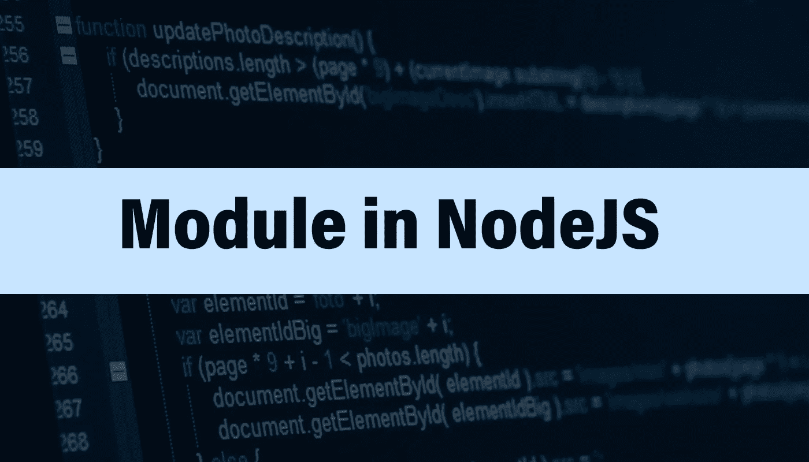

# 节点中的模块

> 原文：<https://medium.com/nerd-for-tech/module-in-nodejs-95eba74e352f?source=collection_archive---------23----------------------->

节点应用程序中的每个文件都被视为一个模块。但首先，我们需要了解客户端 JavaScript 和 NodeJS 环境中全局作用域的核心概念。

在 JavaScript 中，我们多次使用不同的对象和函数，这些对象和函数我们没有定义，但是在整个应用程序中都是可用的。这些都属于全局范围，可以在所有应用程序中访问。其中一些如下:

*console.log()*

*setTimeOut()*

*setInterval()*

*clearInterval()*

在客户端 JavaScript 中，窗口对象表示全局范围。所以，如果我们想访问所有全局作用域的对象和函数，要么直接写它们的名字，要么用一个窗口前缀。如果我们不添加窗口，JavaScript 引擎会自己添加。其次，用户定义的客户端 JavaScript 中的所有变量总是全局范围的，并且将成为窗口对象的一部分。如果我们在客户端 JavaScript 中定义这个变量两次，它将覆盖另一个变量。

当我们构建大规模的应用程序时，我们总是将代码分成几个文件。如果我们在一个文件中定义了一个名为" *calculate* 的函数，然后在另一个文件中定义了另一个名为" *calculate* 的函数，它将覆盖前面的函数。这是客户端 JavaScript 的一个大问题。

这就是为什么在 node 中我们没有窗口对象。我们还有另一个被称为“全局”的对象。所有预定义的 JavaScript 函数和变量都可以通过这个全局对象访问。我们可以给它们加上 global 前缀，或者直接把它写到代码中。但是这里有一个与 NodeJS 全局对象的主要区别，用户声明的变量或函数不会被添加到全局对象中。它们只限于该特定文件，在该文件之外不可用。用面向对象编程的术语来说，我们可以说它们是私有的，在容器或模块之外是不可用的。如果我们想让一个变量在容器外可访问，导出它或者使它成为公共的。

## **代码是如何在模块内部运行的？**

在执行代码之前，节点获取所有文件的内容，并将它们放在一个包装函数中。这个包装函数被立即调用函数表达式并被唯一命名。这个包装函数有它的作用域，在这个函数内部编写的代码在函数外部是不可访问的。这就是为什么所有变量 var、let 和 const 都作用于特定模块而不是全局作用的主要原因。

例如，我们有两个模块模块 A 和模块 B，模块 A 有一些变量，模块 B 有一些变量。现在模块 A 变量将被模块 B 变量访问，直到模块 B 变量被导出。如果模块 A 中有一些变量，而模块 B 中有相同名称的变量，那么它永远不会与它们冲突，因为两者在不同的函数范围内。

节点中的模块

Nodejs 中的每个模块都有 5 个参数，exports、require、module、__filename 和 __dirname。它们中的每一个都在 NodeJS 中提供了不同的功能，并且在我们构建系统时非常有用。

**外卖:**

NodeJS 中的文件称为模块。NodeJS 环境在编译前将其转换成包装函数。

每个 NodeJS 应用程序都有一个文件或一个模块，称为主模块。