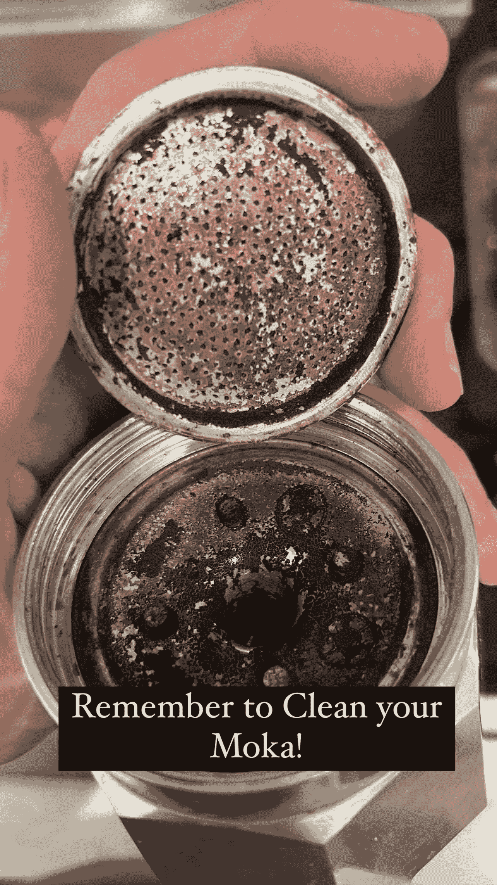
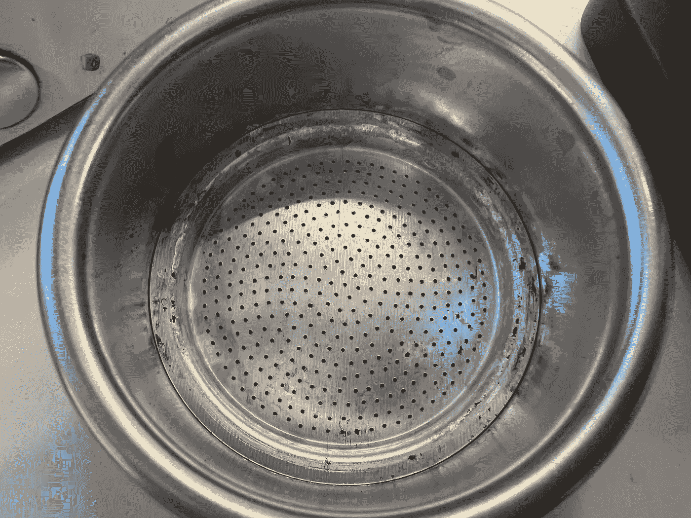
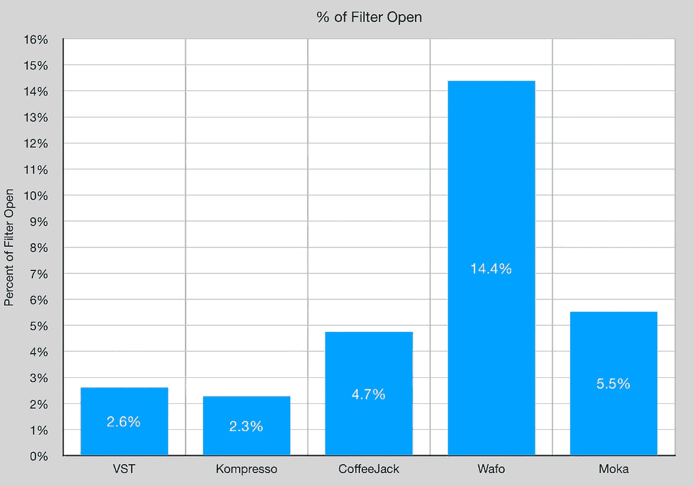
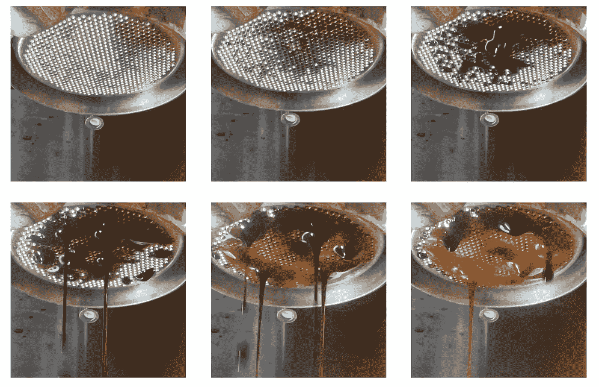
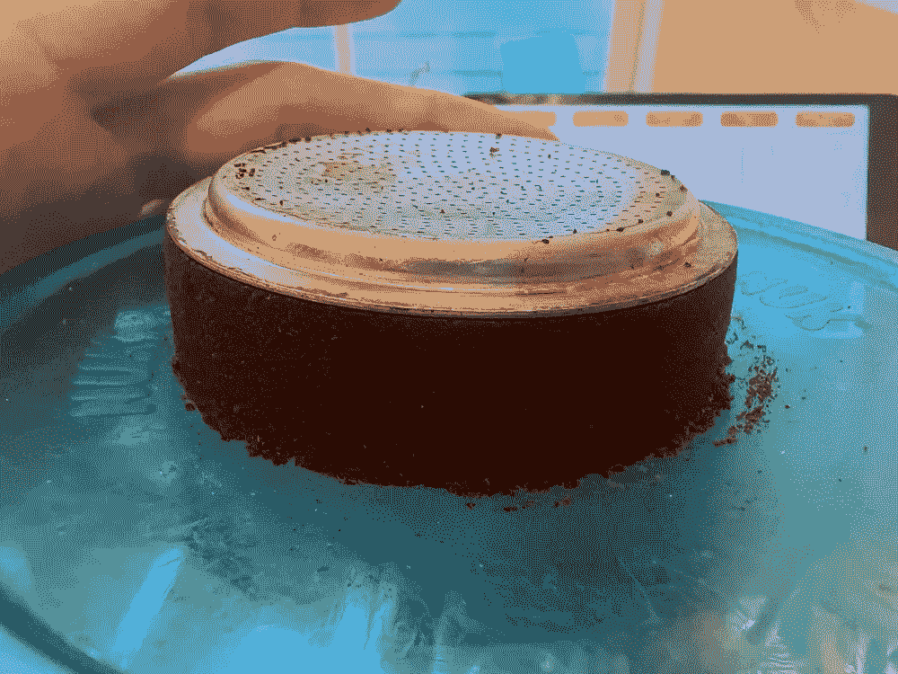
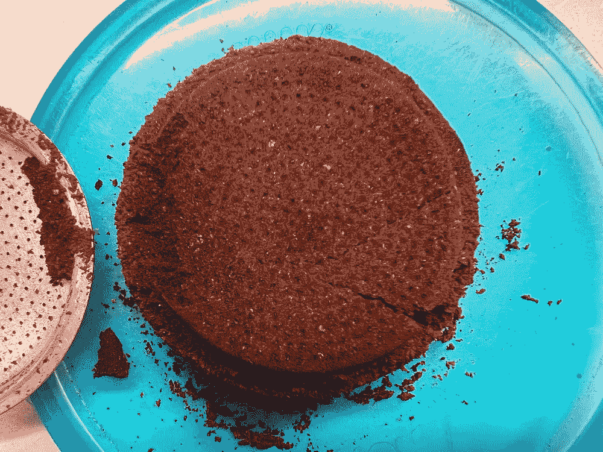
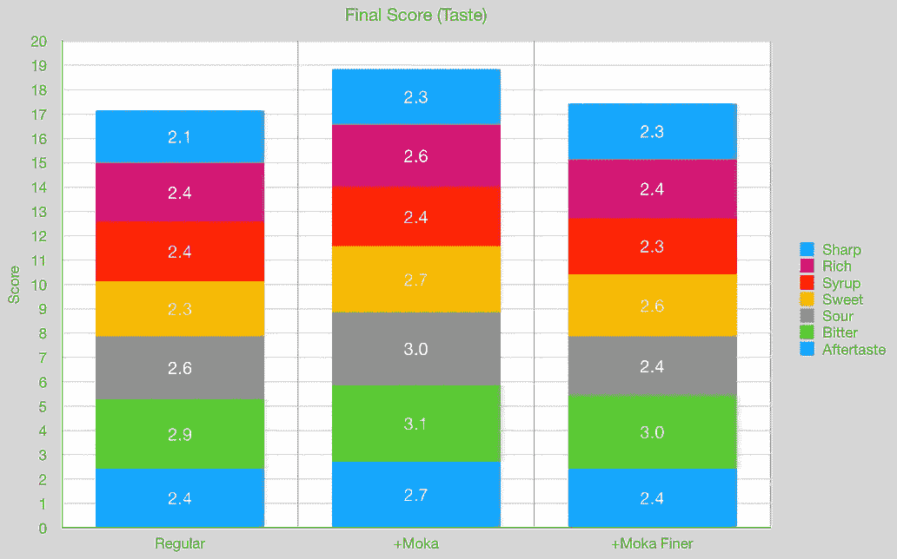
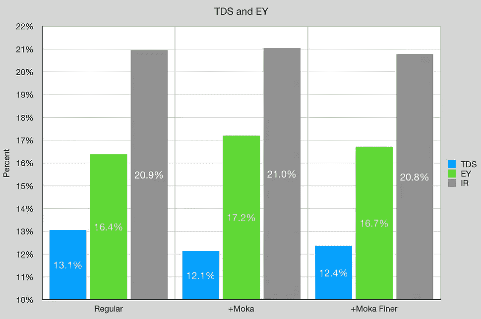

# 浓缩咖啡篮中的陆丹蓝过滤器

> 原文：<https://medium.com/nerd-for-tech/moka-filter-in-an-espresso-basket-495e33aa26ae?source=collection_archive---------0----------------------->

## 咖啡数据科学

## 一个奇怪的理论实验

最近，我一直在观察浓缩咖啡篮和洞的开放程度。我开始想也许小洞不好。精确的篮子是根据标准压力和温度下的流速设计的，但这不是很多人使用的。事实上，更低的压力和流速是新事物。

所以我想验证这个理论。这个理论的一部分来自于[布](https://towardsdatascience.com/cloth-filters-for-espresso-d5038f53605f)过滤器。它们允许难以置信的快速流动，我怀疑这是因为过滤器没有阻碍流动。然而，布料过滤器很难在收缩和残余物之间进行管理。

我该如何轻松地测试它呢？陆丹蓝滤波器怎么样？

所有图片由作者提供

我拿出我的一个陆丹蓝锅，我想更仔细地检查过滤器。我注意到它非常适合篮子，就像一个底部过滤器。这将有更大的孔的好处，没有潜在的问题。

我检查了陆丹蓝过滤器的开放程度，尽管它的孔更少，但它比咖啡插孔更开放。

所以我测试了一下:

这种流动看起来很奇怪，但请记住，这种流动来自顶部的一个屏幕，因此很难说这种流动是正常的还是预期的。

冰球后来看起来相对正常。有一些污点，但总的来说，它看起来像一个很好的提取。

# 设备/技术

[意式咖啡机](https://towardsdatascience.com/taxonomy-of-lever-espresso-machines-f32d111688f1) : [像样的意式咖啡机](https://towardsdatascience.com/developing-a-decent-profile-for-espresso-c2750bed053f)

[咖啡研磨机](https://towardsdatascience.com/rok-beats-niche-zero-part-1-7957ec49840d) : [小生零位](https://youtu.be/2F_0bPW7ZPw)

咖啡:[家庭烘焙咖啡](https://rmckeon.medium.com/coffee-roasting-splash-page-780b0c3242ea)，中杯(第一口+ 1 分钟)

镜头准备:[断奏夯实](https://towardsdatascience.com/staccato-tamping-improving-espresso-without-a-sifter-b22de5db28f6)

[预灌注](https://towardsdatascience.com/pre-infusion-for-espresso-visual-cues-for-better-espresso-c23b2542152e):长，约 25 秒

输液:[压力脉动](https://towardsdatascience.com/pressure-pulsing-for-better-espresso-62f09362211d)

[过滤篮](https://rmckeon.medium.com/espresso-baskets-and-related-topics-splash-page-ff10f690a738) : 20g VST

其他设备: [Atago TDS 计](https://towardsdatascience.com/affordable-coffee-solubility-tools-tds-for-espresso-brix-vs-atago-f8367efb5aa4)、 [Acaia Pyxis 秤](https://towardsdatascience.com/data-review-acaia-scale-pyxis-for-espresso-457782bafa5d)

# 绩效指标

我使用了两组[指标](https://towardsdatascience.com/metrics-of-performance-espresso-1ef8af75ce9a)来评估技术之间的差异:最终得分和咖啡萃取。

[**最终得分**](https://towardsdatascience.com/@rmckeon/coffee-data-sheet-d95fd241e7f6) 是评分卡上 7 个指标(辛辣、浓郁、糖浆、甜味、酸味、苦味和余味)的平均值。当然，这些分数是主观的，但它们符合我的口味，帮助我提高了我的拍摄水平。分数有一些变化。我的目标是保持每个指标的一致性，但有时粒度很难确定。

**使用折射仪测量总溶解固体量(TDS)，该数字结合咖啡的输出重量和输入重量，用于确定提取到杯中的咖啡的百分比，称为**提取率(EY)** 。**

**[**【IR】**](https://towardsdatascience.com/improving-coffee-extraction-metrics-intensity-radius-bb31e266ca2a)**强度半径定义为 TDS vs EY 控制图上原点的半径，所以 IR = sqrt( TDS + EY)。这一指标有助于标准化产量或酿造比的击球性能。****

# ****可行性数据****

****这是极少量的数据，但如果这些照片很糟糕，它可以给出方向。事实证明，这些照片的味道和提取效果都差不多。****

****************

****我不确定从这个测试中会想到什么，但它让我对精确篮子产生了更多的疑问。接下来是不精确篮子，我在一个普通篮子上进一步测试了这个想法。****

****如果你愿意，可以在推特、 [YouTube](https://m.youtube.com/channel/UClgcmAtBMTmVVGANjtntXTw?source=post_page---------------------------) 和 [Instagram](https://www.instagram.com/espressofun/) 上关注我，我会在那里发布不同机器上的浓缩咖啡照片和浓缩咖啡相关的视频。你也可以在 [LinkedIn](https://www.linkedin.com/in/dr-robert-mckeon-aloe-01581595) 上找到我。也可以关注我在[中](https://towardsdatascience.com/@rmckeon/follow)和[订阅](https://rmckeon.medium.com/subscribe)。****

# ****[我的进一步阅读](https://rmckeon.medium.com/story-collection-splash-page-e15025710347):****

****[我的书](https://www.kickstarter.com/projects/espressofun/engineering-better-espresso-data-driven-coffee)****

****[我的链接](https://rmckeon.medium.com/my-links-5de9eb69c26b?source=your_stories_page----------------------------------------)****

****[浓缩咖啡系列文章](https://rmckeon.medium.com/a-collection-of-espresso-articles-de8a3abf9917?postPublishedType=repub)****

****工作和学校故事集****