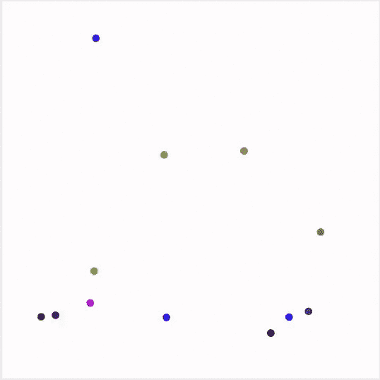
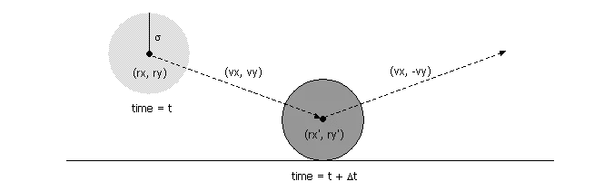
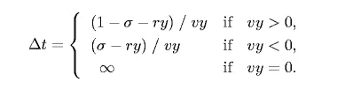
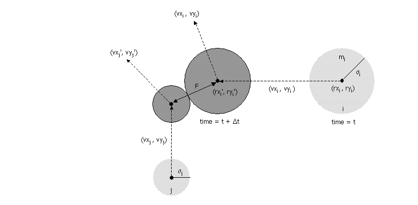
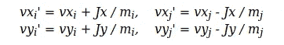

# 硬球的分子动力学模拟——用 Java 实现优先队列

> 原文：<https://medium.com/nerd-for-tech/molecular-dynamics-simulation-of-hard-spheres-priority-queue-in-action-with-java-e5e513e57f76?source=collection_archive---------1----------------------->



**事件驱动模拟**(由于该平台只支持 GIF，所以跳过了一些帧，模拟不像预期的那样流畅)

嘿！在那里，我带着一个有趣的**数据结构和算法问题**即**事件驱动模拟**再次回来。你可能想知道为什么我最近的文章是基于模拟的。如果不是查我以前的文章 [**蒙特卡罗模拟:估算逾渗阈值 Java**](https://dcoster.medium.com/monte-carlo-simulation-estimate-percolation-threshold-in-java-7f253641bbdd)**[**康威的《生命的游戏:细胞自动机**](https://python.plainenglish.io/conways-game-of-life-a-cellular-automaton-81aa5fb15545) 和 [**计算机与数学的艺术:巴恩斯利芬**](/nerd-for-tech/the-art-of-computer-and-mathematics-barnsley-fern-196182622241) **。高效数据结构和算法的发明使得在计算机上模拟真实世界场景成为可能，这引起了我的兴趣。这同样适用于事件驱动模拟。****

**你可能会问，为什么有必要模拟自然界中已经存在的任何东西，为什么我们不能只观察它在自然界中的特征。这个想法是我们想要研究自然世界的某种属性，而不对其他现存的实体产生任何影响(也许是一个粗略的定义)。**

**事件驱动模拟不仅仅局限于计算机科学，也许它可以追溯到爱因斯坦研究花粉粒的运动。所以，你在上面看到的 GIF 可以被看作是某种具有一定质量的粒子的代表，这些粒子的行为符合[弹性碰撞](https://en.wikipedia.org/wiki/Elastic_collision)定律。由于存在**优先级队列**，这种模拟才是可能的。如果不是，那么计算每一次碰撞就需要二次时间。如果你是计算机科学领域的新手或老手，你可能知道二次时间是一个很大的问题。**

**该模拟的主要目标是显示 N 个运动粒子的运动，它们的行为符合弹性碰撞定律。这个问题被建模为计算机科学中的硬盘模型，其中每个移动的粒子通过与其他粒子的弹性碰撞而相互作用，并且被壁所限制。每个粒子都是一个圆盘，有自己的属性，如速度、位置、质量、半径或其他一些力，如动能、重力或摩擦力。在这篇文章中，我们将只看到像速度，位置，质量和半径的属性。**

****让我们来了解一下技术问题****

**像往常一样，所有代码都可以在我的私人 GitHub 库 [**事件驱动模拟**](https://github.com/dcostersabin/Event-Driven-Simulation) 中找到**

**让我们把模拟分解成小问题，这样我们可以解决小问题，进而解决大问题。**

1.  **首先，我们需要一个类来表示一个粒子在封闭环境中自由运动的特性。我们将称之为**粒子问题**。**
2.  **接下来我们需要检测是否有碰撞发生。这就是优先级队列的优势所在。我们预先预测粒子之间可能发生的碰撞，并且只计算事件发生时两个粒子之间碰撞的影响。我们就称之为**事件问题**。**
3.  **最后，我们需要一个包含粒子和事件的类，以便创建一个合适的模拟环境。我们就称之为**碰撞** **系统问题**。**

****粒子问题的解决方案****

**为了解决这个问题，我们需要一个可以表示粒子属性的类。这个类需要像 x，y 坐标这样的属性来表示 2D 平面上的粒子。这是 x 和 y 的速度，粒子的半径，质量和其他奇特的属性。这个类还应该包含像绘图、计算击中水平或垂直轴的时间以及与给定粒子碰撞所需的时间等行为。稍后会详细介绍。**

**所以我创建了一个类，名为**粒子**，具有以下属性**

```
*private double* rx, ry;
*private double* vx, vy;
*private final double* radius;
*private final double* mass;
*private int* count;
*int* r, g, b;
```

**这里 rx 和 ry 代表 x 和 y 坐标，而 vx 和 vy 代表 x 和 y 速度。类似地，半径、质量、计数(计算特定粒子与其他粒子碰撞的次数)以及颜色的 r、g、b。**

```
*public* Particle() {
    radius = 0.01;
    mass = 0.5;
    rx = StdRandom.*uniform*(0.0, 1.0);
    ry = StdRandom.*uniform*(0.0, 1.0);
    vx = StdRandom.*uniform*(-0.005, 0.005);
    vy = StdRandom.*uniform*(-0.005, 0.005);
    r = StdRandom.*uniform*(0, 255);
    g = StdRandom.*uniform*(0, 255);
    b = StdRandom.*uniform*(0, 255);
}
```

**这里没什么特别的，只是用一些随机值初始化变量。**

```
*public void* move(*double* dt) {
    rx += vx * dt;
    ry += vy * dt;
}
```

**由于粒子自由移动，移动功能模拟粒子的运动。这里使用简单的逻辑计算新坐标，即**速度*时间。****

```
*public void* draw() {
    StdDraw.*setPenColor*(*new* Color(r, g, b));
    StdDraw.*filledCircle*(rx, ry, radius);
}
```

**同样也没什么特别的，只是一个在 2D 平面上显示粒子的函数。**

```
*public double* timeToHitHorizontalWall() {
    *if* (vy > 0) *return* (1.0 - ry - radius) / vy;
    *else if* (vy < 0) *return* (radius - ry) / vy;
    *else return* Double.***POSITIVE_INFINITY***;
}*public double* timeToHitVerticalWall() {
    *if* (vx > 0) *return* (1.0 - rx - radius) / vx;
    *else if* (vx < 0) *return* (radius - rx) / vx;
    *else return* Double.***POSITIVE_INFINITY***;
}
```

********

**需要一点高中物理知识。众所周知，速度是其位置相对于时间的变化率。物体到达一定距离所用的时间，即距离除以速度。这同样适用于上述功能。**

```
*public void* bounceOffVerticalWall() {
    vx = -vx;
    count++;
}

*public void* bounceOffHorizontalWall() {
    vy = -vy;
    count++;
}
```

**这两个函数只要分别接触垂直或水平墙壁，就将其轴设置为负。**

```
*public double* timeToHit(Particle that) {
    *if* (*this* == that) *return* Double.***POSITIVE_INFINITY***;
    *double* dx = that.rx - *this*.rx;
    *double* dy = that.ry - *this*.ry;
    *double* dvx = that.vx - *this*.vx;
    *double* dvy = that.vy - *this*.vy;
    *double* dvdr = dx * dvx + dy * dvy;
    *if* (dvdr > 0) *return* Double.***POSITIVE_INFINITY***;
    *double* dvdv = dvx * dvx + dvy * dvy;
    *if* (dvdv == 0) *return* Double.***POSITIVE_INFINITY***;
    *double* drdr = dx * dx + dy * dy;
    *double* sigma = *this*.radius + that.radius;
    *double* d = (dvdr * dvdr) - dvdv * (drdr - sigma * sigma);
    *if* (d < 0) *return* Double.***POSITIVE_INFINITY***;
    *return* -(dvdr + Math.*sqrt*(d)) / dvdv;
}
```

**重担来了。该函数计算与给定粒子碰撞所需的时间。数学类比可以在普林斯顿的 java 作业页面 [**找到。**](https://introcs.cs.princeton.edu/java/assignments/collisions.html)**

****

**根据牛顿第二运动定律，物体的**加速度取决于物体的质量和施加在其上的力的大小**。因此，当两个物体碰撞时，有一些动作合成，但是在这个模拟中，只有速度和方向的变化是可见的，但是更多的可以添加到这个算法中。在上面提到的代码中没有不同的逻辑，它们只是计算发生碰撞所需时间的数学公式。**

```
*public void* bounceOff(Particle that) {
    *double* dx = that.rx - *this*.rx;
    *double* dy = that.ry - *this*.ry;
    *double* dvx = that.vx - *this*.vx;
    *double* dvy = that.vy - *this*.vy;
    *double* dvdr = dx * dvx + dy * dvy;
    *double* dist = *this*.radius + that.radius;
    *double* J = 2 * *this*.mass * that.mass * dvdr / ((*this*.mass + that.mass) * dist);
    *double* Jx = J * dx / dist;
    *double* Jy = J * dy / dist;
    *this*.vx += Jx / *this*.mass;
    *this*.vy += Jy / *this*.mass;
    that.vx -= Jx / that.mass;
    that.vy -= Jy / that.mass;
    *this*.count++;
    that.count++;
}
```

**之后，我们预测了与给定物体的碰撞。现在，我们需要做的就是计算碰撞的结果。因为没有粒子在碰撞后表现出相同的属性，所以必须更新各自的属性。这些更新过程使用下面所示的一些公式来执行。**

****

****事件问题的解决方案****

**创建事件类的主要动机是检查两个粒子是否相对于时间差发生碰撞。因此，为了解决这个问题，我们将不得不借助 java 的 Comparable 接口，它允许我们实现 compareTo 方法来计算时间差，我们可以在将来使用它来安排优先级队列中的节点或事件。正如我们所知，优先级队列可以是最大类型或最小类型。这意味着当我们删除有序优先级队列中的一个项目时，它会删除与我们使用的类型相关的最大或最小节点。因此，主要动机是删除最小节点或代表当前时间步的节点，以便将来发生的事件可以在以后检查和操作。因此，节省了大量的计算。**

**现在，我们需要一个实现可比接口的类。然后，我们在 **compareTo** 方法中定义在队列中对事件类排序的度量。如果你不熟悉类似的界面，我建议你快速浏览一下。此外，一个事件类必须包含两个粒子:它的当前时间步长和每个粒子遇到的碰撞次数。**

**保持冲突数量的原因是我们可以提前预测潜在的冲突。如果粒子在到达预测的时间步之前与另一个粒子碰撞，那么这个事件被认为是无效的。原因是它需要碰撞的粒子已经与另一个粒子发生了碰撞，并改变了速度和方向。**

```
*public* Event(*double* t, Particle a, Particle b) {
    time = t;
    *this*.a = a;
    *this*.b = b;
    *if* (a != *null*) countA = a.count();
    *else* countA = -1;
    *if* (b != *null*) countB = b.count();
    *else* countB = -1;
}
```

**最初，我们在两个不同的变量中维护一个冲突计数，然后我们比较事件是有效还是无效。**

```
*public boolean* isValid() {
    *if* (a != *null* && a.count() != countA) *return false*;
    *if* (b != *null* && b.count() != countB) *return false*;
    *return true*;
}
```

**因此，要使一个事件有效，给定的粒子 A 和 B 必须没有与其他粒子发生任何碰撞。为了验证事件，我们将事件初始化时的冲突计数与事件从队列中删除时的冲突计数进行比较。因此，如果它们匹配，则该对象没有遇到任何碰撞，否则该事件无效并继续下一个事件。我们将在解决碰撞系统问题时看到这个过程。**

****碰撞系统的解决方案****

**这是粒子和事件联系在一起的部分。正如我前面提到的，我们将使用最小优先级队列来维护事件序列，并且有随机分配的粒子数组。**

**创建碰撞系统的动机可以定义如下:**

1.  **从优先级队列中删除即将发生的事件。**
2.  **检查事件是否已经无效(如果任何粒子之前已经发生碰撞)**
3.  **在直线轨迹上将每隔一个粒子移动到时间 t。**
4.  **更新碰撞粒子的速度，如果它满足验证标准。**
5.  **预测未来的粒子墙和粒子-粒子碰撞，并将它们插入优先级队列。**

**如果我们遵循上述条件，那么我们将有一个硬球的分子动力学模拟。**

```
*private static final double* ***refresh*** = 0.2;
*private* MinPQ<Event> pq;
*private double* t = 0.0;
*private* Particle[] particles;
```

**在这里，刷新只是一个奇特的变量，如果你愿意，你可以丢弃它。**

```
*public* CollisionSystem(Particle[] particles) {
    *this*.particles = particles.clone();
}
```

**我们只是克隆先前初始化的粒子，只是为了节省几行。**

```
*private void* predict(Particle a, *double* limit) {
    *if* (a == *null*) *return*;
    *for* (*int* i = 0; i < particles.length; i++) {
        *double* dt = a.timeToHit(particles[i]);
        *if* (t + dt <= limit) {
            pq.insert(*new* Event(t + dt, a, particles[i]));
        }
    }
    *double* dtX = a.timeToHitVerticalWall();
    *double* dtY = a.timeToHitHorizontalWall();
    *if* (t + dtX <= limit) pq.insert(*new* Event(t + dtX, a, *null*));
    *if* (t + dtY <= limit) pq.insert(*new* Event(t + dtY, *null*, a));
}
```

**这里，predict 方法迭代所有粒子，并插入一个关于击中另一个粒子的可能性的事件。这里我使用了一个限制参数，即 limit，它可以被丢弃。此处给出的只是将模拟限制为任意步骤。**

```
*private void* redraw(*double* limit) {
    StdDraw.*clear*();
    *for* (*int* i = 0; i < particles.length; i++) {
        particles[i].draw();
    }
    StdDraw.*show*();
    StdDraw.*pause*(20);
    *if* (t < limit) {
        pq.insert(*new* Event(t + 1.0 / ***refresh***, *null*, *null*));
    }
}
```

**这个函数没有什么特别之处。我们只是在清除之前绘制的粒子集后重新绘制每个粒子。**

```
*public void* simulate(*double* limit) {
    StdDraw.*setCanvasSize*(800, 800);
    pq = *new* MinPQ<Event>();
    *for* (*int* i = 0; i < particles.length; i++) predict(particles[i], limit);
    pq.insert(*new* Event(0, *null*, *null*));

    *while* (!pq.isEmpty()) {
        Event event = pq.delMin();
        *if* (!event.isValid()) *continue*;
        Particle a = event.getA();
        Particle b = event.getB();

        *for* (*int* i = 0; i < particles.length; i++)
            particles[i].move(event.getTime() - t);
        t = event.getTime();

        *if* (a != *null* && b != *null*) a.bounceOff(b);
        *else if* (a != *null* && b == *null*) a.bounceOffVerticalWall();
        *else if* (a == *null* && b != *null*) b.bounceOffHorizontalWall();
        *else if* (a == *null* && b == *null*) redraw(limit);

        predict(a, limit);
        predict(b, limit);
    }
}
```

**在这个模拟函数中可以看到前面提到的步骤。最初，我们预测每个粒子的直线轨迹。我们插入一个值为 0，null，null 的事件来触发模拟的开始。之后，我们删除优先级队列中的最小项，检查它们是否有效。**

**在我们得到一个有效的事件后，我们向前移动每个粒子，检查是否有碰撞发生。然后，我们检查两种粒子是否都存在。如果两者都存在，我们调用 bounceOff 函数来模拟最终更新粒子速度的碰撞。如果这两个粒子中的任何一个为空，那么它们分别被 x 轴或 y 轴反弹。最后，我们预测两个粒子新的直线轨迹。**

**最后，我们完成了硬球的分子动力学模拟。**

**如果你想开始进入 [**机器学习**](https://ai.plainenglish.io/linear-regression-getting-started-with-machine-learning-c2dae103ad16) ，或者 [**构建你自己的 AI 驱动的游戏**](https://ai.plainenglish.io/make-your-own-ai-powered-game-2a18d18a0b4c) ，或者用简单的 GUI 超频你的 [**NVIDIA GPU 风扇，还有很多文章**](/carre4/nvidia-fan-controller-for-linux-diy-2b6173176c8f)**

**谁是 [**萨宾·夏尔马**](https://www.linkedin.com/in/sabin-sharma-398a63192) ？**