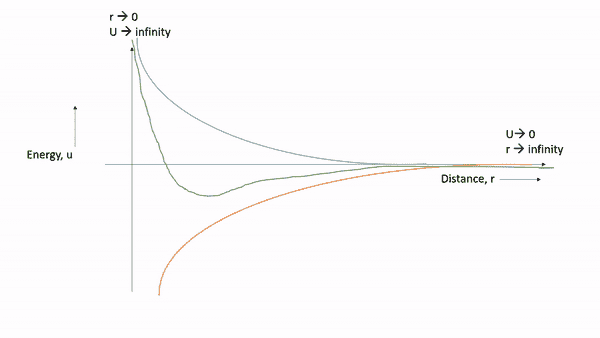
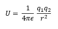
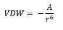
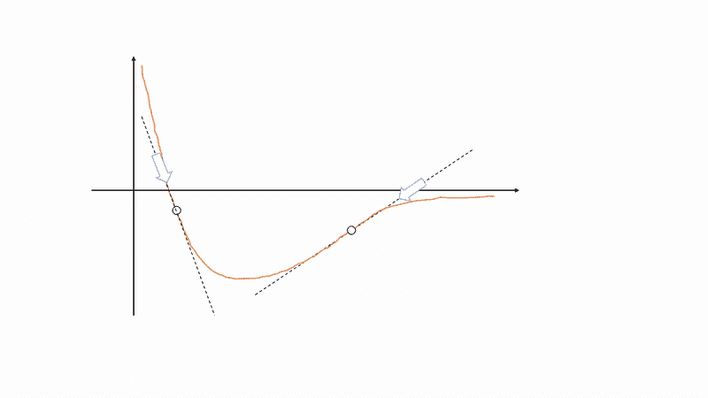
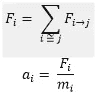
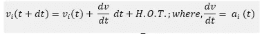

# 分子动力学模拟:完成的方式

> 原文：<https://medium.com/nerd-for-tech/molecular-dynamics-simulation-the-way-its-done-416d7a5fed00?source=collection_archive---------1----------------------->

随着纳米科学技术的进步，分子动力学模拟的应用日益增多。虽然它有一个看似复杂的名字，但 MD 模拟的概念并不复杂，而不是比基于**牛顿力学**更简单。

## MD 模拟的主要目标是什么？

S 暗指陈述，这一切都是关于寻找一段时间后的原子轨迹，包括其中的因果关系。假设，我们有一个 atom '**athleticoMadrid(ATM)**'及其在 t = 0 时在 Metropolitano 体育场**的训练。现在，由于'**德比效应** '*，原子' **atm** '在时间 t = t 时向**伯纳乌**运行(对于一场足球比赛，我们暂且忽略它)。因此发现考虑时间效应的原子从**梅洛波利塔诺**到**伯纳乌**的运动是分子动力学模拟的任务。**

# 很简单吧？是的，它是

这个数值过程本质上是迭代的。很明显，我们并没有放弃，或者在 t=t 之后还没有完成，相反，我们可能还想知道在 t = t+1 发生了什么，等等。

## 关键成分是什么？

**这个迭代过程只需要四个步骤:**

1.  *系统的初始原子位置和速度，即原子水平的温度*
2.  *原子间能量，这是模拟最重要的部分*
3.  *从能量中计算出许多体力*
4.  *对牛顿定律进行积分，以在一段时间(比如 dt)后找到新的速度和位置*

现在，我会试着偷看每一步。首先，我们必须了解初始系统。没有初始系统，什么都做不了。这一步非常简单，没有隐藏的复杂性。我们只需要定义原子的初始位置，然后在某个温度下激发它们，因为在原子层面温度意味着速度。(基础化学应该教你这个)

三维纳米束模型中原子的初始位置

# 原子能间

到计算原子间能量，是 MD 循环中最重要的一步。它通常是一个原子与另一个原子相互作用的能量。需要注意的是，分子动力学模拟没有考虑量子物理的影响，尽管量子力学在分子水平上是显而易见的，但它只使用了经典力学。这就是为什么在许多情况下它可能不包含量子力效应，但是 MD 模拟在完成它的工作时没有这种考虑也做得很好。

**原子间的能量主要有三种，它们是:**

1.  **库仑相互作用**能量源于原子的电荷。随着原子之间的距离变宽，吸引力变得明显，当它们越来越近时，开始互相排斥。

*   假设有几个足球俱乐部属于一个城市。随着两家俱乐部之间的距离缩短，或者更准确地说，两家俱乐部的主场距离更近，两家俱乐部的球迷更容易(以友好的排斥方式)互相仇恨。就像阿森纳和马刺一样。(足球爱好者会懂)
*   *这种相互作用表示为:*

**2。范德瓦尔斯**能量是由于原子的偶极产生的。它在本质上总是内聚性的，内聚性由负号(-ve)表示。它表示为:

**3。电排斥能量**是典型的量子考虑因素。这就是为什么它被描述为一个增长非常快的函数，并且趋向于无穷大，因为它需要无穷多的能量来使两个原子靠近或重叠。

# **之间的力**

在完成所有能量的计算后，我们必须开始计算它们之间的力。在原子术语中，力的定义是当原子不在平衡位置时，它感受到的朝向平衡位置的推力。

这意味着，一个远离平衡能态的原子，总会有一个朝向它的推力，这个推力，力，由原子瞬时位置的斜率来量化。所以，

> “原力将与你同在。一直都是。”

# 始终

接下来的过程只是经典力学的牛顿第二定律的数值积分，即，

在短时间 dt 内对该方程积分将给出新的速度，对这些速度积分将给出更新的位置。这里有一点需要注意，从数值积分的泰勒展开式

如果 dt 较小，等号后面的项将是线性的。这就是原因。如果系统原子运动得更快，那么我们将使用较低的 dt，否则使用较高的 dt。

在重新生成新的位置和速度后，我们要做的是，我们必须再次运行每一步，我们将循环这样做，直到需要为止。

*德比战——同一座城市的两家俱乐部之间的比赛。