# MongoDB:如何获得云托管的免费 MongoDB 集群服务

> 原文：<https://medium.com/nerd-for-tech/mongodb-how-to-get-a-cloud-hosted-free-mongodb-cluster-as-a-service-214db2cc1c29?source=collection_archive---------8----------------------->

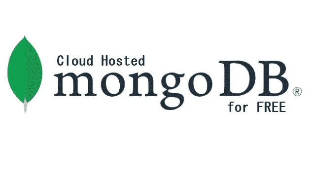

既然我们总是连接到互联网，那么您真的需要为您的项目设置一个本地环境吗？

MongoDB 无疑是最受欢迎的，并且可能是市场上增长最快的 NoSql 数据库之一。它是一个开源的、面向文档的数据库，提供了高可伸缩性和高性能。MongoDB 在 NodeJs 社区中非常受欢迎，并在基于 NodeJs 的技术栈中广泛采用，如 MEAN、MERN、MEVN 等。

要获得云托管的免费 MongoDB 集群，“MongoDB Atlas”是解决方案。请遵循以下步骤:

# ***第一步*** :登录 MongoDb Atlas

登录 [MongoDB 图集](https://www.mongodb.com/cloud)。系统会提示您创建组织和项目。

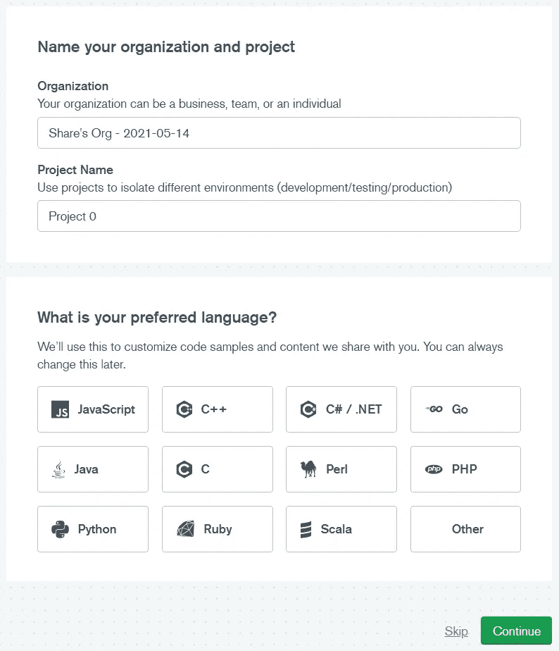

注册后入职页面

# ***步骤#2*** :创建一个空闲集群

系统会提示您创建一个集群—选择 free cluster。

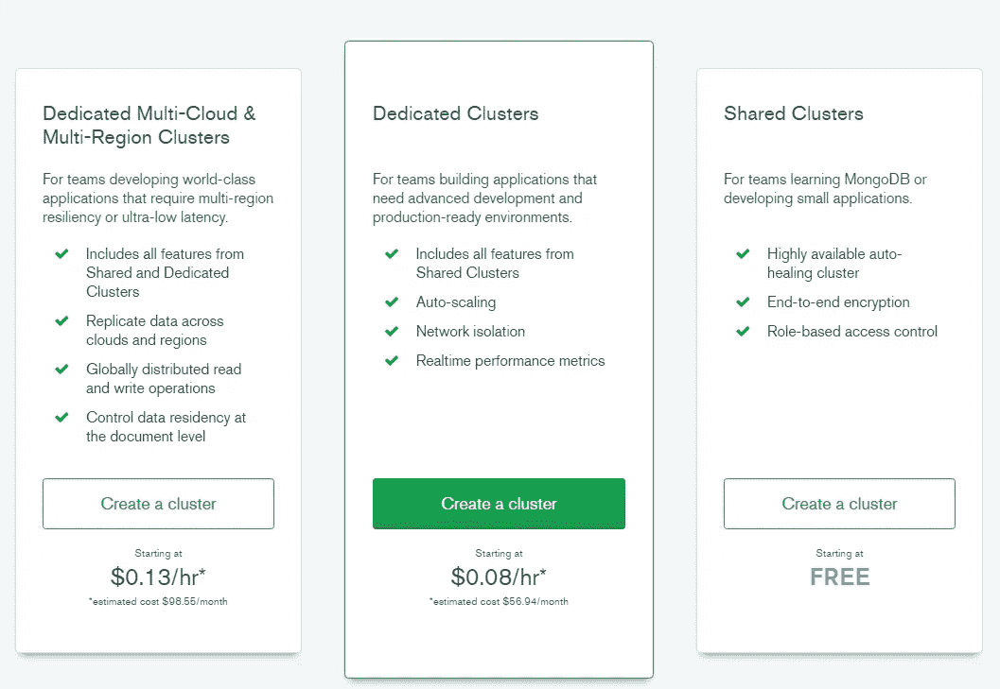

选择创建空闲集群

# ***步骤#3* :选择云提供商&地区**

选择您偏好的云提供商和地区。

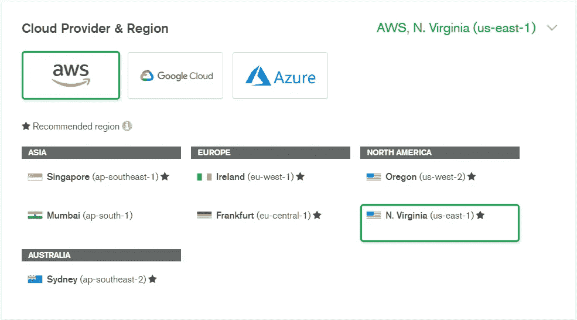

选择您喜欢的任何云提供商和地区

# ***第四步*** : M0 免费

选择“M0 沙盒”集群并点击“创建集群”。

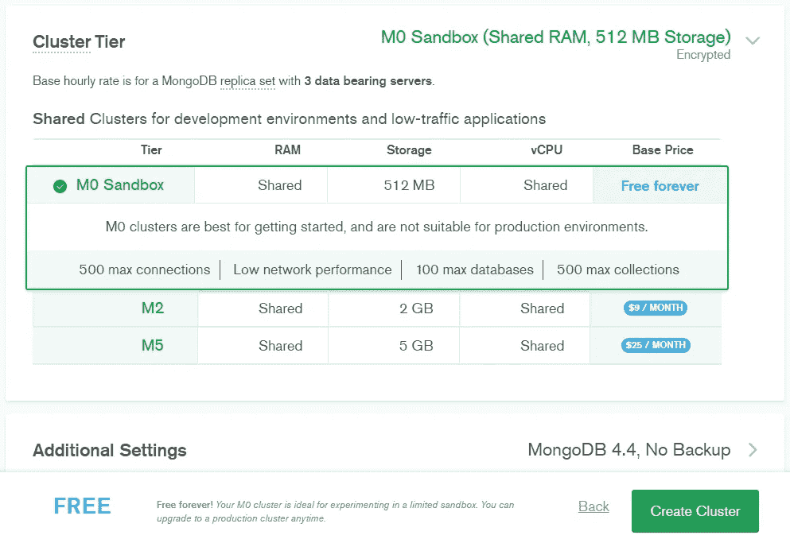

为自由群集选择 M0 沙盒

# ***第五步*** :创建数据库用户

创建一个用户来访问集群。

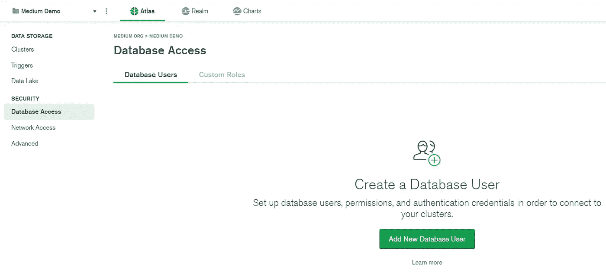

导航到您创建的集群的“数据库访问”选项卡

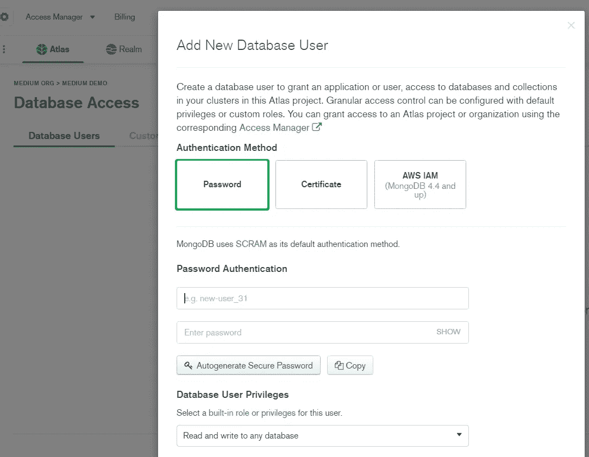

创建用户

# ***步骤#6*** :创建网络规则

若要允许从您的计算机访问，请创建一个网络访问规则

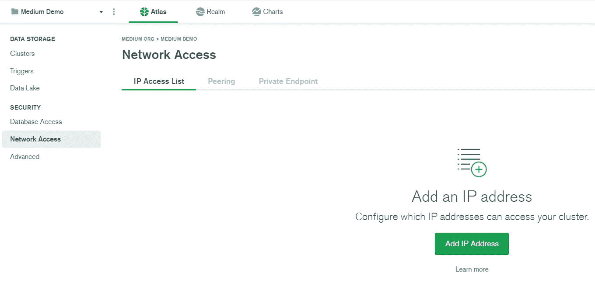

导航到集群的“网络访问”选项卡

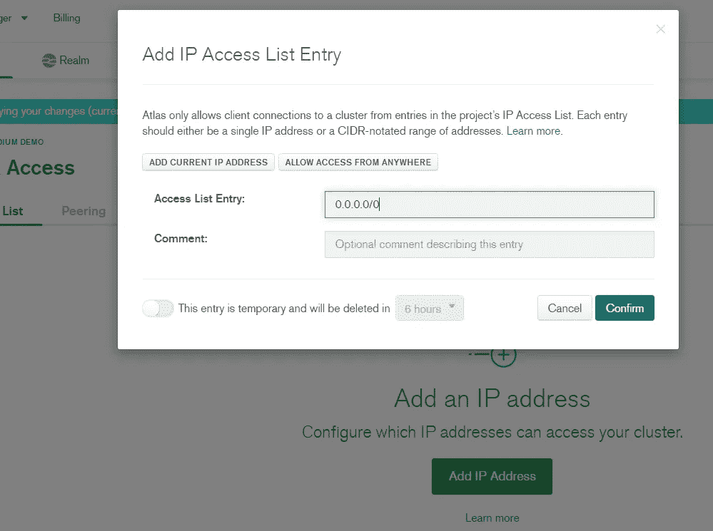

添加您的 IP 范围或 0.0.0.0/0 将其公开

# ***步骤#7*** :连接集群

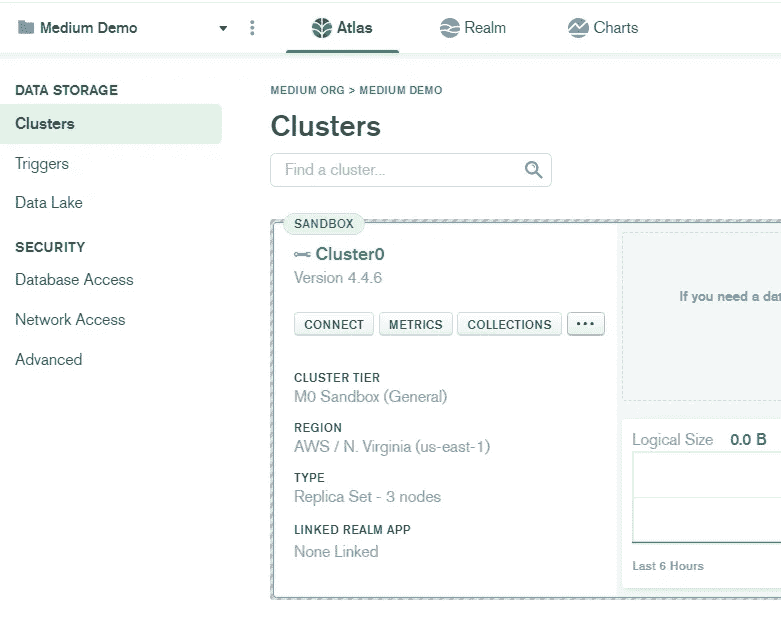

导航到“集群”选项卡并点击“连接”

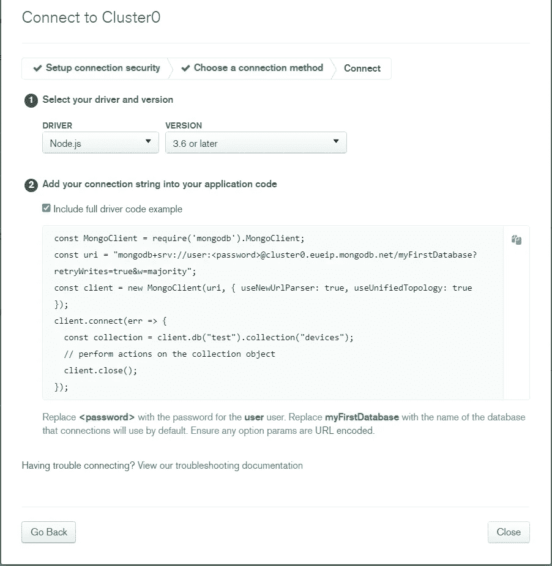

访问不同的选项以连接到您的集群

# ***加成*** :

我个人比较喜欢本地安装 MongoDBCompass，连接集群。

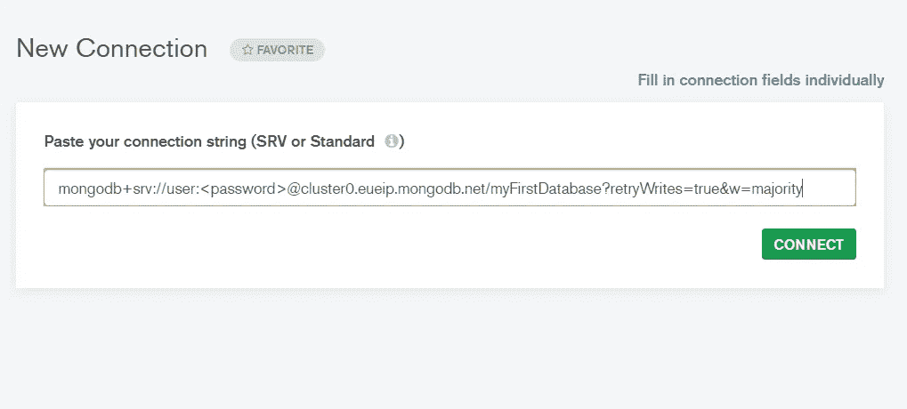

输入正确的凭据并连接