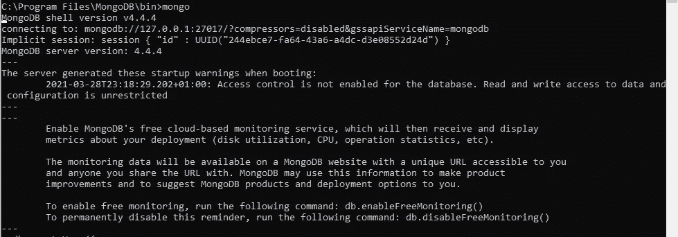
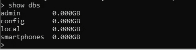
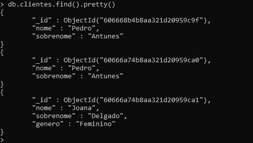
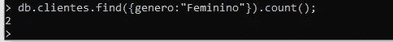

# MongoDB:如何在 Windows 10 上操作 NoSQL 数据库

> 原文：<https://medium.com/nerd-for-tech/mongodb-how-to-manipulate-data-bases-nosql-on-windows-10-42ba94abb630?source=collection_archive---------11----------------------->

要下载 MongoDB，请点击[此处](https://www.mongodb.com/try/download/community)

第一步是在我们的 Windows 命令提示符下输入，然后我们在 MongoDB 的根文件夹下输入，在 **bin** filder 下输入，然后我们在提示符下复制路径并更改目录:

> cd C:\Program Files\MongoDB\bin

下一步是通过键入以下命令进入 MongoDb 的 shell:

> 蒙戈

输出应该是这样的:

产出 1

一旦我们做到这一点，我们可以开始管理 ou 数据库。

**创建新用户:**

要创建新用户，只需在命令提示符下键入以下代码:

输出应该是这样的:

**显示数据库列表:**

只需在提示符下键入以下代码:

> 显示数据库

输出应该是这样的:

**创建数据库**

要创建数据库，只需键入

> 使用 loja

(“loja”是数据库的名称)

**创建收藏**

集合允许用户保存文档，与关系数据库中的表相同。

要创建集合，只需键入以下代码:

> db . create collection**(**' clientes’**)**；

和 verofy 是集合战争创建我们使用以下代码:

> 显示收藏

如下面的输出所示:

**在集合中插入文档**

现在我们要在集合“clientes”上插入文档，只需键入以下命令(这是一个示例):

> db . clientes . insert({ nome:" joo "，sobr enome:" antónio " })；

为了显示插入到确定集合中的文档，我们使用以下代码:

> db . clientes . find()；

输出应该是这样的:

**一次添加多个文档**

只需键入以下代码(以名称为例):

> db . clientes . insert([{ nome:" Pedro "，sobrenome:"Antunes"}，{nome:"Antonio "，sobrenome:"Santos "，genero:" Masculino " }])；

显示文档

有了这个代码，吴就可以以一种相关的方式查看我们的文档:

> db.clientes.find()。漂亮()

现在，我们将通过键入以下代码(示例)在我们的文档中添加一个新字段:

**删除文件**

使用下面的代码，我们将删除每个名为“Pedro”的文档:

> db . clientes . remove({ nome:" Pedro " })；

搜索文档

因此，让我们只使用一个参数来搜索文档，以免键入以下代码:

> db . clientes . find({ nome:" Jose " })；

**结果排序**

要对我们的搜索进行排序，我们可以使用以下命令:

清点文件

键入以下代码:

> db.clientes.find()。count()；

我们还可以统计给定查询的结果:

