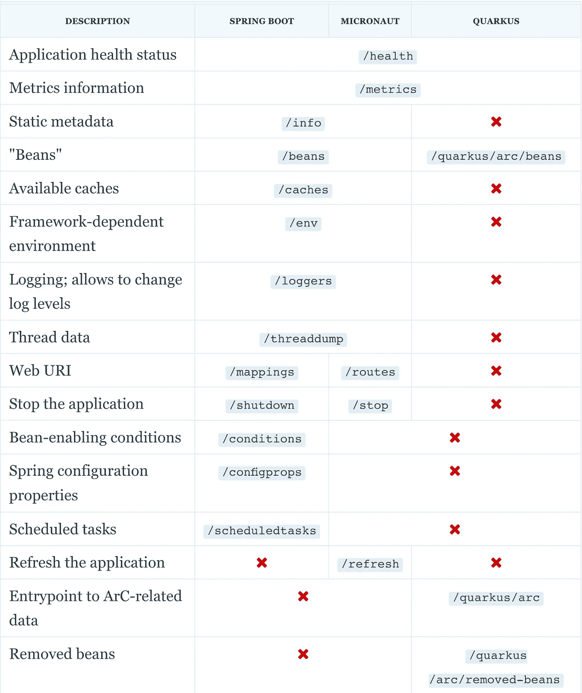

# 跨框架监控

> 原文：<https://medium.com/nerd-for-tech/monitoring-across-frameworks-c47378ed33fe?source=collection_archive---------19----------------------->


开发人员的工作随着应用程序的发布而结束的时代已经一去不复返了。如今，开发人员越来越关心 IT 的运营方面:也许他们自己操作应用程序，但更可能的是，他们的组织促进了开发和运营之间的合作。

当我还是一名顾问时，我就开始对软件的运营方面感兴趣。当 Spring Boot 释放致动器时，我变得很兴奋。通过其“约定-其他-配置”的特性，只需一个附加的依赖项就可以添加监控端点。

从那以后，其他框架不断涌现。它们还提供监控功能。在这篇文章中，我想就这些能力对这些框架进行比较。

# Spring Boot

[Spring Boot](https://spring.io/projects/spring-boot) 是开启监控功能趋势的框架。要启用它们，只需添加一个称为**致动器**的依赖关系:

```
<dependency>
    <groupId>org.springframework.boot</groupId>
    <artifactId>spring-boot-starter-actuator</artifactId>
    <version>2.4.1</version>
</dependency>
```

执行器提供三种端点:

*   默认端点*，如* `/health`、`/metrics`、`/beans`等。
*   依赖项提供的端点。例如，添加 Flyway 将启用`/flyway`端点。
*   您可以提供的自定义端点

使用 Spring Boot，可以通过 JMX 和 HTTP 暴露端点。出于安全原因，默认情况下，所有终端都启用了 JMX。另一方面，HTTP 只对`/health`(以压缩形式)和`/info`启用。

您可以通过 Spring Security 保护 HTTP 端点。这允许广泛的用例。例如，您可以启用特定的端点，但只允许经过身份验证的客户端访问它。

# 微型机器人

[Micronaut](https://micronaut.io/) 还提供监控端点。这些端点大多映射到 Spring Boot 提供的端点，只有少数例外。

要添加管理功能，请添加一个依赖项:

```
<dependency>
    <groupId>io.micronaut</groupId>
    <artifactId>micronaut-management</artifactId>
    <version>2.2.2</version>
</dependency>
```

微机器人通过 HTTP 暴露端点。为了通过 JMX 公开它们，您需要添加一个额外的依赖项。

```
<dependency>
    <groupId>io.micronaut.jmx</groupId>
    <artifactId>micronaut-jmx</artifactId>
    <version>2.1.0</version>
</dependency>
```

默认情况下，除了`/cache`和`/stop`之外，所有端点都被启用。

注意`/metrics`端点需要依赖于千分尺芯。

# 夸库斯

最后但并非最不重要的是夸夸其谈。Quarkus 的方法不同于 Spring Boot 和 Micronaut 的方法:它本身不实现端点，而是依赖于第三方。在进入核心之前，让我离题一点。

很久以前，有一个概念叫做 Java EE，由 Sun 提出，然后由 Oracle 提出。这个想法是设计一套规范，并让行业参与者实现它们。这将使客户受益，因为他们可以透明地从一个兼容 Java EE 的平台迁移到另一个平台。尽管现实并不理想，但它或多或少地发挥了作用，直到两件事情发生。

Java EE 平台是在资源稀缺的时候设计的，要在几个应用程序之间共享。工作中的第一个难题是敏捷和云的兴起，它们支持更小、更高效的运行时。

第二个问题是 Oracle 对 Java EE 失去了兴趣，因为它没有产生足够的(任何？)营收。Java EE 以 Jakarta EE 的名字在 Eclipse Foundation 找到了一个新家，但这不是一夜之间发生的——它花了大约三年时间。在那段时间里，Java EE 没有任何技术上的改进。

随着科技的发展，这是一个致命的威胁。为了防止 Jakarta EE 在迁移期结束时变得过时，并行出现了一组称为[微概要文件](https://projects.eclipse.org/projects/technology.microprofile)的新规范。MicroProfile 提供了一组集中的子规范(括号中是实际版本):

*   配置(2.0)
*   容错(3.0)
*   健康(3.0)
*   JWT·RBAC(1.2)
*   指标(3.0)
*   开放式 API (2.0)
*   开放式跟踪(2.0)
*   Rest 客户端(2.0)

有趣的是，我发现至少有两个库形式的微文件实现——而不是一个成熟的应用服务器:富士通的 [SmallRye](https://smallrye.io/) 和 [Launcher](https://github.com/fujitsu/launcher) 。应用服务器的提供商和开发人员可以使用这些依赖关系，而不是自己重新实现规范。这就是夸库斯遵循的方法。

每项功能都由特定的依赖项来实现。

```
<dependency>
    <groupId>io.quarkus</groupId>
    <artifactId>quarkus-smallrye-metrics</artifactId>
    <version>1.10.5.Final</version>
</dependency>
<dependency>
    <groupId>io.quarkus</groupId>
    <artifactId>quarkus-smallrye-health</artifactId>
    <version>1.10.5.Final</version>
</dependency>
```

此外，Quarkus 提供了多个特定于其 CDI 实现(ArC)的端点。由于其专注于云原生，Quarkus 实现了编译时 CDI。因此，它能够检测没有在其他地方使用的 beans，并且不会实例化它们。请注意，除非明确启用，否则 ArC 端点仅在开发模式下可用。

当编译时类路径上有一个 SmallRye 依赖项时，默认情况下它是启用的。专用标志允许单独禁用它们。对于其他配置属性也是如此，*，例如*，到端点的路径。

# 赫利登

[Helidon](https://helidon.io/) 是 Oracle 提供的基于 Jakarta EE APIs 和 MicroProfile 子集的框架。

我知道它支持开箱即用的`/health`和`/metrics`。对于它们中的每一个，您都需要添加一个依赖项。

我必须承认我没有花足够的时间来讲述更多。有兴趣的请自行查看。

# 总结

这里总结了所有框架的端点。



# 为了更进一步:

*   [Spring Boot 执行器](https://docs.spring.io/spring-boot/docs/current/reference/html/production-ready-features.html)
*   [Micronaut 的管理&监控](https://docs.micronaut.io/latest/guide/#management)
*   [微文件](https://projects.eclipse.org/projects/technology.microprofile)
*   [小黑麦](https://smallrye.io/)
*   [Quarkus —微档案健康](https://quarkus.io/guides/microprofile-health)
*   [Quarkus —微轮廓度量](https://quarkus.io/guides/microprofile-metrics)
*   [Quarkus —上下文和依赖注入](https://quarkus.io/guides/cdi-reference#dev-mode)

*最初发表于 2021 年 2 月 28 日* [*一个 Java 怪胎*](https://blog.frankel.ch/monitoring-across-frameworks/) *。*