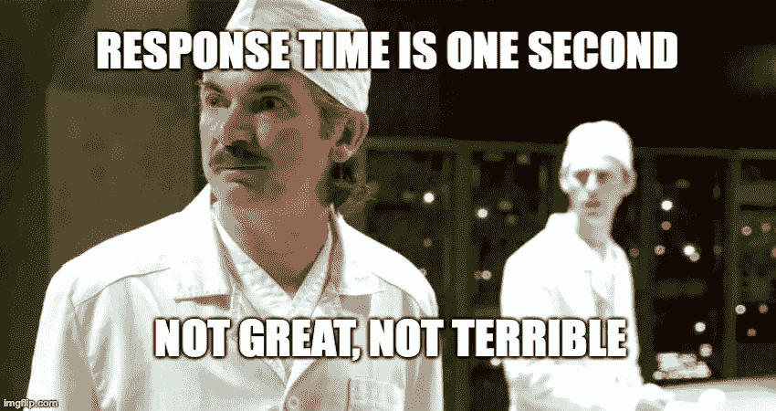

# 【监控】监控什么？在哪里？什么时候？

> 原文：<https://medium.com/nerd-for-tech/monitoring-what-to-monitor-where-when-6f05dfd95884?source=collection_archive---------12----------------------->

你创造了一个伟大的产品。你提供它作为一种服务。您为客户定义质量和性能服务水平协议(SLA)。

现在是时候定义你的监控策略了。您应该从系统中收集哪些指标？从哪里？以什么节奏？

**策略一:是啊，监控，我不知道** **知道**

*   **使用基于客户端的监控**:不需要监控任何东西。如果有些东西不能正常工作，你的客户肯定会让你知道。降低开发成本。有时增加病人心率。
*   **只监控系统级指标:**这都归结为资源拥塞，不需要监控其他任何东西。如果系统运行缓慢，请检查 CPU 或磁盘是否拥塞。如果您的系统返回许多错误，请检查 CPU 或磁盘是否拥塞。想知道为什么你的客户比你的监控发现更多的问题。
*   **仅监控应用级指标:**跟踪应用响应时间和错误率。无需监控基础设施或外部服务。如果您的系统返回大量错误或开始变慢，请开始研究错误日志，或检查各个基础设施组件的本地指标。想知道你的恢复时间为什么这么高？
*   **监控所有的事情:**从任何系统级别，以任何粒度，收集你能得到的所有度量。首先集中精力收集一切。稍后确定指标相关性。生成度量洪水。想知道为什么你的监控系统运行缓慢或维护费用昂贵。
*   **不要聚集指标:**每个指标都是独立的。CPU 指标仅标有基础设施信息。响应时间用 API 端点标记。让人们拼凑 CPU 和特定端点的响应时间之间的联系。我想知道为什么您不能提高系统的自动化程度或实施自动修复。

**策略 2:监控可观察性**

*   **SLA，SLO，SLI** :定义满足您的 SLA 所需的服务水平目标(SLO)。从服务订单中，提取您需要的服务水平指标集(SLI)。围绕这些 sli 定制监控。您的 SLA 要求 99.99%的正常运行时间吗？那么 99.99 的正常运行时间就是你的 SLO。SLIs 是跟踪正常运行时间的指标。并非所有指标都应该是 SLIs。确定哪些指标真正重要，并集中精力有效地收集这些指标。
*   **收集业务级指标:**收集交易、购买、端到端业务流等指标。它们提供了系统行为的总体视图，并在出现任何问题时帮助评估业务影响。
*   **收集端到端测试结果:**实施端到端测试，捕获尽可能多的业务流。持续或尽可能频繁地运行它们。监控他们的结果。使用它们作为系统出现任何问题的早期指标。
*   **收集应用程序级别的性能和质量指标:**收集响应时间、延迟、错误率等指标。跨服务实例聚合它们。从指标百分位数中提取，如第 95 个百分位数。依靠他们来了解你的性能和质量在请求中的分布。
*   **收集与外部服务交互的指标:**外部可以是另一个系统组件，或者是由第三方实体提供的服务。收集与外部服务通信的响应时间和错误率等指标。它们对于检测外部服务提供的性能和质量的下降非常重要。
*   **收集基础设施利用率和性能指标:**收集指标来帮助您快速识别基础设施拥塞。例如 CPU 使用率、磁盘使用率和延迟、内存使用率、网络使用率和数据包丢失。
*   **跨监控层聚合指标:**将应用程序级与业务级和基础设施级指标相关联。用源组件和层标记指标，以支持指标聚合。跨层汇总指标可以帮助您更快地了解问题，并对更复杂的事件发出警报。“服务 X 上的响应时间很长且 cpu 使用率很高”的警报通常更有用，而不是更简单的“服务 X 上的响应时间很长”，或者更嘈杂且通常不太有用的“CPU 使用率很高”。