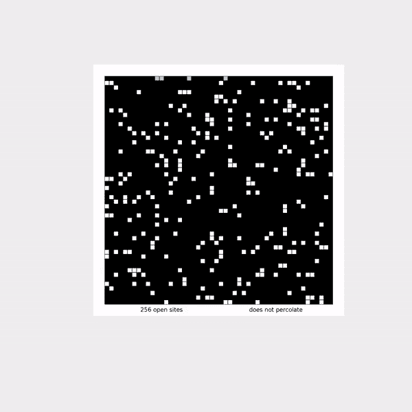
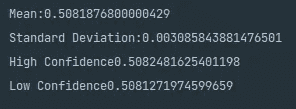

# 蒙特卡罗模拟:在 Java 中估计渗透阈值

> 原文：<https://medium.com/nerd-for-tech/monte-carlo-simulation-estimate-percolation-threshold-in-java-7f253641bbdd?source=collection_archive---------7----------------------->

当我即将完成普林斯顿大学 Coursera 的算法 1 课程的第一周时，一个名字出现在我的屏幕上。那是“蒙特卡洛模拟”。我按下暂停，心想，这到底是什么鬼话！。是的，当我看到这个名字的时候，那是完全一样的反应。

作为一名管理专业的学生，当我开始学习人工智能的旅程时，我只抱有希望，(我成功地完成了这个过程，到目前为止，我名下的项目和文章很少)，但话说回来，我对学习算法和数据结构产生了新的热情。



渗流可视化

好吧！我说的够多了，让我们开始编码吧！！！还有一件事，我认为你有以下主题的先验知识:

1.  动态连接
2.  图表
3.  联合查找(快速联合，快速查找)
4.  加权联合查找
5.  通路压缩

如果没有，那么你应该考虑先去拜访他们。像往常一样，你可以在我的库 [**这里**](https://github.com/dcostersabin/Algorithm-Percolation) **找到源代码。**此外，普林斯顿大学在这个 [**链接**](https://coursera.cs.princeton.edu/algs4/assignments/percolation/specification.php) **上提供了所有必要的依赖关系或目录结构。**

为了简单起见，我将根据两种不同的问题陈述来划分解释部分:

1.  过滤
2.  蒙特 卡罗模拟

**渗透**它的一般含义是水通过任何表面上的孔隙的运动。那么，我们试图达成一致的是什么？这背后的动机是创建一个 N * N 大小的矩阵来表示一个表面，并在表面上打开随机的点，直到表面泄漏。还不清楚？

别担心，我抓住你了。我们主要做的是创建一个 N * N 大小的布尔数组，换句话说，N 行 N 列，每个单元代表表面上的一个小孔。因此，我们需要确定的是渗滤阈值，或者说，为了使水从上到下渗漏，表面需要的平均孔数是多少。

如上图 GIF 所示，它代表了一个 50 乘 50 的表面。黑色的方块是堵塞的毛孔，白色的是开放的毛孔，蓝色的方块代表水的流动。

你可能会问为什么我们需要这个？！就像你在做一个实验，你将不同类型的金属混合在一起，制造一种新的合金，通过让水通过它来测试合金的质量。如果你亲自去做，将会花费大量的工时，所以为了节省时间，你可以在电脑上运行它，看看什么样的组合能得到最好的结果。既然已经回答了为什么，让我们从编码开始。与我的其他文章不同，这个问题的实现是使用 Java 完成的，所以我认为您对 Java 也有一点了解。

**代码**

作为课程的要求，我们创建了一个名为**逾渗**的类，具有以下属性:

```
private boolean[] grid;      

private final WeightedQuickUnionUF gridMap;  

private final int n; private int openCell;              

private final int top ;       

private final int bottom;
```

**网格**代表了我之前解释过的表面部分。网格中会填充“真”或“假”。真实的存在是开放的，虚假的存在是封闭的。

gridMap 表示加权快速联合结构，我认为你已经有一些先验知识。如果不是，就把它看作是在网格中寻找路径的一种机制，这样我们就可以在网格中任何给定的两点之间找到路径。

**openCell** 该变量将用于计算我们随机打开的表面上开孔或开孔的数量。

**顶部**和**底部**是额外添加的结构，以便我们可以映射顶部和底部之间是否有开放路径。这有助于我们得出结论，如果找到任何路径，表面就会泄漏。这里我们将它们初始化(顶部和底部)为开始和结束索引。因此，在初始化网格和网格地图时，我们将它们的大小设为 N * N + 2，以增加顶部和底部。

```
public Percolation(int n) {      

   if (n <= 0) throw new IllegalArgumentException();                                       gridMap = new WeightedQuickUnionUF(n * n + 2);                                  grid = new boolean[n*n+2];                              

   this.n = n;                                  openCell = 0;                                  top = 0;                                  bottom = n * n + 1;                           
}
```

通常，我们希望 N 大于 0，因为没有结构有负维数。如前所述，我们将网格和网格图的大小初始化为 N * N + 2。Top 和 Bottom 被初始化为起始和结束索引。

```
private void checkRowsColumn(int row, int col) { if (row < 1 || row > this.n || col < 1 || col > this.n) throw new IllegalArgumentException();                                                        
}
```

checkRowsColumn 函数只在行和列小于 1 或大于 N 时抛出非法参数异常，如果不选中，它将在程序的后面给出数组索引越界异常。为了防止这种情况发生，我们有一个限制层。

```
private int indexOf(int row , int col){ checkRowsColumn(row,col);                            

return (row - 1) * n + (col -1);                           }
```

在 indexOf 方法中，我们获取行和列，并返回特定交叉点的索引。例如，如果 row = 2，col = 2，则该单元格的索引将是 3，因为数组的索引从 0 开始(不包括 Top 和 Bottom 的逻辑)。

```
public boolean isOpen(int row , int col)                           {                  

checkRowsColumn(row , col); return grid[indexOf(row ,col)]; }
```

isOpen 函数是自解释的。它检查给定的单元格是真还是假。真意味着水可以通过，假意味着它拒绝水。

```
public boolean isFull(int row , int col)                           { checkRowsColumn(row, col); if(!isOpen(row,col)) return false; return gridMap.find(indexOf(row,col)) == gridMap.find(top); }
```

同样，isFull 检查点或像元是否有通向顶部的路径，因为顶部是水源，如果顶部和底部像元之间存在任何路径，水将流经该路径。

```
public int numberOfOpenSites(){ return this.openCell; }
```

该函数只返回打开的孔的总数或包含真值的单元格的总数。

```
public boolean percolates(){ return gridMap.find(top) == gridMap.find(bottom); }
```

如果在顶部和底部之间存在任何路径，则认为表面是渗透的。

```
public void open(int row, int col) 
{                               
 ........................                                                   
}
```

所以最长和最难的逻辑隐藏在开放函数中。最初，表面不会渗透。我们随机打开一个孔，或者将一个特定的单元格初始化为真，然后检查顶部和底部之间是否存在路径。在这个函数中，我们使用两个参数 row 和 col 来确定要打开的单元格。在蒙特卡罗实现中进一步解决了随机开放。现在，我们将着眼于渗透背后的逻辑。

```
checkRowsColumn(row,col);
int current_cell_index = indexOf(row, col);
```

最初，我们检查给定的行或列是否在范围内。如果它超过了这个范围，我们就确定要打开的单元格的索引。如前所述，网格是一个布尔数组，因此如果索引中的值为真，则认为它是开放的。因此，如果单元格中的值为 false，我们将尝试打开该单元格。事情没那么简单。如果我们只用真值代替假值，算法就不起作用。在我们用真替换假之后有许多后置条件。

```
grid[current_cell_index] = true;                                   this.openCell ++ ;
```

在我们用真值替换假值之后，我们将开放单元格的数量增加 1。寻找表面是否渗透的主要动机是寻找顶部和底部之间的路径。因此，当我们打开表面的细胞时，我们需要检查各种条件。我们需要检查相邻的牢房是否开放。如果相邻单元是开放的，则存在路径。然后，我们绘制出这条路，直到它无路可走或没有尽头。

```
if(row == 1) gridMap.union(current_cell_index,top);
```

我们检查的第一个条件是单元格的索引是否位于第一行。因为在路径压缩的加权快速查找中，顶部的每个单元都与根相连，或者换句话说，表面的顶部有水，所以如果存在任何孔，水流过该孔。为了解决这种特殊的情况，我们做的是在顶部和我们最近打开的模拟水流的单元之间创建一条路径。

简单介绍一下什么是路径压缩，把它看作是一种重新创建给定树结构的方法，在这种树结构中，节点的排列方式使得到达一个叶节点需要最少的边数。

```
if(row == this.n) gridMap.union(current_cell_index,bottom);
```

回到第二步，我们在这里检查最近打开的单元格是否在底行。如果是的话，我们就把打开的单元格连接到底部的单元格。将底部电池视为一个容器，用于在表面漏水时收集水。

**以上**

```
if(row > 1 && isOpen(row - 1 ,col))                                   { assert(current_cell_index > n); gridMap.union(current_cell_index,current_cell_index - n); }
```

如果最近打开的单元格既不在顶部也不在底部。这是我们检查相邻细胞的地方。因为最近打开的单元格可能在其顶部、底部、右侧、左侧有打开的单元格。我们检查所有的条件。在上面给出的代码中，它检查一个单元格是否在其顶部打开，即(row —当前行之前的 1 行)。如果条件匹配，我们就在它上面的单元格之间创建一个链接。所以如果它的顶部有水，水就会流过它。

**下图**

```
if (row < this.n && isOpen(row + 1 , col))                                   { assert(current_cell_index + n < n * n); gridMap.union(current_cell_index , current_cell_index + n); }
```

同样，我们检查底部的单元格。如果它下面的单元格是打开的，我们在它们之间创建一个并集，这意味着我们在新打开的单元格和它下面已经打开的单元格之间创建一个路径。

**左**

```
if(col > 1 && isOpen(row, col - 1))                                   { gridMap.union(current_cell_index,current_cell_index- 1); }
```

**右**

```
if(col < this.n && isOpen(row, col + 1))                                   {                                       gridMap.union(current_cell_index,current_cell_index + 1);                                   }
```

用同样的方法，我们检查前一个和后一个单元格之间的潜在路径。简单地说，如果它右边或左边的单元格是打开的，我们就在它们之间创建一条路径。

因此，现在我们已经成功地创建了一个模型来表示一个表面，它可以确定该表面是否泄漏。如您所见，我们没有单独运行该模型。为了形象化这个普林斯顿有包含 PercolationVisualization.java 的文件。

**蒙特卡洛模拟**

我们的逾渗模型只是一个抽象的结构来代表一个表面。通过反复模拟泄漏的发生，对事件(渗透)进行精确分析。现在让我们开始模拟部分。

你可能会问的第一个问题是，我们为什么需要这种分析。你可能会说我们已经有了一个模型，我们只是运行它并检查表面是否泄漏！

你没有错，但也不完全正确。因为我们随机地均匀打开一个单元，所以泄漏的发生率是不同的。因此，我们需要对平均回报(在这种情况下是发现漏洞)、标准差、最高置信水平和最低水平进行具体分析。

所以蒙特卡罗方法是一种估计不确定事件可能结果的数学技术。当系统渗透时，打开的单元部分给出了渗透阈值的估计。所以我们的任务是，看看需要多少开孔，表面才能渗透。

所有的数学方程式都是普林斯顿在这一页给出的。正如他们提到的，我们需要找到平均值、标准差、95%置信区间的低端点以及 95%置信区间的高端点。为此，我们初始化 4 个变量，即:

```
private final double mean ;

private final double sd;

private final double highConfidence;private final double lowConfidence;
```

这种模拟背后的主要逻辑是，我们初始化一个大小为 N 的表面，检查它是否相对于随机打开的单元渗透，并重复这个过程给定的次数。

```
if(n <= 0 || trials <= 0) throw new IllegalArgumentException();
```

最初，我们检查给定的大小(即 n)和试验(即重复次数)是否大于 0。如果给定的参数有效，我们创建 3 个变量。

1.  数组来存储结果即结果

```
double[] results = new double[trials];
```

2.存储随机生成的行号的整数变量

```
int testY;
```

3.存储随机生成的列号的整数变量

```
int testX;
```

在初始化所需的变量后，我们循环跟踪时间。

```
for(int i = 0 ; i < trials;i ++) { ---------- }
```

初始化我们之前建立的大小为 n 的渗流模型。

```
Percolation per = new Percolation(n);
```

现在是有趣的部分

```
while(!per.percolates()) {                                           
     testX = (int)((StdRandom.uniform() * n) + 1);                                                   testY = (int)((StdRandom.uniform() * n) + 1);                                               if(!per.isOpen(testY,testX))                                                   {                                                          per.open(testX,testY);                                           } } results[i] = (double)(per.numberOfOpenSites()) / (n * n);                               }
```

我们在一个点上循环，直到表面渗透。最初，系统不会渗透，因为所有的单元都是封闭的。现在我们随机均匀地生成一个随机的行和列。在我们有了一组新的行和列之后，我们使用之前在我们的渗滤模型上创建的 open 函数打开那个特定的单元格。新的单元打开后，我们再次检查表面或模型是否渗透。这个过程一直持续到系统渗透为止。如果系统渗滤，它从 while 循环中出来，开放位点或细胞的数量除以其总大小，即(n * n ),得到一个分数或估计值。然后，我们将这个估计值存储在一个数组中，并重复这个过程。

```
mean = StdStats.mean(results); sd = StdStats.stddev(results); lowConfidence =  mean - (1.96 * sd)/ Math.sqrt(trials); highConfidence =  mean + (1.96 * sd)/ Math.sqrt(trials);
```

在进行模拟试验后，我们借助普林斯顿大学提供的库，即 StdStats.mean()来计算平均值。

同样，我们使用 StdStats.stddev()对收集的结果计算标准偏差。

为了计算 95%置信区间的高和低端点，我们使用普林斯顿指南提供的公式并分别存储它们。

现在要运行蒙特卡罗模拟，我们所要做的就是初始化一个 PercolationStasts 对象，剩下的就是自动处理了。

```
PercolationStats s = *new* PercolationStats(50,10000);System.***out***.println("Mean:" + s.mean());System.***out***.println("Standard Deviation:"+ s.stddev());System.***out***.println("High Confidence" + s.confidenceHi());System.***out***.println("Low Confidence" + s.confidenceLo());
```

这里我们检查一个尺寸为 50 的表面 10000 次。结果看起来像这样



蒙特 卡罗模拟