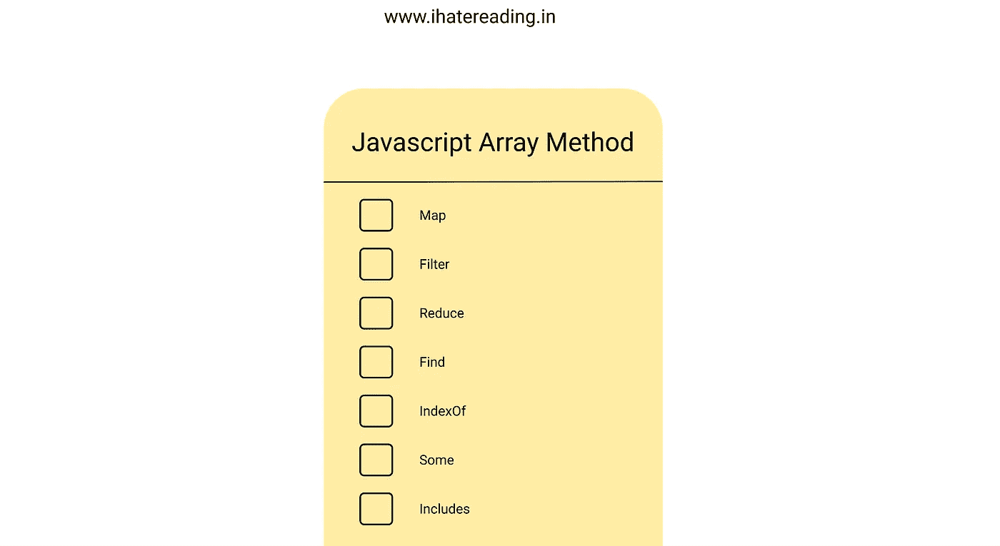

# 最常用的 Javascript 数组方法

> 原文：<https://medium.com/nerd-for-tech/most-used-javascript-array-methods-34ae7464c18b?source=collection_archive---------5----------------------->

讨论一些开发者日常生活中常用的 javascript 数组方法

[**网站**](http://ihatereading.in)

## 在后台

这个故事开始于我写一个关于如何从 javascript 中删除重复的故事。我在一次采访中被问到这个问题，所以我写了一个关于这个问题的故事，在今天的故事中，我将讲述 javascript 中最常用的数组方法。大多数时候，数据是否来自于…