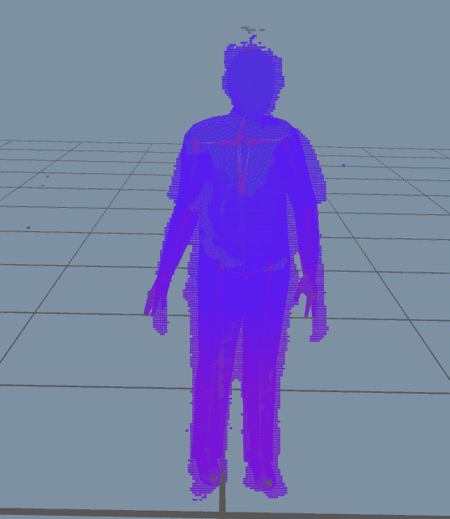

# 动作捕捉 DIY

> 原文：<https://medium.com/nerd-for-tech/motion-capture-diy-e411fcd44a12?source=collection_archive---------0----------------------->

//钱有限？没问题！

自制莫卡

在过去的几天里，我研究了如何使用 Mixamo 下载动画用于我们的游戏开发项目。当我们找不到适合自己情况的动画时，我们该怎么办？

幸运的是，你不需要花几万块买一套 mocap 西装和相机。你会怎么问？好吧，让我们看看我们需要什么来让你的日常电脑工作。