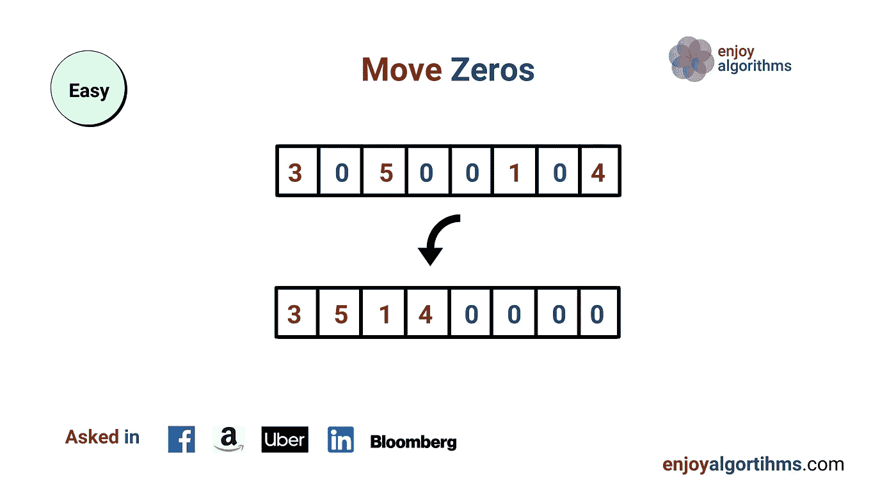

# 移动零点

> 原文：<https://medium.com/nerd-for-tech/move-zeroes-21fd2107ebb3?source=collection_archive---------2----------------------->

(LeetCode easy 问题的解决方案)



给定一个整数数组`nums`，将所有的`0`移动到它的末尾，同时保持非零元素的相对顺序。

**注意**您必须在不复制数组的情况下就地执行此操作。

**例 1:**

```
**Input:** nums = [0,1,0,3,12]
**Output:** [1,3,12,0,0]
```

**例 2:**

```
**Input:** nums = [0]
**Output:** [0]
```

**约束:**

*   `1 <= nums.length <= 10^4`
*   `-2^31 <= nums[i] <= 2^31 - 1`

1.  **强力方法**

还有一种暴力方法。只需使用内置的排序函数对元素进行排序。

**时间复杂度:O(nlogn)**

**空间复杂度:O(1)**

**2。优化方法**

下面的代码是一个优化的方法。在这种情况下，我们使用两点方法。I 指针用于跟踪非零元素，当存储在第 I 个索引处的值为 0 时，计数器递增，否则仅与第 j 个索引处的元素交换。

让我们试运行下面的代码:

以 nums = [0，1，0，3，12]为例，

i = 0，j = 0，n = 5

0 < 5 , nums[0] = 0 , i = 0 +1 = 1

i = 1, j = 0, 1 < 5, nums[1] = 1 , so swap them , nums = [1,0,0,3,12] and so on…

Keep incrementing and swapping the values according to the conditions , you will finally get nums =[1,3,12,0,0].

**时间复杂度:O(n)，空间复杂度:O(1)**

```
**class Solution {
public:
    void moveZeroes(vector<int>& nums) {
        int i = 0, j=0, n = nums.size();
        while(i<n)
        {
            if(nums[i]!=0)
            {
                swap(nums[i],nums[j]);
                i++;
                j++;
            }
            else 
                i++;
        }
    }
};**
```

希望这能帮助你清楚地了解如何寻求解决方案。直到那时，继续编码，继续学习！

请继续关注更多的博客！💻