# 玩家运动-游戏开发系列 03

> 原文：<https://medium.com/nerd-for-tech/movement-of-our-player-game-dev-series-03-be5f8de75bd7?source=collection_archive---------20----------------------->

要在 3D 世界中移动，你需要矢量 3。

上一篇:[高效布局](https://sj-jason-liu.medium.com/how-to-create-unity-2d-game-2-6e9e0d79a1b8)

一旦我们打开一个新项目，我们将自动获得 2 个游戏对象:
主摄像头&定向光。

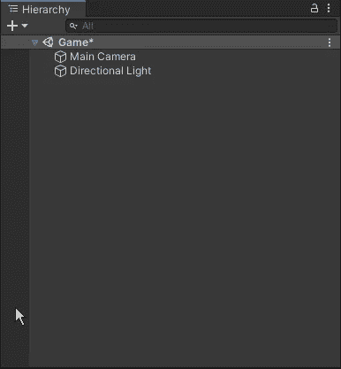

我们需要添加一个游戏对象作为我们要移动的玩家。

要创建，右击`Hierarchy` > `3D Object` > `Cube`。
或者您可以点击`GameObject`下拉菜单进行创建。

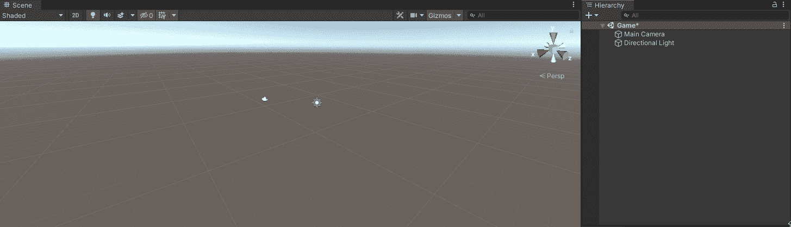

右键单击层次结构

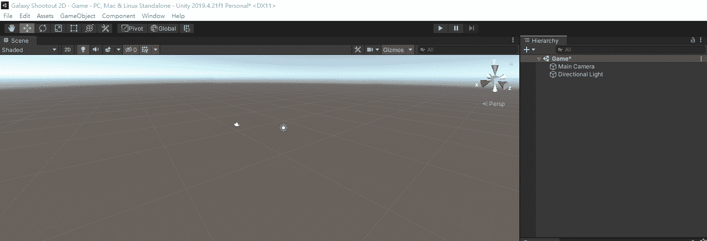

从下拉菜单中单击

我们可以看到游戏对象在我们的游戏视图上。

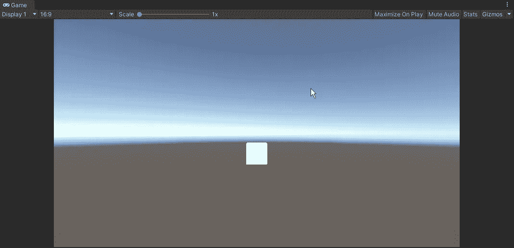

让我们把名字改成 Player，现在我们要让它动起来。

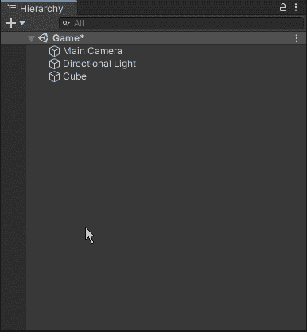

Unity 中的每个游戏对象都有一个包含 3 个数据的变换组件:位置、旋转和缩放。

如果我们想移动一个游戏对象，我们将需要控制位置。

首先，让我们将 Y 轴上的玩家拖动到负 2 左右作为默认位置。

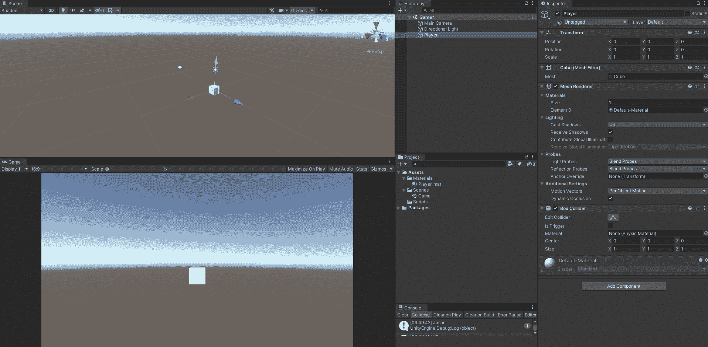

然后我们在`Project`窗口中创建一个脚本文件夹，并创建一个名为`Player`的 C#脚本。

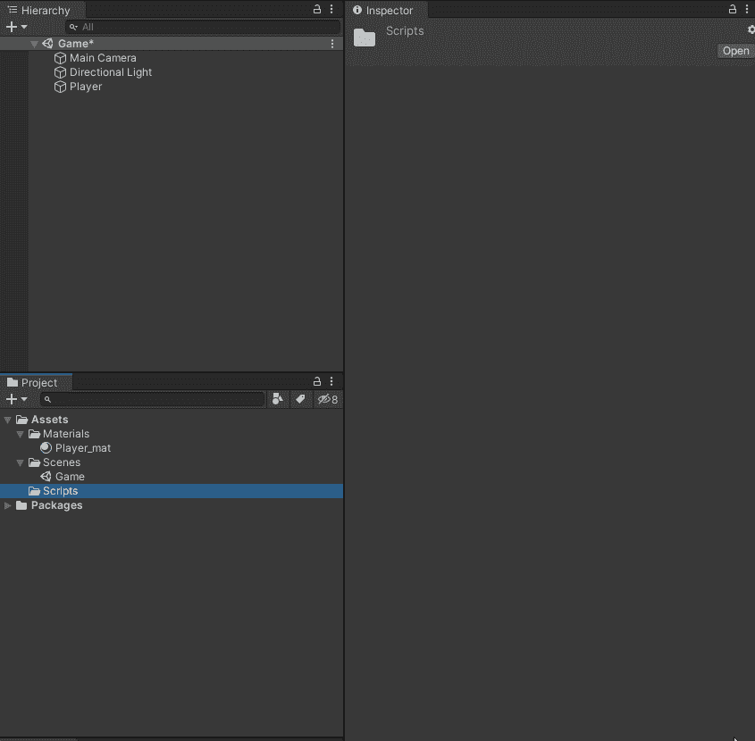

确保在开始时命名脚本，否则以后需要在脚本编辑器中更改脚本名和类名。

让我们将脚本拖到玩家游戏对象中，并在`Inspector`窗口中双击打开脚本。

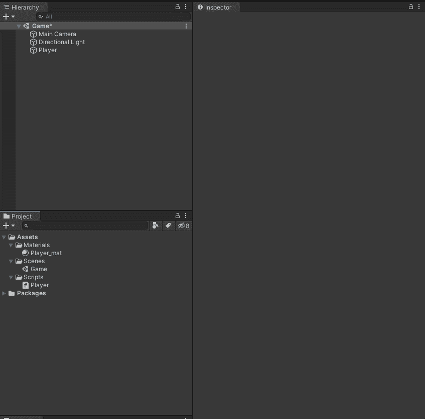

为了获得当前位置，我们需要访问`void Start()`中的转换组件:

```
void Start()
{
  transform.position
}
```

然后我们可以在相同的分数后设定我们的新位置。
要在 3D 中设置一个新位置，我们使用`Vector3`并总是在它前面加上`new`。

```
void Start()
{
  transform.position = new Vector3()
}
```

通过输入向量 3，您可以使用上下箭头键来查找参考。

现在我们想让我们的玩家在 Y 轴上回到 0，我们可以改变向量 3:

```
void Start()
{
  transform.position = new Vector3(0, 0, 0);
}
```

我们让 X，Y，Z 轴都为 0。并且总是在末尾加上分号。

保存我们的脚本并返回 Unity，然后单击顶部中间的`Play`。

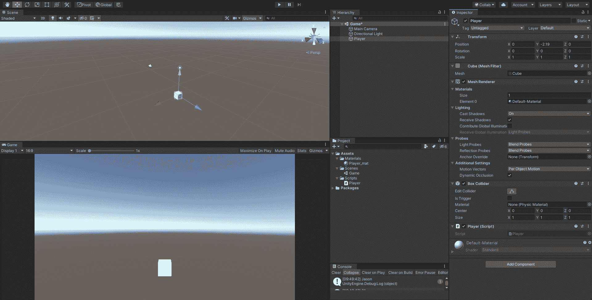

玩家玩的时候走到 0，0，0。这就是`Start()`功能的工作原理。
它在脚本被调用时和第一次帧更新之前工作。

现在让我们不断移动我们的球员。

您可能会注意到在`Start()`下面还有一个名为`Update()`的函数。
与`Start()`不同，`Update()`每帧都起作用。我们可以在`Update()`里面下命令，让它在每一帧都有动作。

要移动我们的位置，我们需要另一个叫做`Translate`的方法。

```
void Update()
{
  transform.Translate();
}
```

然后我们需要告诉它我们想要移动的方向。让我们把它移到左边。我们只需输入`Vector3.left`就可以访问运动。

```
void Update()
{
  transform.Translate(Vector3.left);
}
```

保存脚本并在 Unity 中玩以查看结果。


你可以看到我们的球员像子弹一样飞得很远。那是因为它每帧移动 1 个单位(大约 1 米)。通常在我们的游戏中一秒钟有 60 帧。当你有了更好的设备，它会变得更高。这意味着它在启动后每秒至少飞行 60 米。

我们可以通过输入时间变量来改变速度:

```
void Update()
{
  transform.Translate(Vector3.left * Time.deltaTime);
}
```

`Time.deltaTime`是一个变量，让你在每一秒钟内跑完。并且用星号来相乘，它使我们的运动每秒钟跑 1 米，而不是帧。
结果如下:

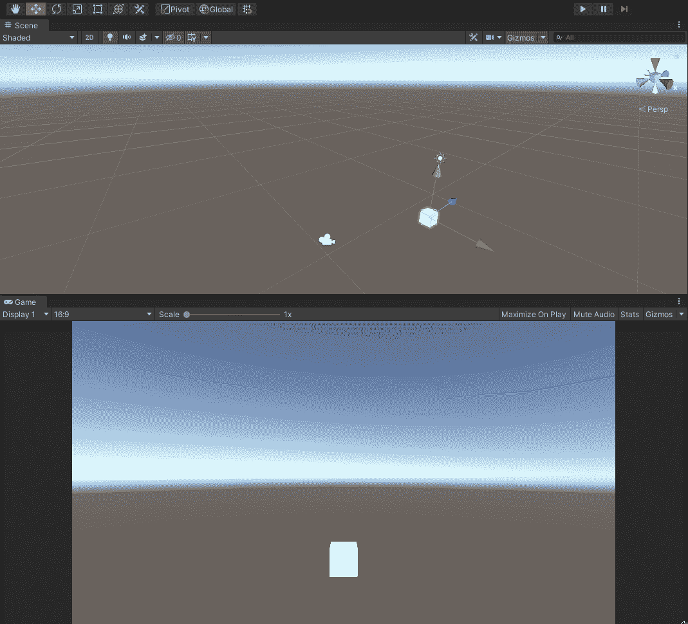

现在我们能够正常移动播放器，我们可以添加一个输入控件。

在 Unity 内部，有一个默认的输入法。我们可以通过`Project Settings`下拉菜单> `Input Manager` > `Axes`来查看，在这里可以看到 Unity 所有的输入默认设置。

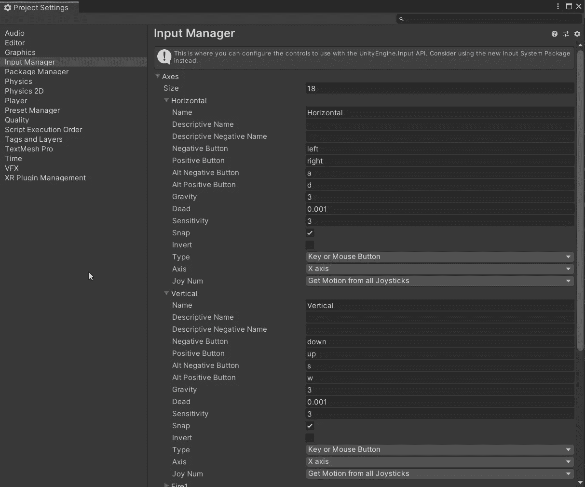

通过下拉水平和垂直，两者都有默认按钮。

我们可以做一个简单的测试来了解如果我们输入这些按钮会有什么值。
让我们为水平和垂直输入设置两个公共变量。

```
public float horizontalInput;
public float verticalInput;void Update()
{
  horizontalInput = Input.GetAxis("Horizontal");
  verticalInput = Input.GetAxis("Vertical");
}
```

我们可以通过使用`Input.GetAxis`来访问我们的输入。

请注意，我们需要输入的字符串与它在输入管理器上显示的完全相同，带有大写字母。Unity 将作为输入读取。
点击播放并按 WSAD 或箭头键查看结果:

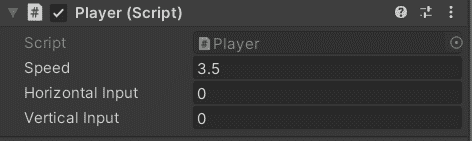

当按下 A&D 时，水平方向将得到从-1 到 1 输入，当按下 W&S 时垂直方向也是如此。

乘`horizontalInput`为水平移动。并使用`Vector3.up` & `verticalInput`再添加一行进行垂直移动。

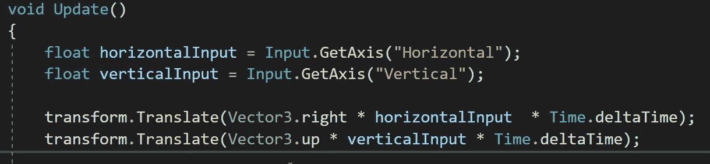

玩它，你现在应该能控制你的播放器了。

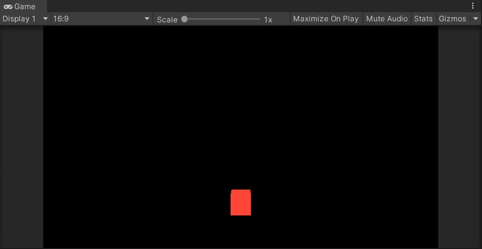

有用！但是，移动速度太慢了。我们需要添加一个可调值来提高速度。
添加一个私有变量，这样播放器速度就不会被其他脚本改变:

> 要验证脚本中的私有变量，请在名称的开头使用下划线。

```
private float _speed = 3.5f;
```

然后我们可以将`_speed`乘以我们的运动:


现在我们的球员动作更合理了。

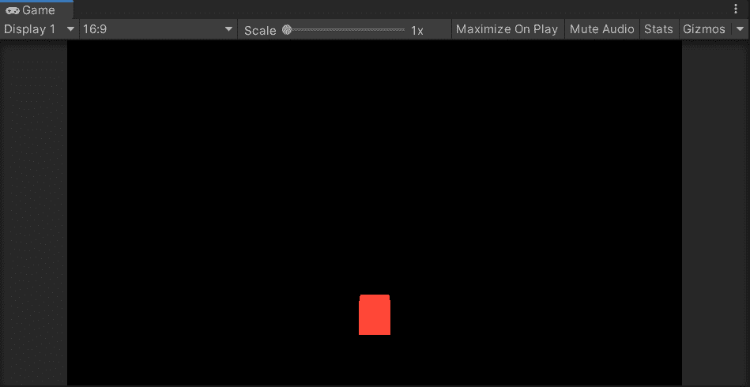

虽然我们的球员可以顺利移动，但还有一个问题，我们需要限制移动空间。

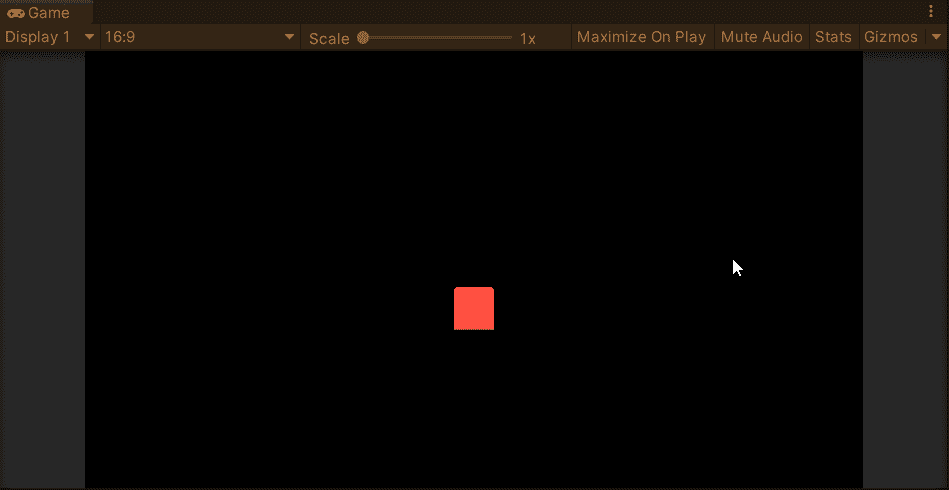

我们可以通过拖动播放器来检查检查器中的值。

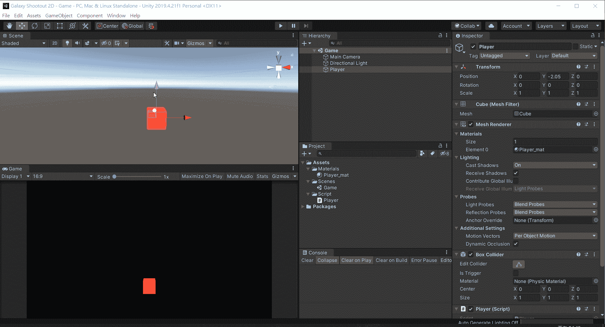

因此，我们应该将我们的玩家的位置限制在 Y 轴上从-3.8 到 0，X 轴上从-11.3 到 11.3。现在我们可以在脚本中添加我们的限制。

使用`new Vector3`到阿瑟的新位置。到目前为止，我们只想设置我们的 Y 轴，我们可以通过使用`transform.position.x`将我们的 X 轴保持为当前位置。
在 Y 轴上，我们可以使用`Mathf.Clamp`管理一个范围作为我们的最小值和最大值。
在`Mathf.Clamp`中，您需要输入 3 个值:

*   1-要限制的浮点数，即 y 位置。
*   2-最小值，即-3.8。
*   3-最大值为 0。

```
transform.position = new Vector3(transform.position.x, Mathf.Clamp(transform.position.y, -3.8f, 0), 0);
```

那么玩家不会在 Y 轴上消失。

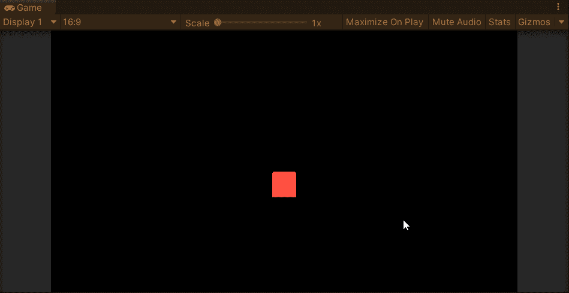

作为位置-x，我们可以让它在到达两边的边缘时消失，并在对面显示出来。在这种情况下，我们需要 if 语句。if 语句允许我们在特定条件发生时使用语句，

```
if(//this happened)
{
  //doing this
}
```

如果我们的位置-x 达到 11.3 或-11.3，我们应该使值为负。这将使位置 x 值在发生时相反。
这一次，我们要保持`transform.position.y`不变。

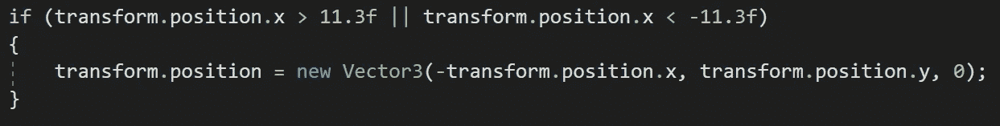

在条件部分，有一个`||`作为“或”。这意味着如果 x 大于 11.3f 或小于-11.3f，则设置新位置。
然后我们在`transform.position.x`开头加一个负号。
下面是它的工作原理，

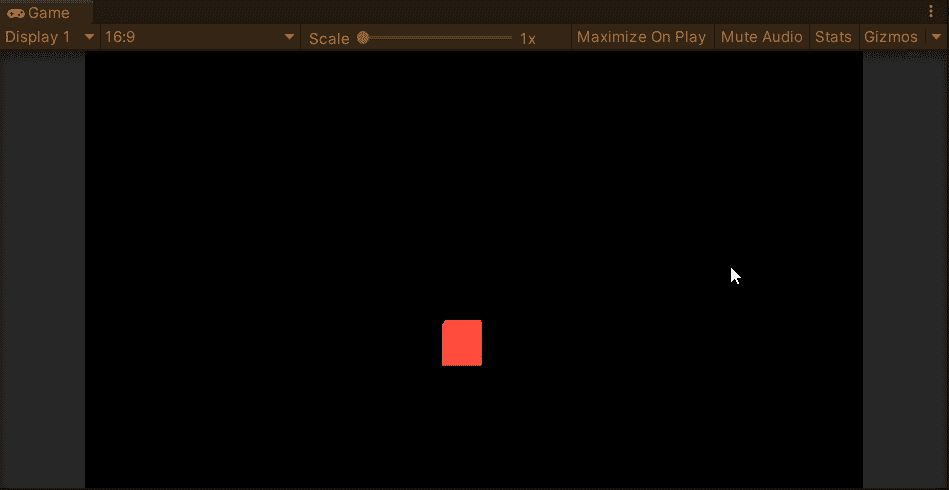

玩家运动到此为止。

接下来:[玩变量](https://sj-jason-liu.medium.com/play-with-variables-game-dev-series-04-3902e70c3c68)