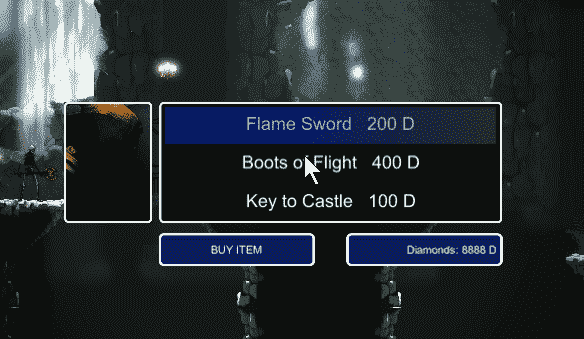
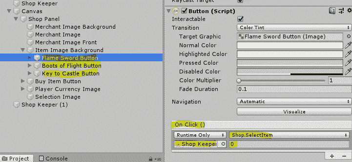
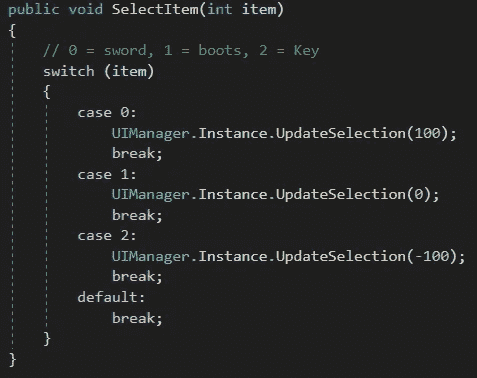
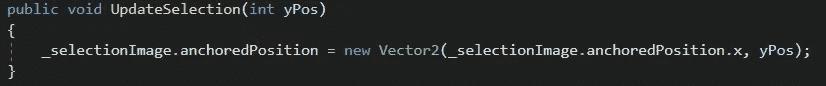

# 通过矩形变换移动对象

> 原文：<https://medium.com/nerd-for-tech/moving-objects-via-rect-transform-90d59da72afb?source=collection_archive---------13----------------------->

**目标:**在画布上重新定位图像。

这是我们商店的布置。当我们点击其中一个项目按钮时，该按钮将告诉我们的 *UIManager* 脚本将透明的蓝色选择图像放置到适当的位置。

但是画布上的 UI 对象没有传统的转换；他们有*矩形变换*。但是由于它们被定位在画布上，我们不能简单地分配一个新的*位置*来得到我们想要的结果。甚至 *localPosition* 在不同的屏幕分辨率下给我们的结果也不一致。我们必须使用*固定位置*来给自己完全的控制权。

按钮调用*商店*脚本中的 *SelectItem* 方法，并传入一个数字来标识自己。这

*SelectItem* 方法接收标识符编号，并使用它来决定应该将哪个值发送给 *UIManager* 的 *UpdateSelection* 方法。该值将是选择图像用来定位自身的 *anchoredPosition.y* 参数。

最后， *UIManager* 的 *UpdateSelection* 方法接受传入的值，并应用于选择图像的 *anchoredPosition.y* 参数。它保持当前的*锚定位置. x* 参数。这就是我们要找的效果！

