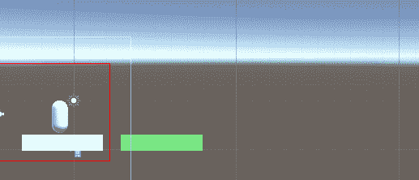
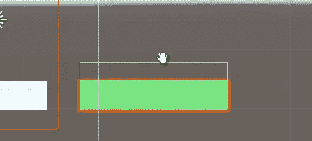
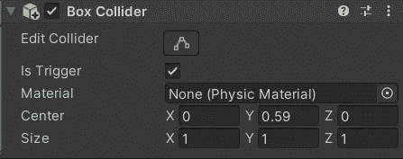
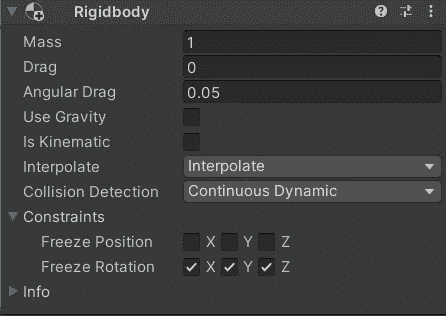
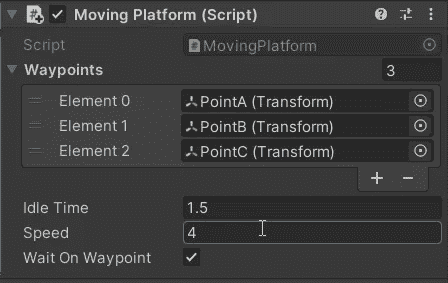
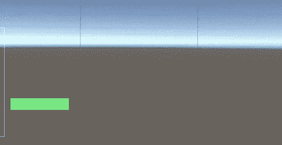

# 移动平台

> 原文：<https://medium.com/nerd-for-tech/moving-platform-abb47d7a07ca?source=collection_archive---------10----------------------->

**目标**:编写一个模块化路径的移动平台

另一个常青平台组件是**动平台**。我们将以一种**模块化**的方式创建和编写它，因此我们可以轻松地复制它的行为，只需改变定义路径的路点。

是的，路点。事实上，我打算重用/重新思考我在之前的游戏[大羊毛](https://danioquero.itch.io/the-great-fleece)中为**巡逻守卫**(这里[这里](https://danio-quero.medium.com/into-game-mechanics-guards-patrol-part-1-720c330aed46?source=your_stories_page-------------------------------------)和[这里](https://danio-quero.medium.com/into-game-mechanics-guards-patrol-part-2-290a592811ea?source=your_stories_page-------------------------------------))编写的大部分代码。

让我们先设计一些东西:

1.  平台将以给定的速度尽可能平稳地从一个航路点移动到另一个航路点，在每个航路点停止(或不停止)，并在第一个和最后一个航路点停留较长时间。
2.  玩家必须很好地固定在平台上，除非它跳下来，这意味着它会随着平台移动

仅此而已。

让我们从更简单的第二点开始。要让玩家粘在平台上，最简单的方法就是在玩家落地的那一瞬间让它成为平台的**子**，跳跃的时候拿出来。

为了实现这种行为，我们需要在平台上添加另一个箱式碰撞器组件，一个触发器，**向平台外倾斜**以检测着陆。当然我们需要一个没有重力的刚体。

为了让对撞机倾斜，我们可以改变 T21 中心的 y 轴分量。我们还需要**冻结** x-y-z 旋转，以避免与角色发生不必要的奇怪碰撞行为。

现在的剧本， *MovingPlatform。*

当触发进入或退出时，我们设置玩家孩子是否在平台上。

现在让我们来看看运动本身。我们将在`FixedUpdate()`方法中执行它，确保一个**一致的时间戳**，产生一个更平滑的效果。

`WaypointsGood()`方法返回一个布尔值，表明列表中是否有路点，访问它们是否安全。然后在`5`行，我们检查是否已经到达当前的航路点。

如果是，我们评估下一个航路点(`7`)，如果平台在第一个或最后一个航路点，我们启动一个协程使其等待，否则，如果启用了等待航路点选项，我们使其等待较短的时间。

如果还没有到达航路点，平台移动，`16`。

通过改变 id 或列表索引来评估下一个航路点。但是如果达到极限，路径的方向改变，因此从 0 到最大，索引是**递增**，然后从最大开始是**递减**等等。

平台被这个**聪明绝招**停了。因为我们不可能等待并阻止`FixedUpdate()`内部的运动，我们实际上并没有阻止它！我们只是用协程把速度设为零！在协程中，我们可以等待，然后恢复速度。

实际运动通过 Vector3 类的`MoveTowards()`方法执行。

一旦脚本完成，我们只需要从检查器中正确地填充它。

作为航路点只是转换空物体的组成部分。

现在，我们可以通过添加、删除或替换路点来玩得开心，并拥有全新的路径:水平、垂直或对角线！

我们来看看结果。

