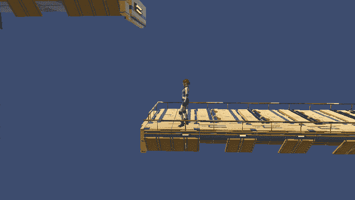
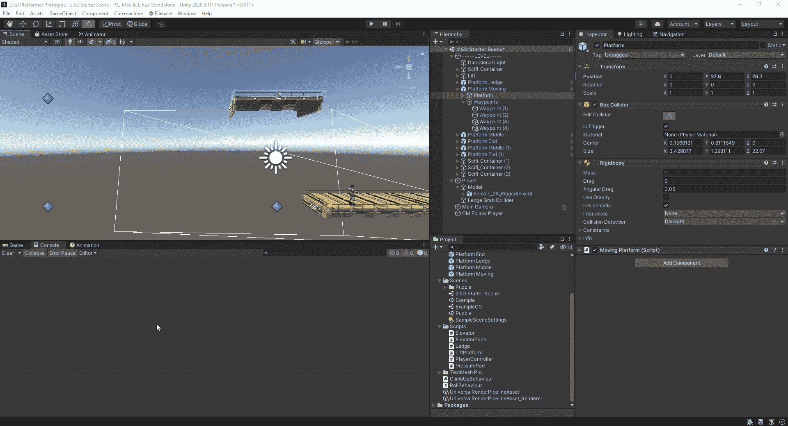
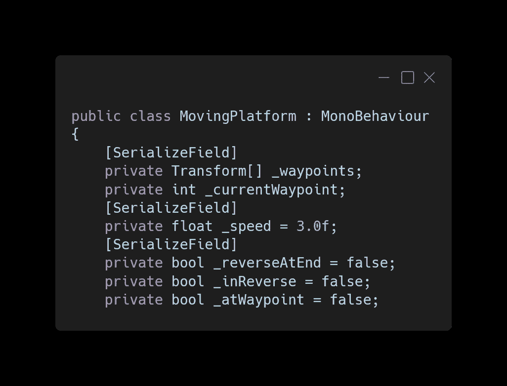
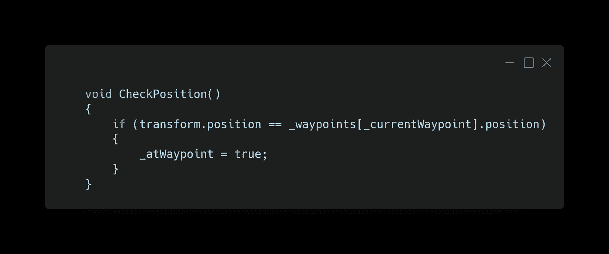
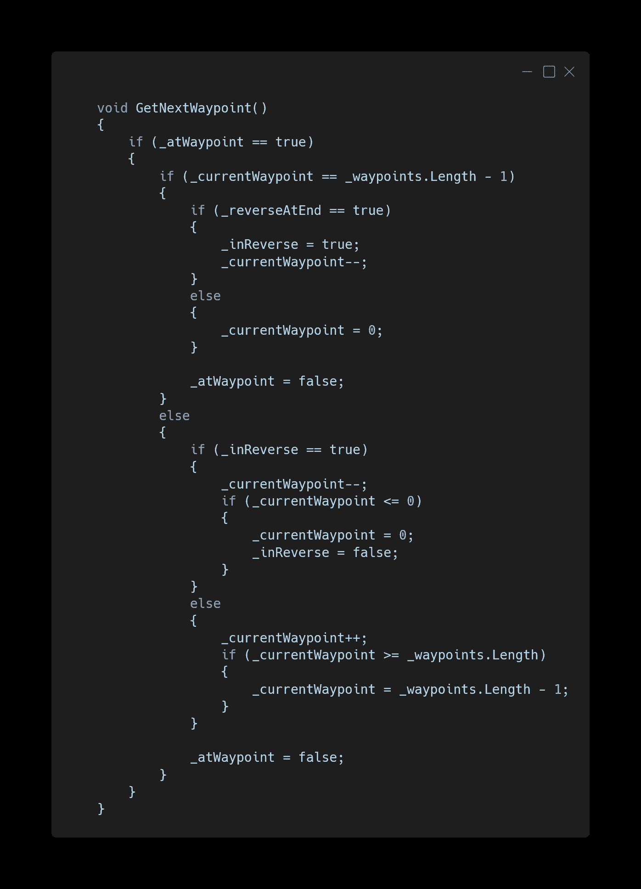
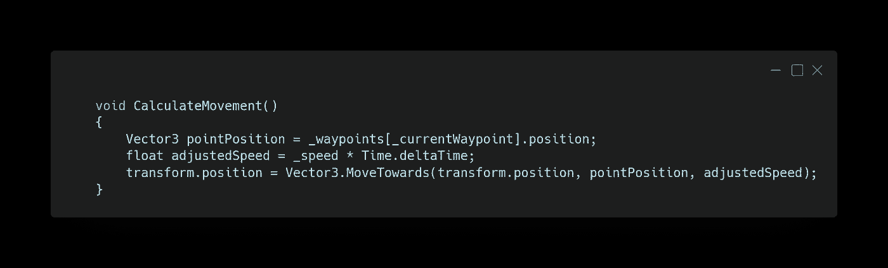
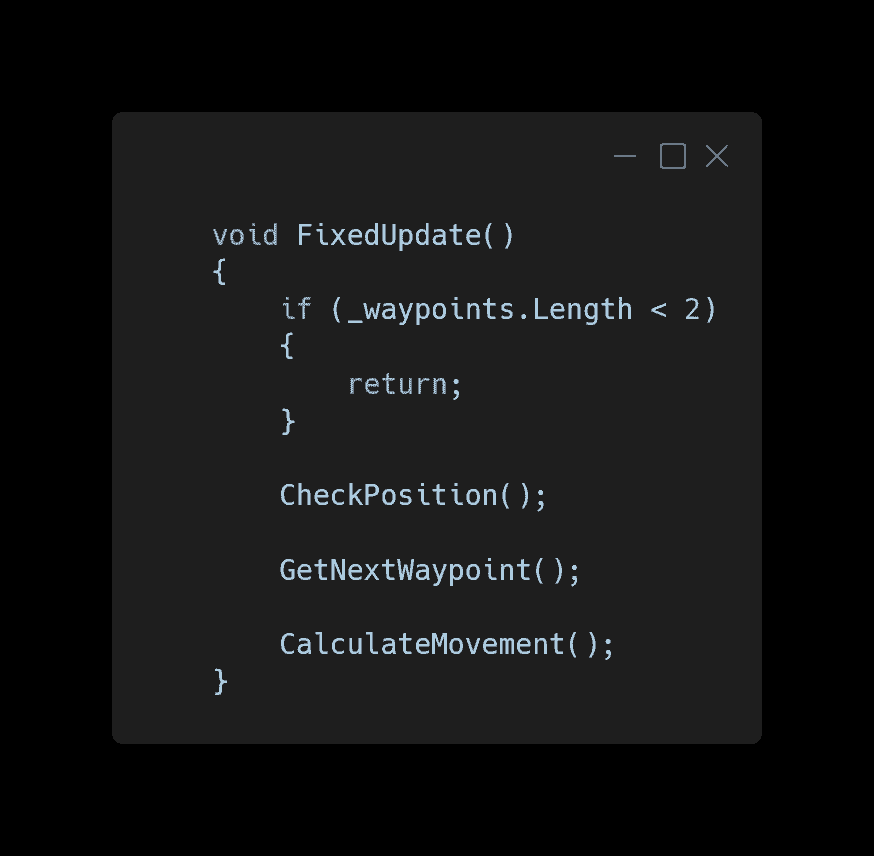
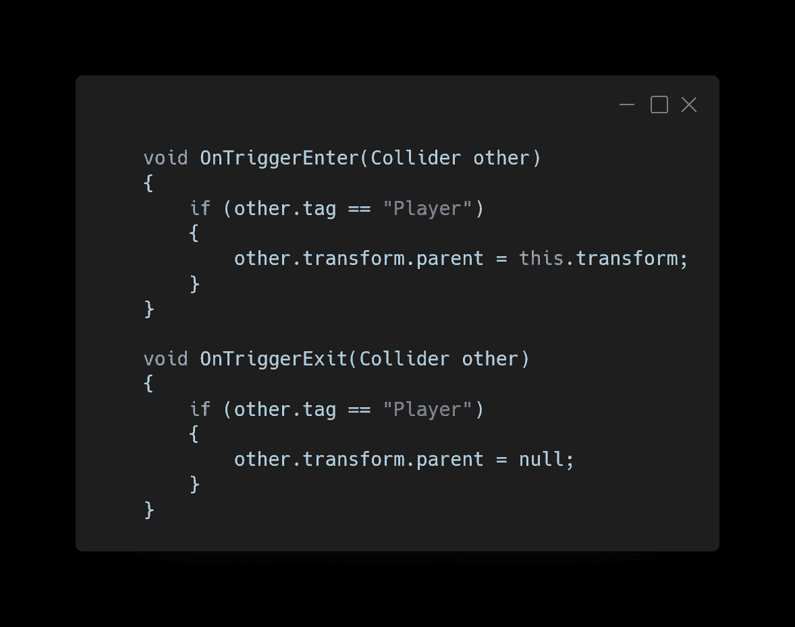
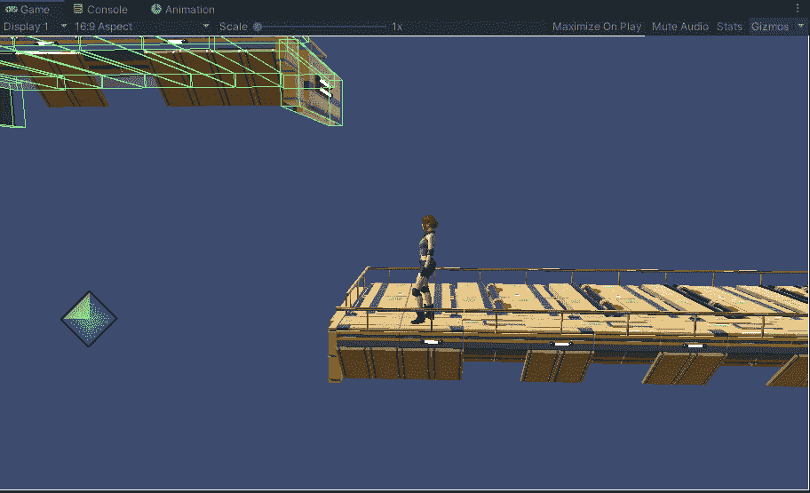

# 移动平台—重构

> 原文：<https://medium.com/nerd-for-tech/moving-platform-refactor-61cc572d4ea6?source=collection_archive---------17----------------------->

这篇文章将从上一篇文章的[开始在移动平台上展开。我们将增加使用任意数量的航路点的能力，以及在航路点上反向返回或从头开始的选项。](https://kwpowers.medium.com/creating-a-moving-platform-in-unity-cef46f25f41c)

该平台有一个箱式碰撞器，它被设置成一个带有刚体的触发器，用来检测玩家是否走上和离开平台。航路点是空的游戏对象。

要更改 MovingPlatform 脚本以使用任意数量的路点，并决定它在到达最后一个点时的行为，我们需要一些变量。

1.  保存航路点变换的数组。
2.  数组中当前航路点的索引。
3.  平台在各路点之间移动的速度。
4.  如果平台到达终点时应该直接到达第一个航路点，或者通过数组返回。
5.  如果平台当前正在通过阵列反向运行。
6.  如果平台位于当前航路点索引位置，并且应该改变索引。

该方法检查平台是否位于当前航路点的位置，如果是，则将 at 航路点 bool 设置为 true。

这个方法检查平台是否在航路点，然后我们改变当前的航路点索引值。如果当前航路点是数组中的最后一个航路点，我们检查平台是否应该在末尾反转，并将 reverse 设置为 true 并递减当前航路点。如果不是，那么当前航路点被设置为第一个航路点，并且在航路点被设置为假。

对于其他航路点，如果是反向，我们递减索引，当到达第一个航路点时，将反向设置为假。如果平台没有反向，我们增加索引，确保它不超过阵列索引范围，并将航路点设置为假。

该方法获取航路点位置，然后以设定的速度乘以自上一帧以来的时间将平台移向该位置。

我们对平台的移动使用了 FixedUpdate，这样它可以平稳地移动玩家。首先要确保数组中有不止一个航路点。然后我们检查平台的位置，获得下一个航点，然后将平台移动到当前航点。

最后，我们添加一个 OnTriggerEnter 来检查播放器，然后将播放器设置为平台的子级，并添加一个 OnTriggerExit 来移除播放器的父级。

平台现在可以循环通过任意数量的给定航路点。

