# 在 Unity 中移动平台

> 原文：<https://medium.com/nerd-for-tech/moving-platforms-in-unity-14930769bd50?source=collection_archive---------22----------------------->

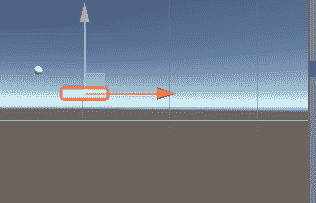

啊，好老的移动平台！这是我们游戏记忆中如此美好的一部分，现在轮到我们来制作一些了，让我们开始吧！

首先，让我们抓取一个当前的平台，并将其重命名为 Moving_Platform，复制几次，并将副本命名为 Point_A 和 Point_B，并将 Point_B 移动到您希望平台移动的位置。

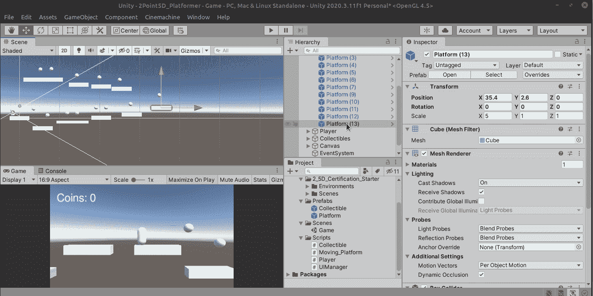

因为我们实际上只需要点 A 和点 B 的变换位置，所以继续删除除变换以外的所有内容。不幸的是，选项框被切断了记录屏幕，但只是'删除组件'在每个项目。

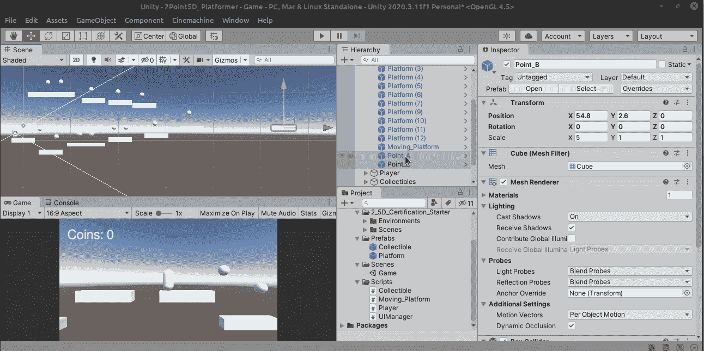

太好了！我们准备好让事情动起来了！创建一个名为 MovingPlatform 的脚本，并将其拖动到移动平台游戏对象上。

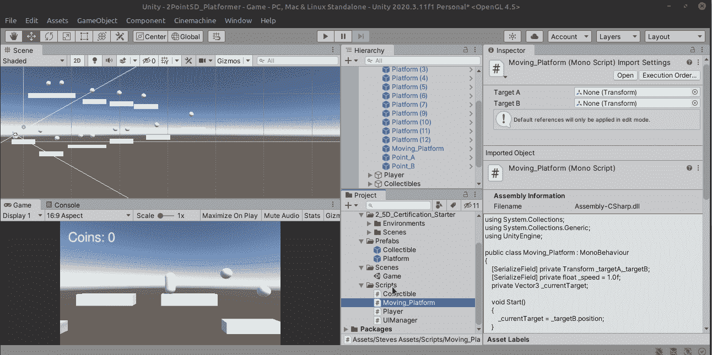

我们要做的第一件事是为 PointA 和 PointB 创建容器。

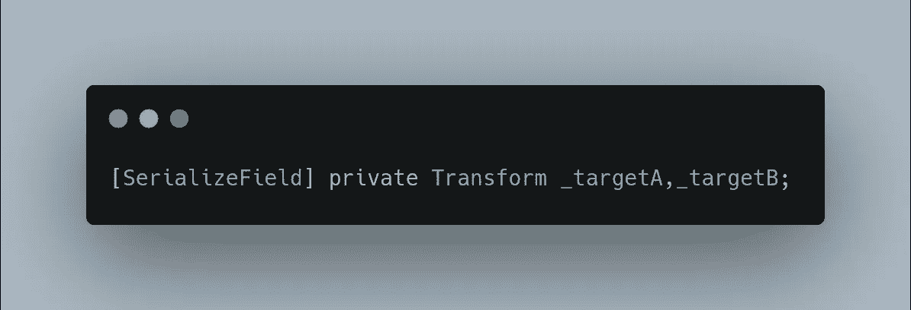

接下来，将 Point_A 拖动到 targetA，将 PointB 拖动到 _targetB。

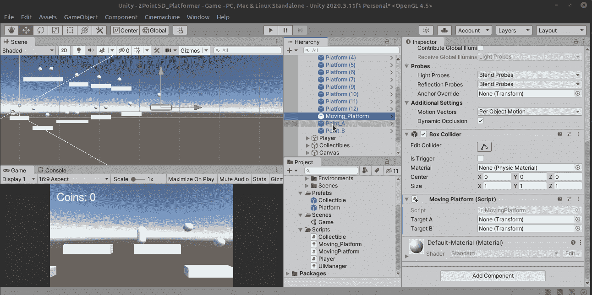

我们有很多方法可以解决这个挑战，但对于这一个，我们将使用名为 MoveTowards 的 Vector3 方法

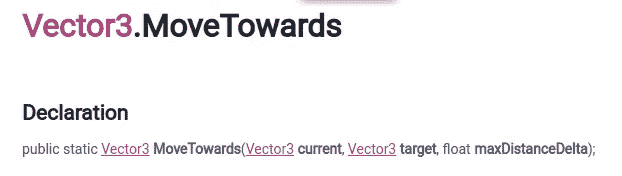

这很简单，你有当前位置、目标位置和 maxDistanceDelta，这是一个很好的词，表示“我们想走多大的一步”或…速度。

所以我们先做一个速度变量。

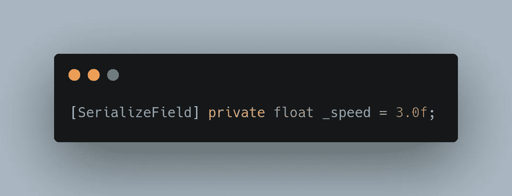

太好了！让我们将 target_b 作为我们的目标，并将这个命令放在 update 方法中。

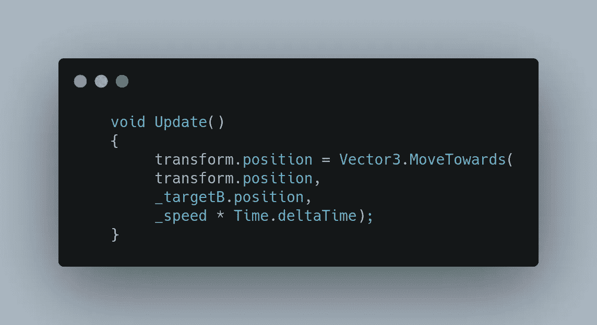

所以我们取当前的 transform.position，然后指定 Vector3。使我们从当前位置移动到 now _targetB 乘以 _speed * Time.deltaTime 的位置的 move origing 方法。

我们去看看吧！

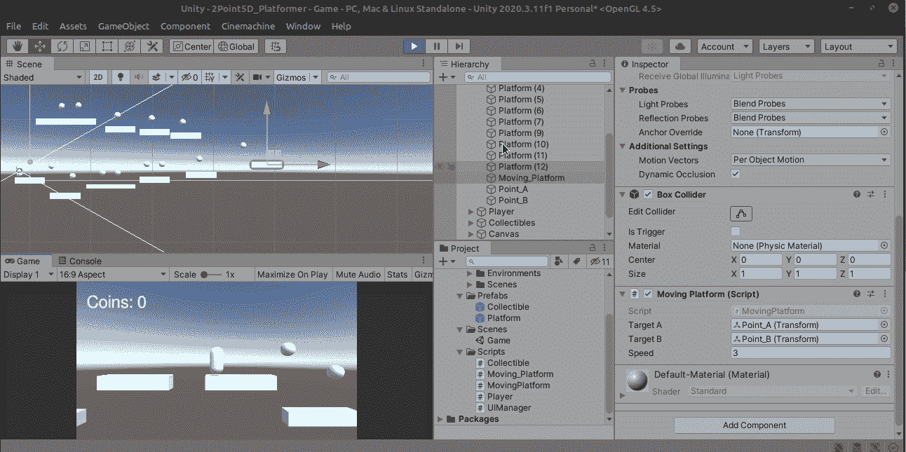

它还活着！嗯，它在动…现在我们需要一些乒乓球动作。

经过一番思考，我发现让平台从一个点切换到另一个点的最直接的方法是使用 _currentTarget 变量，我们不断地用它切换 targetA 和 targetB，并不断地向 _currentTarget 移动。

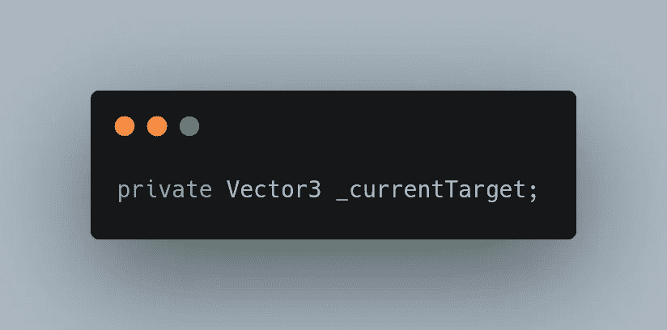

我们在 Start()中将它设置为 PointB。

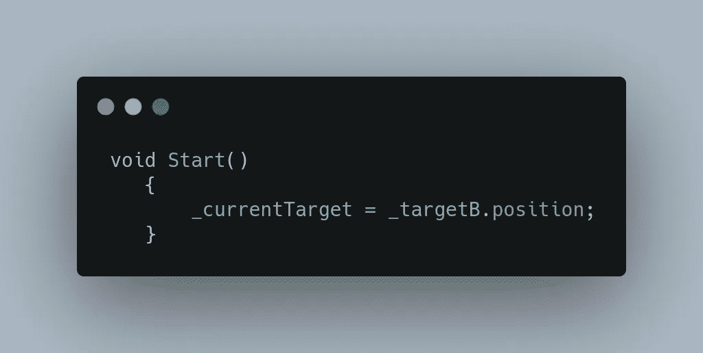

让我们将 Update 中的当前代码移到一个名为 MoveTowardsCurrentTarget()的新函数中。

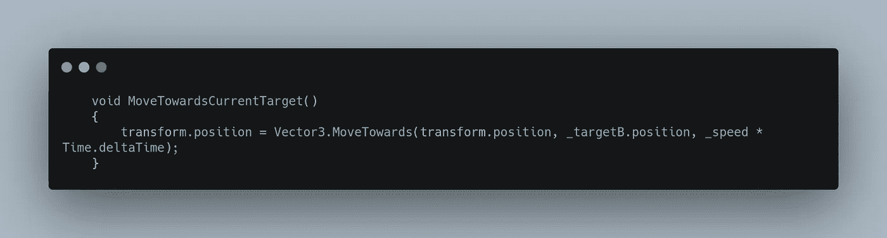

我们将把 _targetB.position 改为 _currentTarget.position。

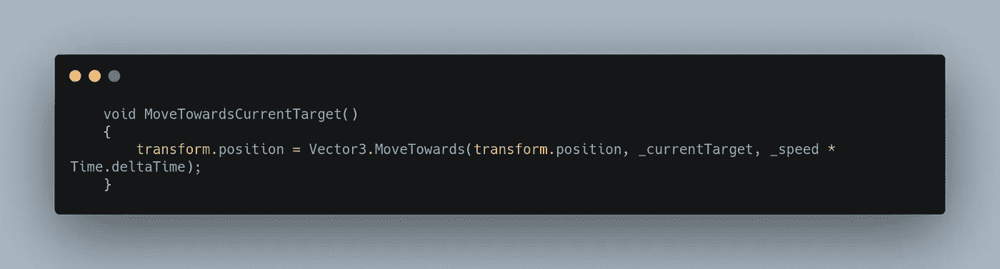

让我们在 Update()中调用 MoveTowardsCurrentTarget，这样它就会一直发生。

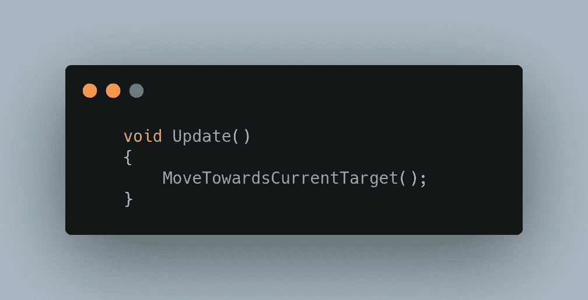

如果我们现在运行它，它将完全按照以前的方式运行，只是我们已经为切换打下了基础。让我们创建一个名为 CheckIfTargetReached()的新函数

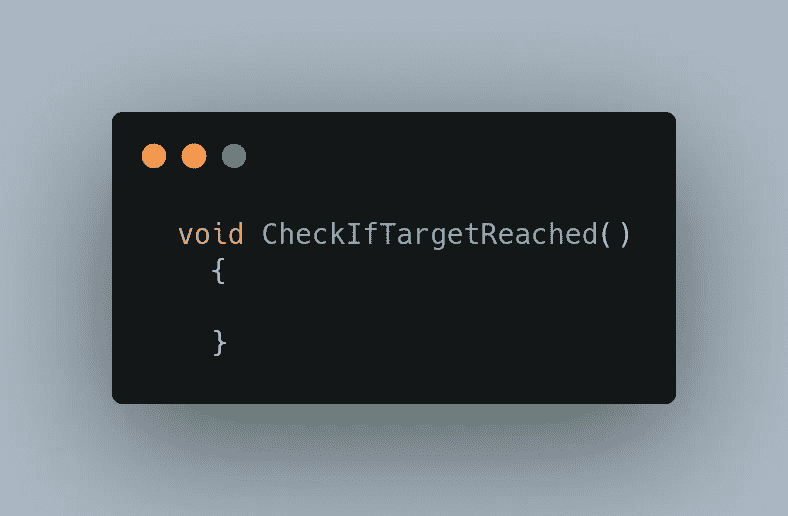

这是我们编程中最难的部分。你准备好了吗？先用伪代码吧！

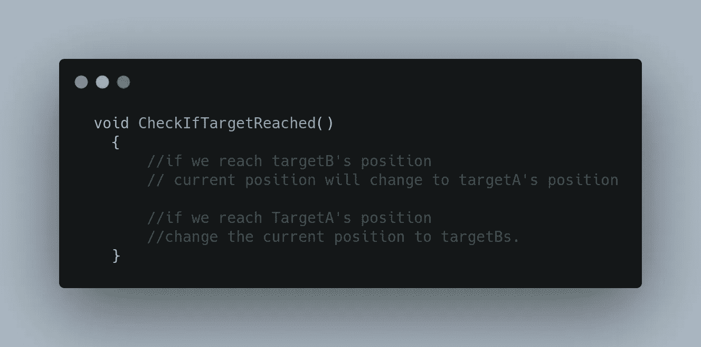

相当简单！让我们一行一行地做:

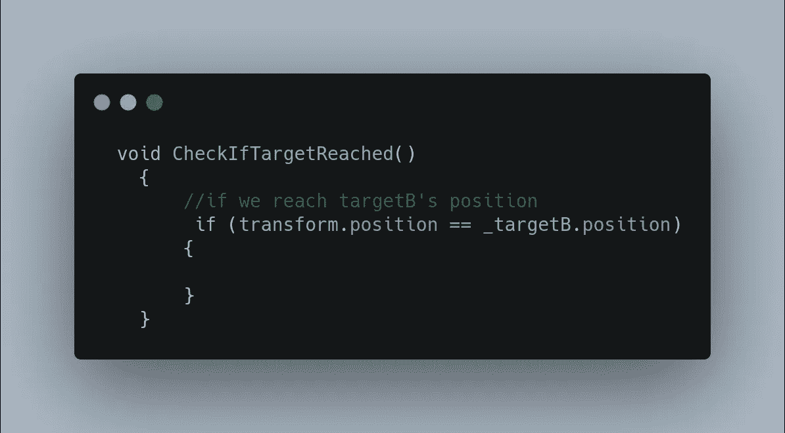

我们需要改变当前位置，我们有一个名为 _currentTarget 的变量…

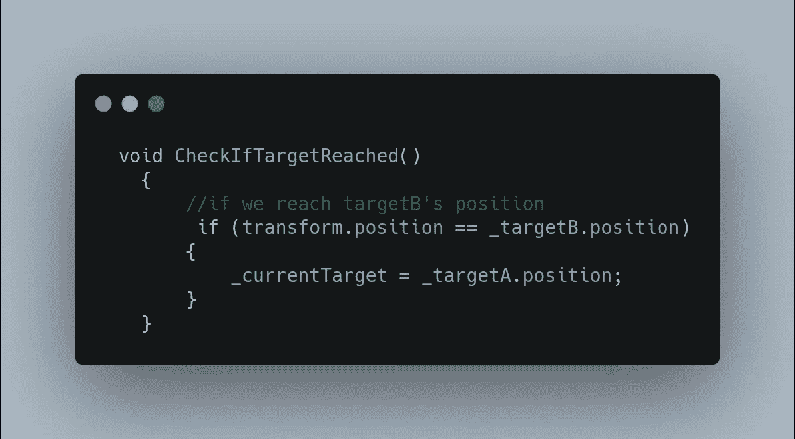

就是这样！由于 Update 总是在运行，所以代码会自行处理，一旦它到达 targetB 的位置，当前的目标将会改变，平台将自动开始移动到 targetA！但现在我们需要对目标 A 进行检查？你说得对！

如果你现在运行游戏，它不会工作，因为我们需要这个功能在更新，所以它也在每一帧运行！

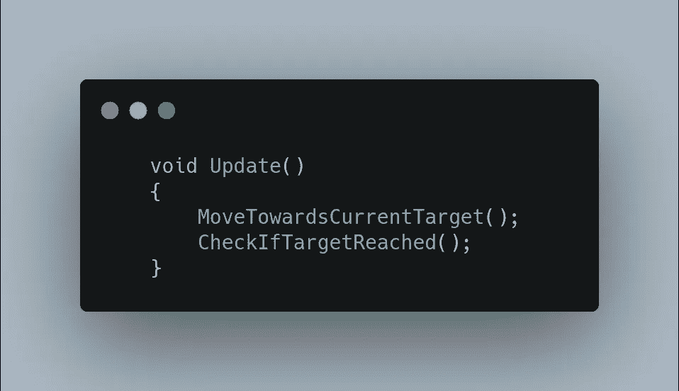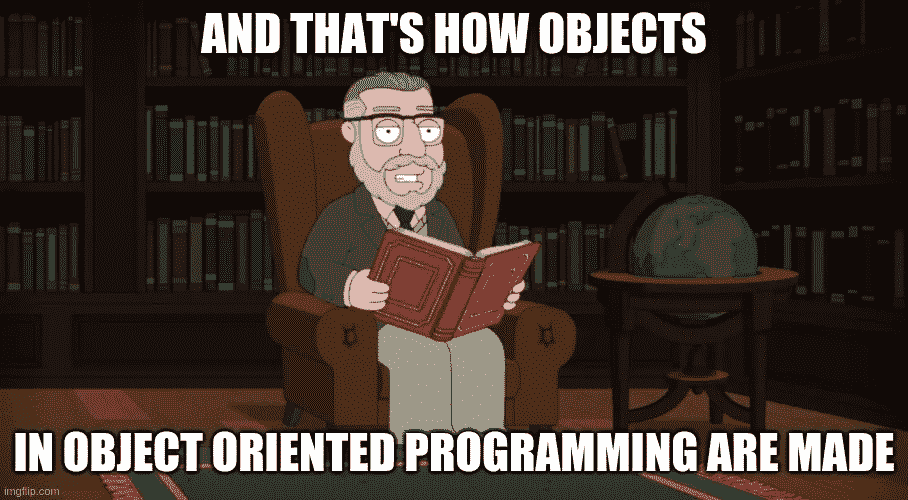

相当干净和可读的更新，不是吗？总是努力让你的代码易于理解。你这样做不仅是为了别人，也是为了你自己。

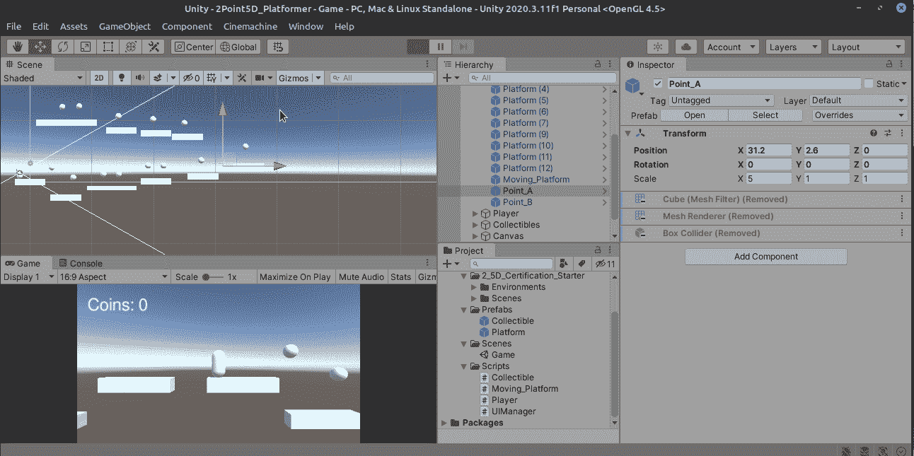

让我们跑到月台上车吧！玩家死了，因为他只是呆在一个地方，没有“骑”上平台。这是我们明天要解决的问题！到时候见！